# VinhKhanh — Product Requirements Document (PRD)

> **Phiên bản:** 2.0 | **Ngày:** 24/04/2026
> **Nền tảng:** ASP.NET Core 10 · React + Vite · .NET MAUI Android
> **Tài liệu chi tiết từng nhóm:** xem thư mục [`docs/`](./docs/)

---

## Mục lục

1. [Tổng quan sản phẩm](#1-tổng-quan-sản-phẩm)
2. [Actors & Phân quyền](#2-actors--phân-quyền)
3. [Danh sách Feature](#3-danh-sách-feature)
4. [Use Case Diagram tổng quan](#4-use-case-diagram-tổng-quan)
5. [Class Diagram tổng quan](#5-class-diagram-tổng-quan)
6. [ERD tổng quan](#6-erd-tổng-quan)
7. [Sequence Diagrams](#7-sequence-diagrams)
8. [Activity Diagrams](#8-activity-diagrams)

---

## 1. Tổng quan sản phẩm

**VinhKhanh** là nền tảng du lịch ẩm thực thông minh. Khi du khách đi bộ qua một quán ăn đã đăng ký, điện thoại tự động phát thuyết minh giới thiệu quán bằng ngôn ngữ của họ — không cần mở app, không cần thao tác.

### Kiến trúc hệ thống

```
┌──────────────────────────────────────────────────────────────┐
│  Presentation   │ Admin Web UI (React)  │ Mobile (.NET MAUI) │
├──────────────────────────────────────────────────────────────┤
│  Application    │ AdminApproveUseCase · AnalyticsVisitUseCase · PoiSyncUseCase │
├──────────────────────────────────────────────────────────────┤
│  Domain         │ Poi · ApplicationUser · Payment · AnalyticsEvent · ...       │
├──────────────────────────────────────────────────────────────┤
│  Infrastructure │ AppDbContext (EF Core) · GeminiAiService · EncryptionUtility │
└──────────────────────────────────────────────────────────────┘
```

---

## 2. Actors & Phân quyền

| Actor | Mô tả | Điều kiện truy cập |
|---|---|---|
| **Admin** | Quản trị viên hệ thống | JWT với role `Admin` |
| **ShopOwner** | Chủ quán đăng ký trên hệ thống | JWT với role `ShopOwner` + `IsApproved=true` |
| **Visitor** | Du khách dùng app mobile | Không cần đăng nhập (hoặc JWT role `Visitor`) |

**Luồng phân quyền quan trọng:**
- `ShopOwner` đăng ký → `IsApproved=false` → Admin duyệt → `IsApproved=true` → mới đăng nhập được
- `Visitor` đăng ký → `IsApproved=true` ngay lập tức, `ActivationDate=UtcNow`
- Mọi request của `ShopOwner` đều gọi `IsApprovedAsync()` kiểm tra DB thực tế (không chỉ dựa vào JWT)

---

## 3. Danh sách Feature

Hệ thống có **18 feature** chia thành 6 nhóm:

### Nhóm A — Xác thực & Tài khoản (3 feature)

| # | Feature | Actor | Mô tả |
|---|---|---|---|
| F01 | **Đăng nhập** | Tất cả | Xác thực email/password, nhận JWT 24h. Chặn ShopOwner chưa được duyệt (403). |
| F02 | **Đăng ký tài khoản ShopOwner** | ShopOwner | Tạo tài khoản chờ Admin duyệt. `IsApproved=false`, role `ShopOwner`. |
| F03 | **Đăng ký tài khoản Visitor** | Visitor | Tạo tài khoản tự động kích hoạt. `IsApproved=true`, `ActivationDate=now`. |

### Nhóm B — Quản lý POI (5 feature)

| # | Feature | Actor | Mô tả |
|---|---|---|---|
| F04 | **Admin quản lý POI toàn hệ thống** | Admin | Xem, tạo, sửa, xóa bất kỳ POI nào. Admin tạo POI → `Status=Approved` ngay. Sinh `QrToken` tự động. |
| F05 | **Duyệt / Từ chối / Ẩn POI** | Admin | Chuyển trạng thái POI: `Pending_Approval → Approved/Rejected/Hidden`. Từ chối phải có lý do ≥ 10 ký tự. |
| F06 | **ShopOwner quản lý POI của mình** | ShopOwner | Tạo POI ở `Status=Draft`. Chỉ sửa/xóa khi `Draft` hoặc `Rejected`. Không xóa khi `Pending_Approval`. |
| F07 | **Gửi POI để Admin duyệt** | ShopOwner | Chuyển `Draft → Pending_Approval`. Chỉ được gửi khi đang ở `Draft`. |
| F08 | **AI dịch thuật nội dung POI** | Admin, ShopOwner | Nhập tên + mô tả tiếng Việt → Gemini API dịch sang tiếng Anh và tiếng Nhật. Fallback qua 4 model: `gemini-2.5-flash → gemini-1.5-flash → gemini-2.0-flash → gemini-2.5-flash-lite`. |

### Nhóm C — Trải nghiệm Mobile (4 feature)

| # | Feature | Actor | Mô tả |
|---|---|---|---|
| F09 | **Đồng bộ POI offline** | Visitor | Delta sync: chỉ tải POI thay đổi sau `lastSync`. Lưu SQLite local. Hoạt động offline khi mất mạng. Pruning tự động xóa POI đã bị xóa trên server. |
| F10 | **Thuyết minh tự động khi đến gần quán** | Visitor | GPS → Haversine distance → Debounce 2 lần → Cooldown 10 phút → chọn POI Priority cao nhất → phát MP3 hoặc TTS. Audio ducking giảm nhạc nền khi phát. |
| F11 | **Quét QR code để xem thông tin quán** | Visitor | Quét QR → resolve token → lấy thông tin POI + deep link `vinhkhanh://poi/{id}`. Redirect sang web nếu chưa cài app. |
| F12 | **Đánh giá POI bằng sao** | Visitor | Upsert rating 1–5 sao theo `DeviceId`. Mỗi thiết bị chỉ có 1 rating/POI. Hiển thị điểm trung bình và số lượt đánh giá. |

### Nhóm D — Kiểm soát truy cập & Thanh toán (3 feature)

| # | Feature | Actor | Mô tả |
|---|---|---|---|
| F13 | **Dùng thử miễn phí 3 POI** | Visitor | 3 POI đầu tiên nghe miễn phí. Ghi `FreeTrialRecord` sau mỗi lần nghe. Unique index `(DeviceId, PoiId)`. |
| F14 | **Dùng thử thiết bị 7 ngày** | Visitor | Thiết bị mới tự động kích hoạt `DeviceTrial` 7 ngày. Nghe không giới hạn trong thời gian thử. |
| F15 | **Mua Access Pass** | Visitor | Thanh toán → `Payment(Status=Pending)` → callback → `Status=Completed, ExpiryDate=+7 ngày`. Nghe không giới hạn. |

### Nhóm E — Analytics & Dashboard (2 feature)

| # | Feature | Actor | Mô tả |
|---|---|---|---|
| F16 | **Dashboard tổng quan Admin** | Admin | Số POI, lượt visit, lượt narration, người online (5 phút), biểu đồ hoạt động 8 giờ, số ShopOwner chờ duyệt. |
| F17 | **Heatmap & Content Performance** | Admin | Heatmap tọa độ theo ngày/khoảng ngày. Top POI theo lượt nghe. Realtime dashboard qua SignalR (throttle 1s). Mật độ = `uniqueDevices × 100 / 121m²`. |

### Nhóm F — Quản trị hệ thống (1 feature)

| # | Feature | Actor | Mô tả |
|---|---|---|---|
| F18 | **Cài đặt hệ thống** | Admin | Quản lý key-value config: URL frontend, link tải app Android/iOS. Dùng cho QR redirect và deep link. |

---
## 4. Use Case Diagram tổng quan

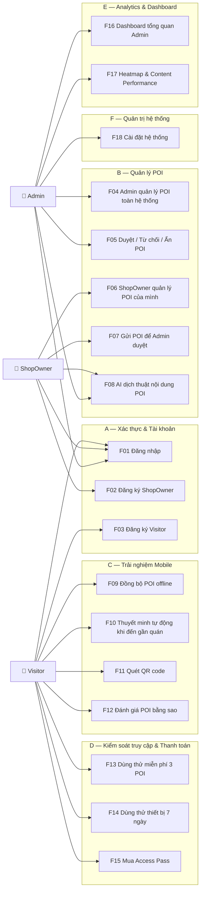

---

## 5. Class Diagram tổng quan

```mermaid
classDiagram
  class Poi {
    +int Id
    +string BasePoiId
    +string CategoryCode
    +double Latitude
    +double Longitude
    +double Radius
    +string QrToken
    +int Priority
    +bool IsApproved
    +PoiStatus Status
    +bool IsPremium
    +string OwnerId
    +string RejectionReason
    +DateTime UpdatedAt
  }
  class PoiLocalization {
    +int PoiId
    +string LanguageCode
    +string Name
    +string Description
    +string AudioUrl
  }
  class PoiRating {
    +int PoiId
    +string DeviceId
    +int Stars
    +DateTime RatedAt
  }
  class ApplicationUser {
    +string Id
    +string FullName
    +bool IsApproved
    +DateTime ActivationDate
  }
  class AnalyticsEvent {
    +int Id
    +string DeviceId
    +int PoiId
    +string EventType
    +double Latitude
    +double Longitude
    +DateTime Timestamp
  }
  class Payment {
    +string TransactionId
    +string UserId
    +PaymentType Type
    +PaymentStatus Status
    +DateTime ExpiryDate
  }
  class FreeTrialRecord {
    +string DeviceId
    +int PoiId
    +DateTime FirstHeardAt
  }
  class DeviceTrial {
    +string DeviceId
    +DateTime ExpiryDate
    +DateTime LastCheckedAt
  }
  class SystemSetting {
    +string Key
    +string Value
  }
  class IPoiRepository {
    <<interface>>
    +GetSyncPoisAsync(lastSyncAt, ct)
    +ApprovePoiAsync(id, ct)
    +GetAllActiveBaseIdsAsync(ct)
  }
  class IAnalyticsRepository {
    <<interface>>
    +AddVisitEventAsync(evt, ct)
  }
  class PoiSyncUseCase {
    +ExecuteAsync(SyncRequest, ct) SyncResponse
    -NormalizeCategoryCode()
    -InferCategory()
  }
  class AnalyticsVisitUseCase {
    +ExecuteAsync(AnalyticsVisitCommand, ct)
    -BuildAnonymousDeviceId() string
  }
  class AdminApproveUseCase {
    +ExecuteAsync(poiId, ct) bool
  }
  class GeminiAiService {
    +GenerateTranslationsAsync(name, desc, ct)
    -ExtractJsonPayload()
  }
  class GeofenceEngine {
    -EnterDebounceThreshold = 2
    -DefaultCooldown = 10min
    +StartAsync(languageCode)
    +MarkPoiAsPlayed(poiId, cooldown)
    -ProcessLocationAsync(location)
    -HandleInsidePoisWithPriorityAndDebounce()
    -CalculateDistance() double
  }
  class NarrationService {
    +PlayAudioAsync(filePath)
    +SpeakAsync(text, lang)
    +StopAll()
    -RunExclusiveNarrationAsync()
    -BeginAudioDuckingAsync()
    -SanitizeTtsText()
  }
  class DatabaseService {
    +SyncPoisFromServerAsync(ct) bool
    +GetLocalizedPoisAsync(langCode)
    -ApplyServerChangesAsync()
    -SelectByFallback()
    -NormalizeLanguageCode()
  }
  class AccessService {
    +DeviceId string
    +HasActivePass() bool
    +SyncTrialStatusAsync()
    -GetPersistentDeviceId()
  }

  Poi "1" --> "*" PoiLocalization : Cascade
  Poi "1" --> "*" PoiRating : Cascade
  Poi "1" --> "*" AnalyticsEvent
  Poi "1" --> "*" FreeTrialRecord
  ApplicationUser "1" --> "*" Poi : OwnerId
  ApplicationUser "1" --> "*" Payment : UserId

  PoiSyncUseCase --> IPoiRepository
  AdminApproveUseCase --> IPoiRepository
  AnalyticsVisitUseCase --> IAnalyticsRepository

  GeofenceEngine --> DatabaseService
  GeofenceEngine --> NarrationService : OnPoiEntered
  NarrationService --> AccessService
```

---

## 6. ERD tổng quan

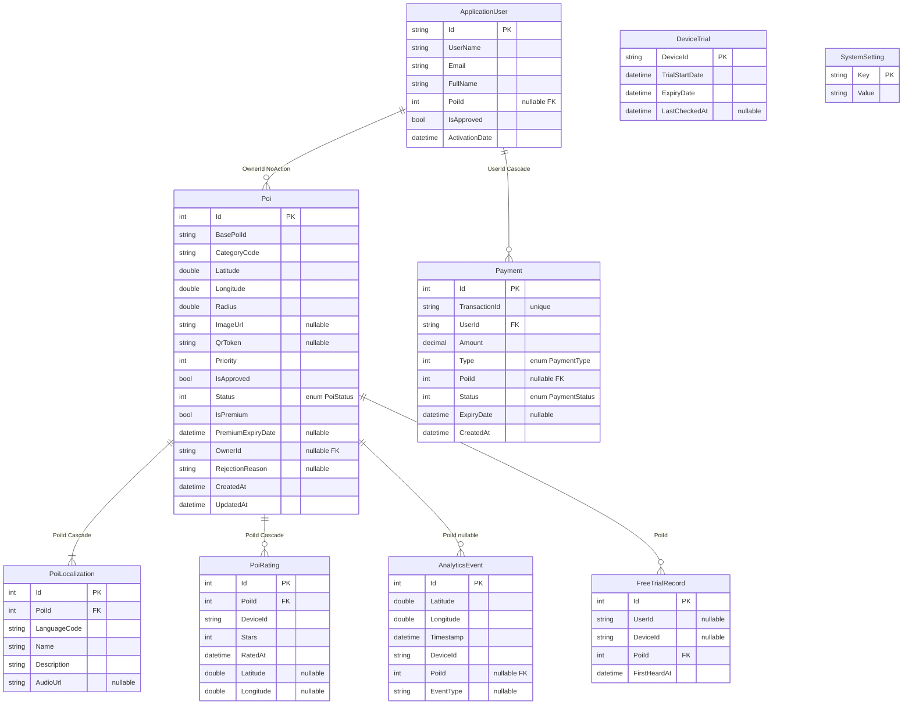

**Ràng buộc DB:**
- `PoiRating`: Unique `(DeviceId, PoiId)` · Check `Stars BETWEEN 1 AND 5`
- `FreeTrialRecord`: Unique `(UserId, PoiId)` khi `UserId IS NOT NULL` · Unique `(DeviceId, PoiId)` khi `DeviceId IS NOT NULL`
- `Payment.TransactionId`: Unique index
- `PoiStatus`: `Draft=0, Pending_Approval=1, Approved=2, Rejected=3, Hidden=4`
- `PaymentType`: `AccessPass=0, PremiumUpgrade=1`
- `PaymentStatus`: `Pending=0, Completed=1, Failed=2, Refunded=3`

---
## 7. Sequence Diagrams

### F01 — Đăng nhập

**Logic:** `FindByEmailAsync` → `CheckPasswordAsync` → kiểm tra `IsApproved` → tạo JWT 24h với claims `NameIdentifier`, `Role`, `ActivationDate`.

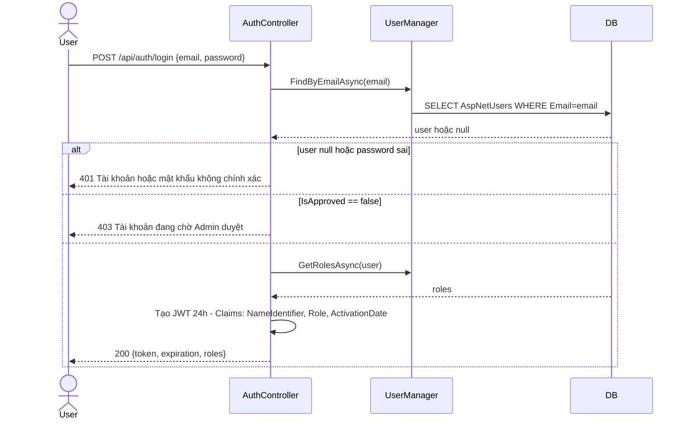

---

### F04 + F05 — Admin tạo POI và duyệt POI của ShopOwner

**Logic tạo (Admin):** `Status=Approved` ngay, sinh `BasePoiId=Guid[..10]`, `QrToken=poi-Guid[..20]`, upload ảnh vào `wwwroot/media/`, tạo 3 `PoiLocalization` (vi/en/ja).

**Logic duyệt:** set `Status=Approved, IsApproved=true, UpdatedAt=UtcNow` → Mobile sẽ nhận POI này trong lần sync tiếp theo.

**Logic từ chối:** validate `reason.Length >= 10` → set `Status=Rejected, RejectionReason=reason`.

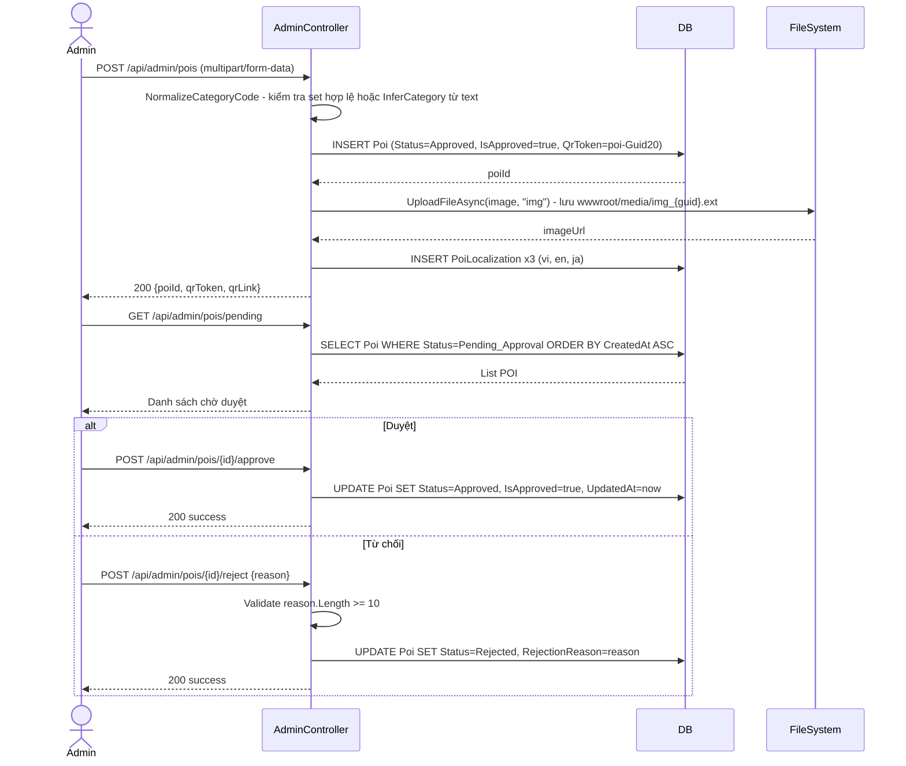

---

### F06 + F07 — ShopOwner tạo và gửi duyệt POI

**Logic tạo:** `IsApprovedAsync()` kiểm tra DB thực tế → `Status=Draft, IsApproved=false, OwnerId=CurrentUserId`.

**Logic sửa:** chỉ cho phép khi `Status == Draft || Status == Rejected`. Chặn khi `Pending_Approval` hoặc `Approved`.

**Logic gửi duyệt:** chỉ cho phép khi `Status == Draft` → chuyển sang `Pending_Approval`.

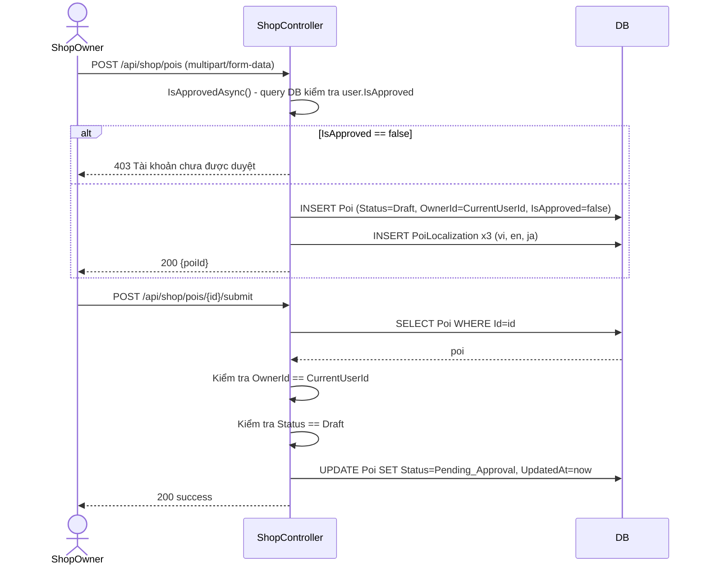

---

### F08 — AI dịch thuật

**Logic:** Thử lần lượt 4 model Gemini. Mỗi model retry tối đa 2 lần với delay tăng dần (2s → 4s). Parse JSON từ `candidates[0].content.parts[0].text`, loại bỏ markdown wrapper bằng `ExtractJsonPayload`.

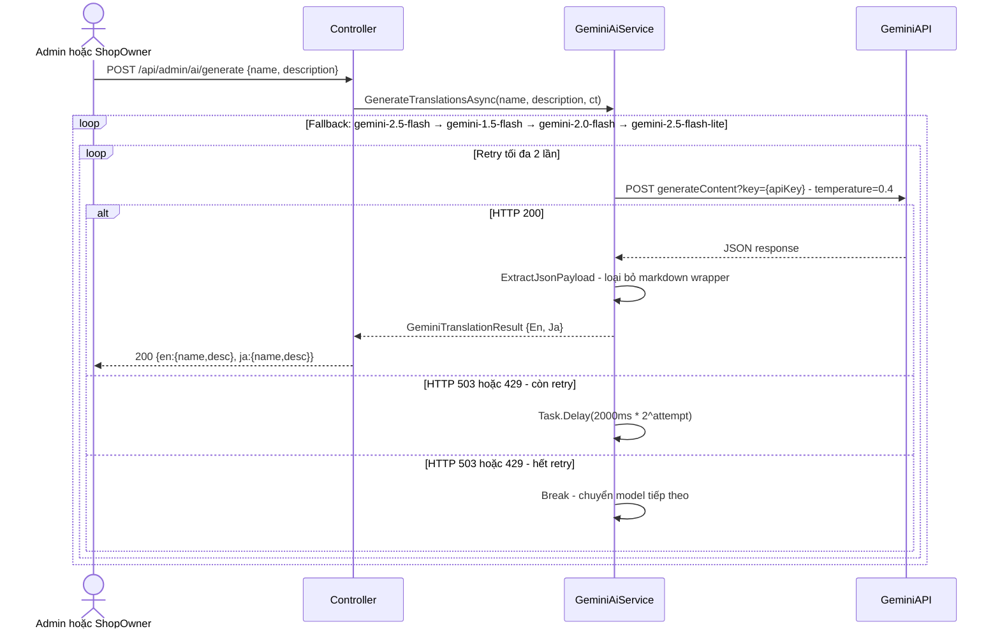

---

### F09 — Đồng bộ POI offline

**Logic:** `GetLastSyncTime()` từ `Preferences` → GET `/api/pois/updates?lastSync={ISO8601}` → `PoiSyncUseCase.ExecuteAsync` query `WHERE UpdatedAt > lastSyncAt AND Status=Approved` → `ApplyServerChangesAsync`: upsert theo `(BasePoiId, LanguageCode)` → Pruning xóa POI không trong `ActiveBasePoiIds` → lưu `ServerTime` làm mốc mới.

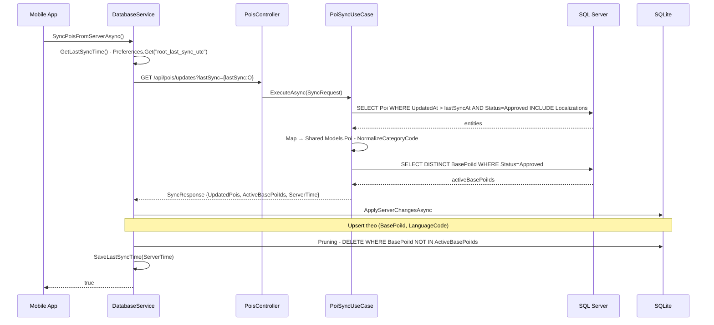

---

### F10 — Thuyết minh tự động khi đến gần quán

**Logic GPS:** `ListenLoopAsync` → `GetLocationAsync(Best, 15s)` → `ShouldEmitLocationChanged` (distance ≥ 1m hoặc heartbeat 15s) → `LocationChanged.Invoke`.

**Logic Geofence:** `ProcessLocationAsync` → `CalculateDistance(Haversine)` → phân loại inside/outside → `HandleInsidePoisWithPriorityAndDebounce`: tăng counter, lọc `counter >= 2 && !active && !cooldown` → chọn `OrderByDescending(Priority).ThenBy(Id).First()` → `OnPoiEntered.Invoke`.

**Logic Narration:** `RunExclusiveNarrationAsync` → `BeginAudioDuckingAsync(AudioFocusRequest.MayDuck)` → nếu có `AudioPath`: `PlayWithMediaElementAsync(timeout=12s)`, nếu không: `SanitizeTtsText` → `TextToSpeech.SpeakAsync(Rate=0.92)` → `EndAudioDucking` → ghi `AnalyticsEvent(narration)` → `MarkPoiAsPlayed(cooldown=10min)`.

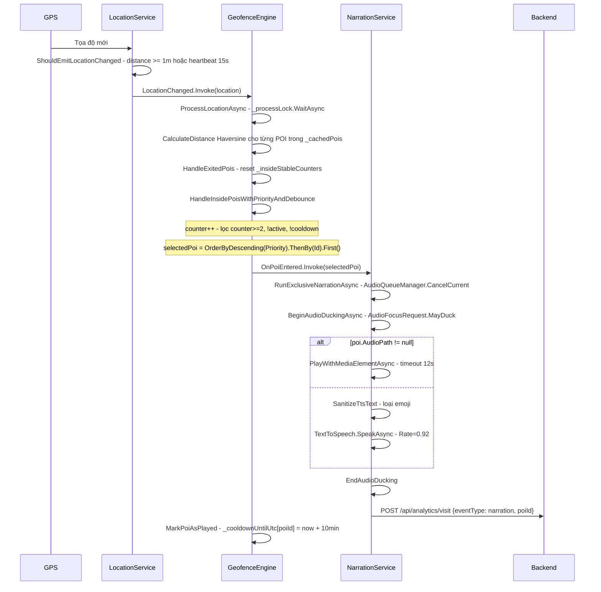

---

### F13 + F14 + F15 — Kiểm soát truy cập

**Logic check:** đếm `FreeTrialRecord` distinct PoiId theo `DeviceId` → kiểm tra `DeviceTrial.ExpiryDate` → kiểm tra `Payment(Status=Completed, ExpiryDate > now)`.

**Logic auto-trial:** `SyncTrialStatusAsync` → nếu `!HasActivePass && TrialRemainingDays==0 && FreeTrialUsed==0` → `StartTrialAsync` → `DeviceTrial(ExpiryDate=now+7days)`.

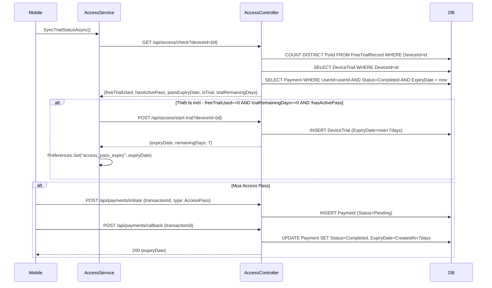

---

### F17 — Heatmap & Realtime Dashboard

**Logic ghi sự kiện:** `AnalyticsVisitUseCase.ExecuteAsync` → `BuildAnonymousDeviceId(SHA256)` → `INSERT AnalyticsEvent` → nếu `narration`: upsert `FreeTrialRecord` → `PublishRealtimeUpdateAsync` (throttle 1s) → `analyticsHub.Clients.Group("AdminGroup").SendAsync("analytics:realtime")`.

**Logic heatmap:** group by `(Math.Round(lat,4), Math.Round(lng,4))` → mỗi ô ≈ 11×11m = 121m² → `density = uniqueDevices × 100 / 121` → `Take(500)`.

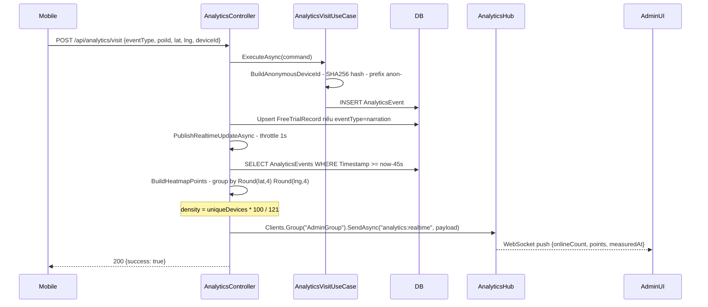

---
## 8. Activity Diagrams

### F05 — Vòng đời POI

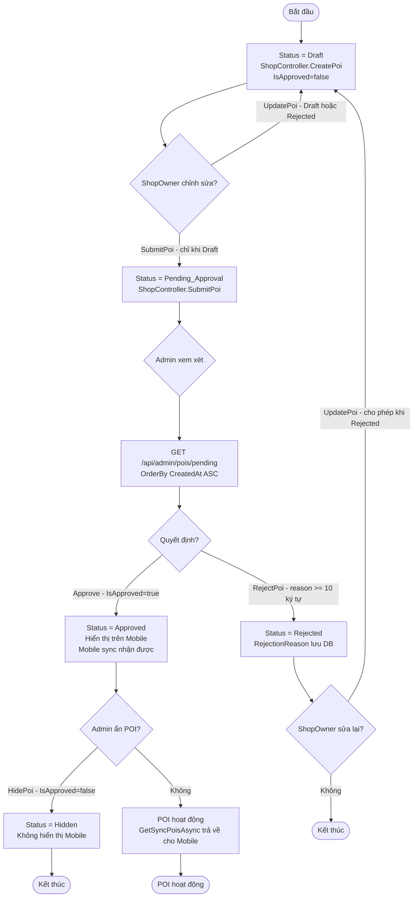

**Ràng buộc trạng thái:**
- `UpdatePoi`: chặn khi `Pending_Approval` hoặc `Approved` → 403
- `DeletePoi`: chặn khi `Pending_Approval` → 403
- `SubmitPoi`: chặn khi không phải `Draft` → 400

---

### F10 — GeofenceEngine xử lý GPS

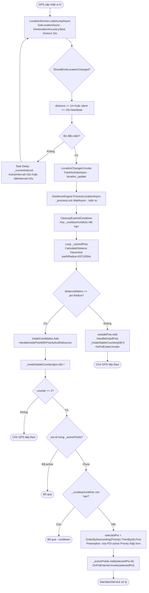

---

### F10 — NarrationService phát thuyết minh

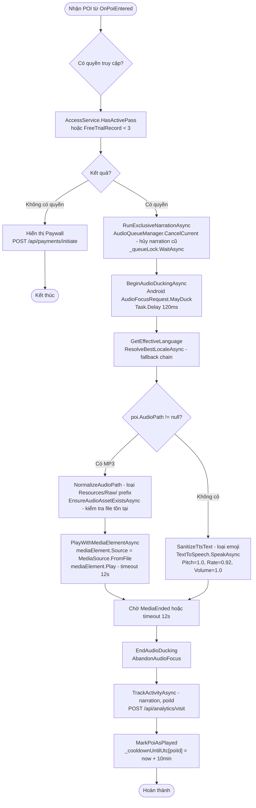

---

### F13 + F14 + F15 — Kiểm soát truy cập Visitor

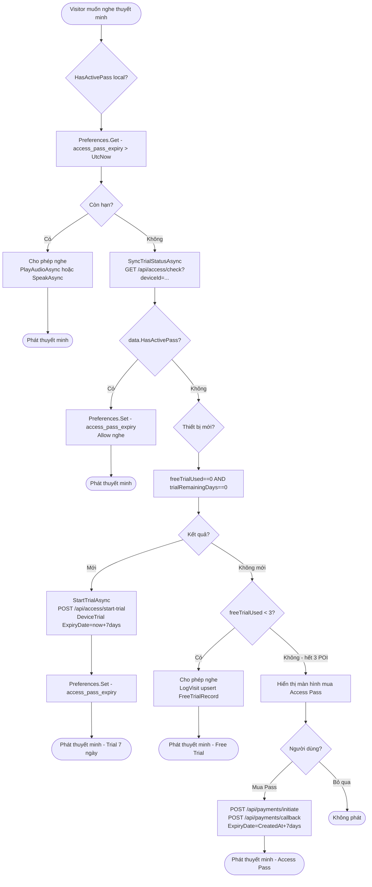

---

### F09 — Khởi động Mobile và đồng bộ dữ liệu

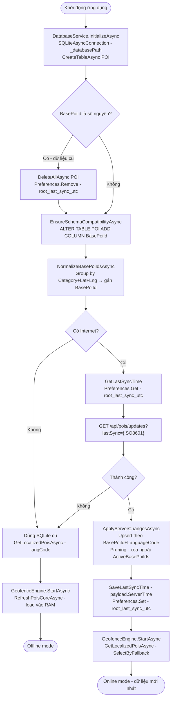

---

*Tài liệu chi tiết từng feature: xem thư mục [`docs/`](./docs/)*
