# Tài liệu Hệ thống VinhKhanh Food Street

> Phiên bản: 1.0 | Cập nhật: 04/2026

---

## 1. Tổng quan hệ thống

<<<<<<< Updated upstream
VinhKhanh Food Street là nền tảng du lịch ẩm thực thông minh gồm 3 thành phần chính:
=======
1. [Tổng quan dự án](#1-tổng-quan-dự-án)
2. [Kiến trúc hệ thống](#2-kiến-trúc-hệ-thống)
3. [Chức năng hệ thống](#3-chức-năng-hệ-thống)
4. [Use Case Diagram](#4-use-case-diagram)
5. [Mô hình dữ liệu (ERD)](#5-mô-hình-dữ-liệu-erd)
6. [Class Diagram](#6-class-diagram)
7. [Sequence Diagrams](#7-sequence-diagrams)
8. [Activity Diagrams](#8-activity-diagrams)
9. [API Reference](#9-api-reference)
10. [Hướng dẫn cài đặt nhanh (Quick Start)](#10-hướng-dẫn-cài-đặt-nhanh-quick-start)
11. [Cấu hình hệ thống (Configuration)](#11-cấu-hình-hệ-thống-configuration)
12. [Cấu trúc thư mục (Workspace Structure)](#12-cấu-trúc-thư-mục-workspace-structure)
13. [Luồng phát triển (Dev Workflow)](#13-luồng-phát-triển-dev-workflow)
14. [Tầm nhìn & Roadmap](#14-tầm-nhìn--roadmap)

---

## 1. Tổng quan dự án

### 1.1 Mô tả

VinhKhanh là ứng dụng hướng dẫn du lịch ẩm thực tự động. Khi du khách đến gần một điểm ăn uống (POI) đã đăng ký, ứng dụng mobile tự động phát thuyết minh bằng giọng nói (MP3 hoặc TTS) giới thiệu về địa điểm đó. Nội dung hỗ trợ đa ngôn ngữ (Tiếng Việt, Tiếng Anh, Tiếng Nhật) nhờ tích hợp Google Gemini AI.

### 1.2 Thành phần hệ thống
>>>>>>> Stashed changes

| Thành phần | Công nghệ | Mô tả |
|---|---|---|
| **Backend API** | ASP.NET Core 10, EF Core, SQL Server | REST API trung tâm |
| **Admin Web UI** | React 18, Vite, Tailwind CSS | Quản trị & cổng chủ quán |
| **Mobile App** | .NET MAUI (Android) | App du khách |

**Domain:** `https://enormitpham.me`  
**Server:** AWS EC2 t3.medium, Singapore (`ap-southeast-1`)  
**SSL:** AWS ALB + ACM Certificate

---

## 2. Kiến trúc hệ thống

```
┌─────────────────────────────────────────────────────────────┐
│                        INTERNET                             │
└──────────────────────┬──────────────────────────────────────┘
                       │ HTTPS
              ┌────────▼────────┐
              │   AWS ALB       │  (enormitpham.me)
              │   + ACM SSL     │
              └────────┬────────┘
                       │ HTTP :80
              ┌────────▼────────┐
              │   EC2 t3.medium │
              │   Ubuntu 22.04  │
              │                 │
              │  ┌───────────┐  │
              │  │   Nginx   │  │  port 80
              │  │           │  │
              │  │ /         │  │──► React SPA (static files)
              │  │ /api/     │  │──► ASP.NET Core :5000
              │  │ /media/   │  │──► ASP.NET Core :5000
              │  └───────────┘  │
              │                 │
              │  ┌───────────┐  │
              │  │ ASP.NET   │  │  port 5000 (systemd service)
              │  │ Core API  │  │
              │  └─────┬─────┘  │
              │        │        │
              │  ┌─────▼─────┐  │
              │  │SQL Server │  │  port 1433 (Docker container)
              │  │  Docker   │  │
              │  └───────────┘  │
              └─────────────────┘

Mobile App (Android)
  └── HTTPS ──► enormitpham.me/api/
```

### 2.1 Kiến trúc Clean Architecture (Backend)

```
<<<<<<< Updated upstream
VinhKhanhFoodStreet/
├── VinhKhanh.Domain/          # Entities, Interfaces (không phụ thuộc gì)
│   └── Entities/
│       ├── Poi.cs             # Điểm tham quan
│       ├── PoiLocalization.cs # Nội dung đa ngôn ngữ
│       ├── ApplicationUser.cs # User (Identity)
│       ├── AnalyticsEvent.cs  # Sự kiện analytics
│       ├── Payment.cs         # Thanh toán
│       └── FreeTrialRecord.cs # Lịch sử dùng thử
│
├── VinhKhanh.Application/     # Use Cases (business logic)
│   └── UseCases/
│       ├── PoiSyncUseCase.cs       # Đồng bộ POI cho mobile
│       ├── AnalyticsVisitUseCase.cs # Ghi nhận lượt xem
│       └── AdminApproveUseCase.cs  # Duyệt POI
│
├── VinhKhanh.Infrastructure/  # EF Core, Migrations, Repositories
│   ├── Data/AppDbContext.cs
│   ├── Repositories/
│   └── Migrations/
│
├── VinhKhanh.Shared/          # DTOs dùng chung (API ↔ Mobile)
│   └── Models/
│       ├── SyncRequest.cs
│       ├── SyncResponse.cs
│       └── Poi.cs (DTO)
│
├── VinhKhanh.Admin/           # ASP.NET Core Web API
│   ├── Controllers/
│   │   ├── AuthController.cs      # Đăng nhập, đăng ký
│   │   ├── AdminController.cs     # Quản lý POI, duyệt
│   │   ├── ShopController.cs      # Cổng chủ quán
│   │   ├── AnalyticsController.cs # Thống kê
│   │   └── PoisController.cs      # Sync endpoint cho mobile
│   └── Program.cs
│
├── VinhKhanh.Admin.Ui/        # React SPA
│   └── src/pages/
│       ├── Dashboard.jsx      # Tổng quan
│       ├── PoiManager.jsx     # Quản lý POI
│       ├── Approvals.jsx      # Duyệt POI
│       ├── Analytics.jsx      # Thống kê
│       └── shop/              # Cổng chủ quán
│
└── VinhKhanh.Mobile/          # .NET MAUI Android
    ├── Services/
    │   ├── SyncService.cs     # Đồng bộ từ server
    │   ├── NarrationEngine.cs # TTS / phát audio
    │   ├── AuthService.cs     # Đăng nhập
    │   └── GeofenceService.cs # Phát hiện vị trí
    └── ViewModels/
        └── MapViewModel.cs    # Logic bản đồ
=======
Mobile App ──sync──► Backend API ──query──► Database (EF Core)
                          │
                     GeminiAiService ──► Google Gemini API
                          │
Admin Web UI ──manage──► Backend API
```

---
## 3. Chức năng hệ thống

> [!NOTE]
> **Cập nhật Tiến độ Hoàn thiện Code (Version Mới nhất)**
> Hệ thống Backend vừa được lập trình bổ sung đầy đủ các tính năng nâng cao theo đúng thiết kế:
> - [x] **Duyệt ShopOwner**: Đã hoàn thiện API `POST /api/admin/approve-owner/{userId}` để Admin kích hoạt tài khoản chủ quán.
> - [x] **Nâng cấp Premium**: Đã nâng cấp DB (bảng `Payment`) và `PaymentController` thêm loại `PaymentType = PremiumUpgrade`, tự động bật `IsPremium = true` khi giao dịch thành công.
> - [x] **Mức độ ưu tiên (Priority)** & **QR Code**: API cập nhật POI đã cấu hình tham số `Priority`. Có thêm API `POST /api/admin/pois/{id}/reset-qr` để tạo mới lại mã QR.
> - [x] **Cấu hình hệ thống (Settings)**: Đã triển khai bảng `SystemSettings` trong DB kết hợp Endpoint `GET|PUT /api/admin/settings` để quản lý các biến hệ thống trực tiếp từ UI.


### 3.1 Xác thực & Phân quyền

| Chức năng | Endpoint | Mô tả |
|-----------|----------|-------|
| Đăng nhập JWT | `POST /api/auth/login` | Xác thực email/password, trả JWT token 24h |
| Đăng ký ShopOwner | `POST /api/auth/register-shop` | Tạo tài khoản chủ quán, chờ Admin duyệt |
| Đăng ký Visitor | `POST /api/auth/register-visitor` | Tạo tài khoản du khách, tự động kích hoạt |
| Phân quyền 3 role | — | Admin / ShopOwner / Visitor với quyền hạn khác nhau |

### 3.2 Quản lý POI (Admin)

| Chức năng | Endpoint | Mô tả |
|-----------|----------|-------|
| Xem danh sách POI | `GET /api/admin/pois` | Lấy tất cả POI kèm thông tin chủ quán |
| Xem POI chờ duyệt | `GET /api/admin/pois/pending` | Lọc POI có status Pending_Approval |
| Xem chi tiết POI | `GET /api/admin/pois/{id}` | Chi tiết POI kèm QR link |
| Tạo mới POI | `POST /api/admin/pois` | Tạo POI với upload ảnh, tự động Approved |
| Cập nhật POI | `PUT /api/admin/pois/{id}` | Cập nhật thông tin và ảnh POI |
| Duyệt POI | `POST /api/admin/pois/{id}/approve` | Chuyển status → Approved |
| Từ chối POI | `POST /api/admin/pois/{id}/reject` | Chuyển status → Rejected kèm lý do (≥10 ký tự) |
| Ẩn POI | `POST /api/admin/pois/{id}/hide` | Chuyển status → Hidden |
| Dashboard summary | `GET /api/admin/dashboard-summary` | Tổng số POI, lượt visit, narration, activity series |

### 3.3 Cổng chủ quán (ShopOwner)

| Chức năng | Endpoint | Mô tả |
|-----------|----------|-------|
| Xem danh sách POI của mình | `GET /api/shop/pois` | Chỉ POI thuộc OwnerId hiện tại |
| Xem chi tiết POI | `GET /api/shop/pois/{id}` | Chi tiết POI của mình |
| Tạo POI mới | `POST /api/shop/pois` | Tạo POI ở trạng thái Draft |
| Cập nhật POI | `PUT /api/shop/pois/{id}` | Chỉ được sửa khi status là Draft/Rejected |
| Xóa POI | `DELETE /api/shop/pois/{id}` | Không xóa được khi đang Pending_Approval |
| Gửi duyệt | `POST /api/shop/pois/{id}/submit` | Chuyển Draft → Pending_Approval |
| AI dịch thuật | `POST /api/shop/ai/generate` | Dịch vi → en, ja qua Gemini API |
| Xem thống kê | `GET /api/shop/analytics` | Thống kê visit/narration 30 ngày gần nhất |

### 3.4 Đồng bộ Mobile

| Chức năng | Endpoint | Mô tả |
|-----------|----------|-------|
| Sync POI theo timestamp | `GET /api/pois/updates?lastSync=...` | Trả danh sách POI đã cập nhật sau lastSync |
| Hỗ trợ audio mode | `includeAudio=true/false` | Bao gồm hoặc bỏ qua AudioUrl trong response |
| SyncResponse | — | Trả UpdatedPois, DeletedIds, ServerTime |

### 3.5 Thuyết minh tự động

- **GeofenceEngine**: Tính khoảng cách Haversine giữa GPS hiện tại và tọa độ POI. Yêu cầu debounce ≥2 lần liên tiếp trong vùng bán kính trước khi kích hoạt. Áp dụng cooldown để tránh phát lại ngay. Ưu tiên POI theo trường `Priority`.
- **NarrationService**: Phát file MP3 từ `AudioUrl` nếu có; fallback sang TextToSpeech (TTS) nếu không có audio. Hỗ trợ audio ducking trên Android (giảm âm lượng nhạc nền khi phát thuyết minh).
- **Ghi AnalyticsEvent**: Sau mỗi lần phát thuyết minh, ghi sự kiện `narration` kèm tọa độ GPS và PoiId.

### 3.6 Kiểm soát truy cập

| Chức năng | Endpoint | Mô tả |
|-----------|----------|-------|
| Kiểm tra trạng thái | `GET /api/access/check` | Trả freeTrialUsed, hasActivePass, passExpiryDate |
| Bắt đầu DeviceTrial | `POST /api/access/start-trial?deviceId=...` | Kích hoạt 7 ngày dùng thử cho thiết bị |
| Free Trial | — | 3 POI đầu tiên miễn phí (FreeTrialRecord) |
| Access Pass | `POST /api/payments/initiate` + `POST /api/payments/callback` | Mua gói 7 ngày |

### 3.7 Analytics

| Chức năng | Endpoint | Mô tả |
|-----------|----------|-------|
| Ghi nhận sự kiện | `POST /api/analytics/visit` | Ghi visit hoặc narration kèm tọa độ GPS |
| Heatmap | `GET /api/analytics/heatmap` | Điểm nhiệt theo tọa độ, hỗ trợ lọc theo ngày |
| Content performance | `GET /api/analytics/content-performance` | Top POI theo lượt nghe, hỗ trợ lọc theo ngày |
| Dashboard summary | `GET /api/admin/dashboard-summary` | Tổng quan số liệu cho Admin |

### 3.8 AI dịch thuật

- Gọi **Google Gemini API** để dịch tên và mô tả POI từ Tiếng Việt sang Tiếng Anh và Tiếng Nhật.
- **Admin**: `POST /api/admin/ai/generate` (role Admin hoặc ShopOwner)
- **ShopOwner**: `POST /api/shop/ai/generate`
- Kết quả dịch tự động điền vào form tạo/sửa POI.

### 3.9 QR Code

| Chức năng | Endpoint | Mô tả |
|-----------|----------|-------|
| Tạo QrToken | Tự động khi Admin tạo/xem POI | Token duy nhất dạng `poi-{guid}` (20 ký tự) |
| Tra cứu POI qua QR | `GET /api/qr/{token}` | Trả thông tin POI kèm localizations |
| Hiển thị QR link | Admin UI | Link dạng `{host}/api/qr/{token}` |

### 3.10 Đánh giá POI

| Chức năng | Endpoint | Mô tả |
|-----------|----------|-------|
| Gửi / cập nhật rating | `POST /api/pois/{id}/ratings` | Upsert rating 1–5 sao theo DeviceId |
| Xem điểm trung bình | `GET /api/pois/{id}/ratings` | Trả averageStars, ratingCount, userStars |

> Mỗi DeviceId chỉ có 1 rating per POI (upsert). Rating kèm tọa độ GPS tùy chọn.

---
## 4. Use Case Diagram

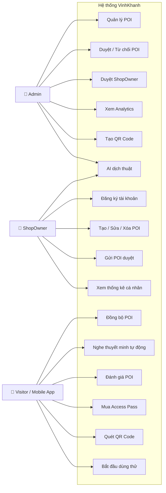

---
## 5. Mô hình dữ liệu (ERD)

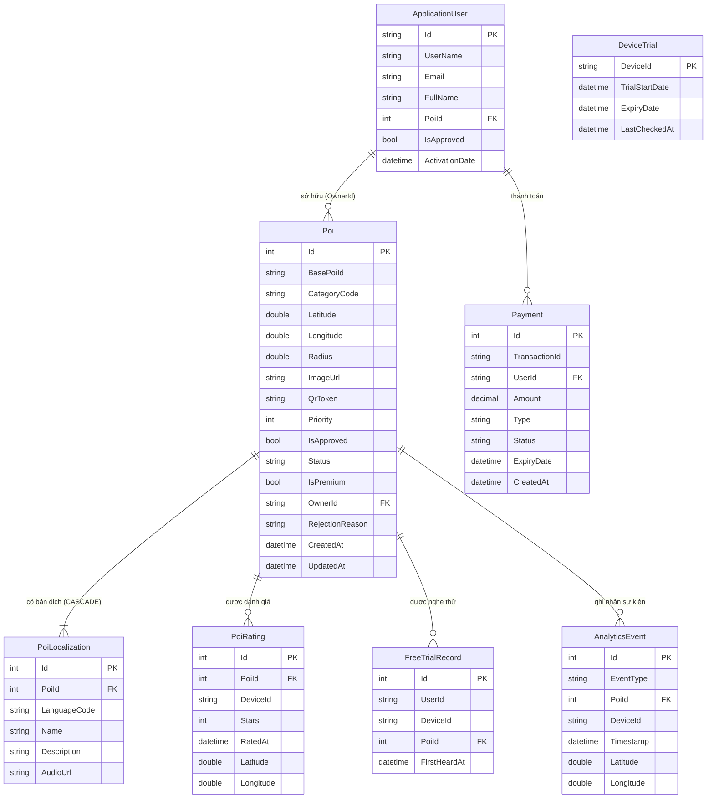

---
## 6. Class Diagram

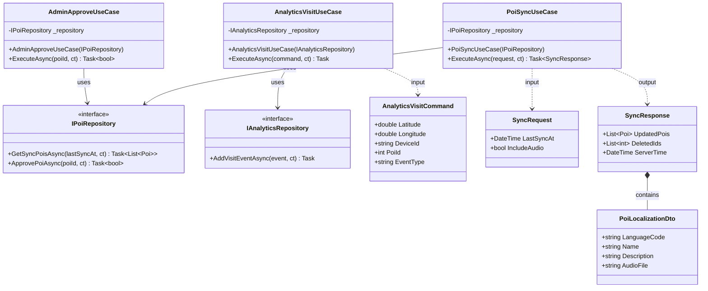

---
## 7. Sequence Diagrams

### 7.1 Đăng nhập & Đăng ký

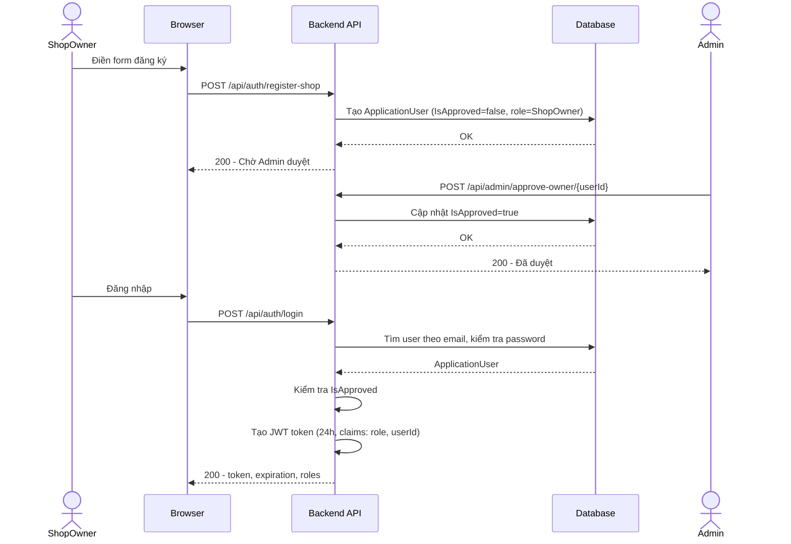

### 7.2 Tạo & Duyệt POI

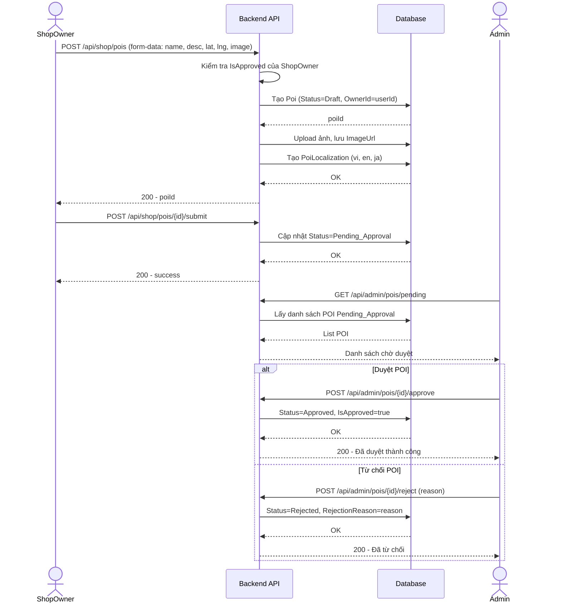

### 7.3 Đồng bộ Mobile

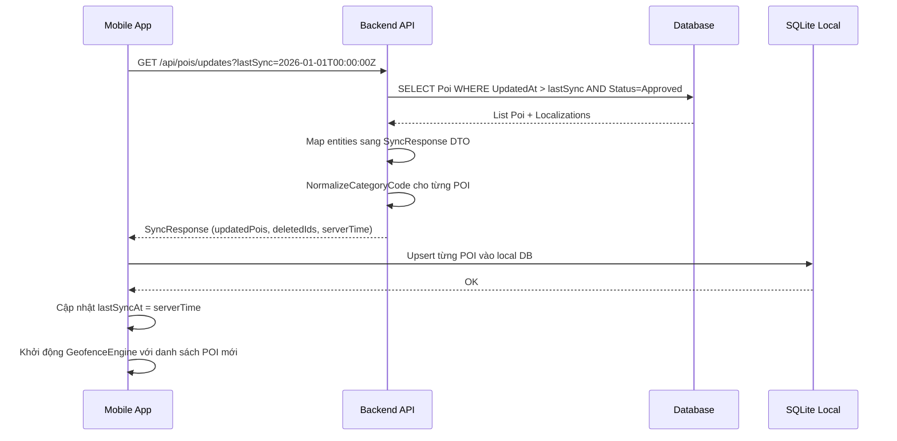

### 7.4 Thuyết minh tự động

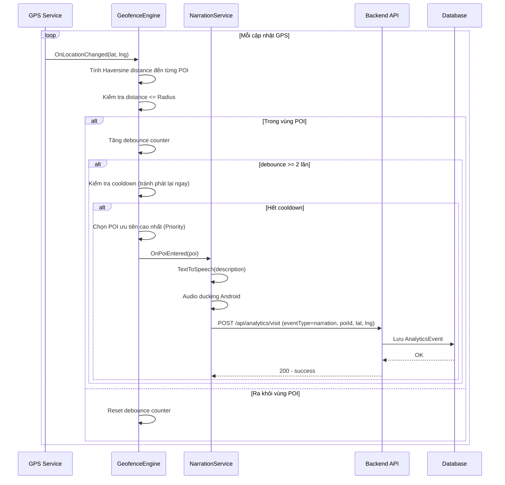

### 7.5 AI dịch thuật

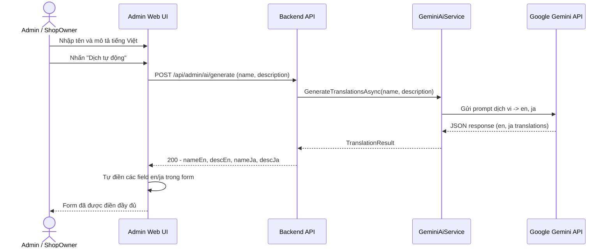

### 7.6 Kiểm soát truy cập

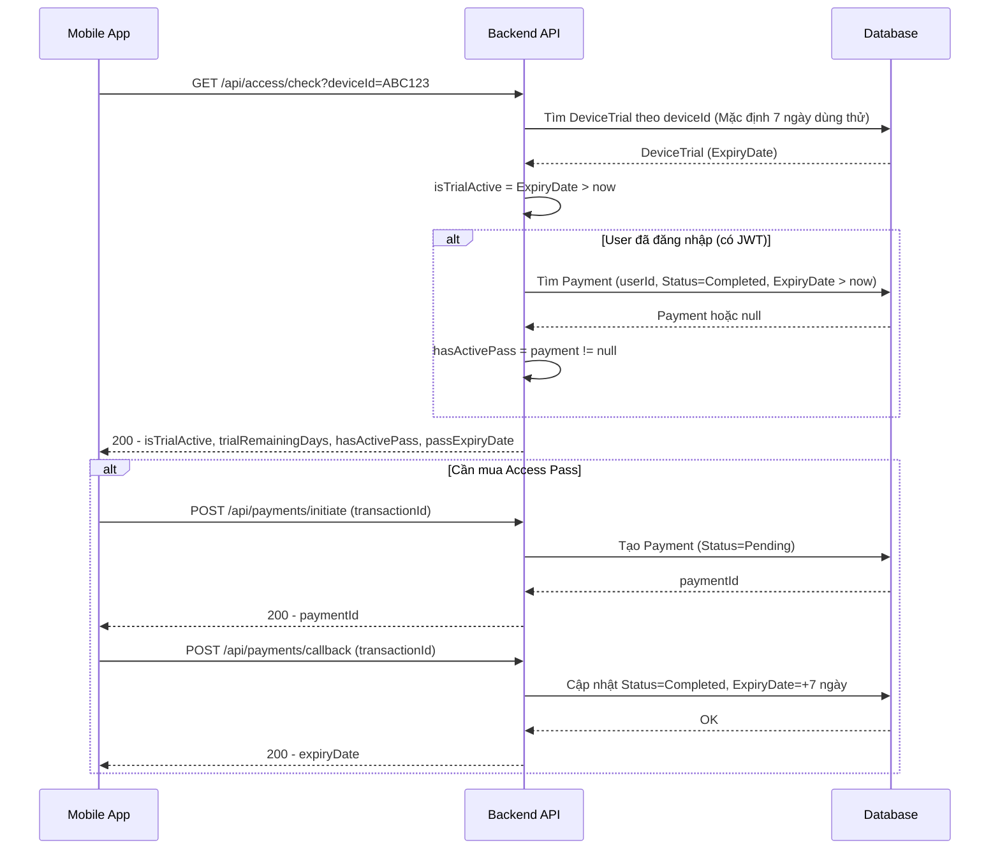

### 7.7 Quét QR

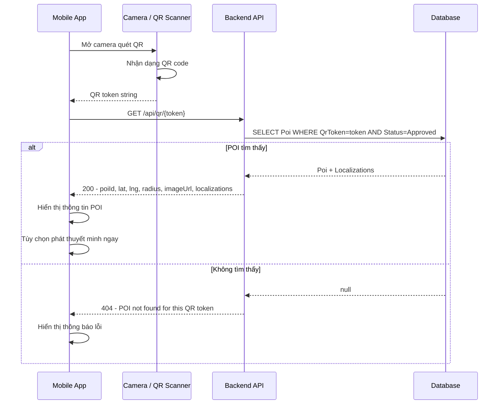

### 7.8 Đánh giá POI

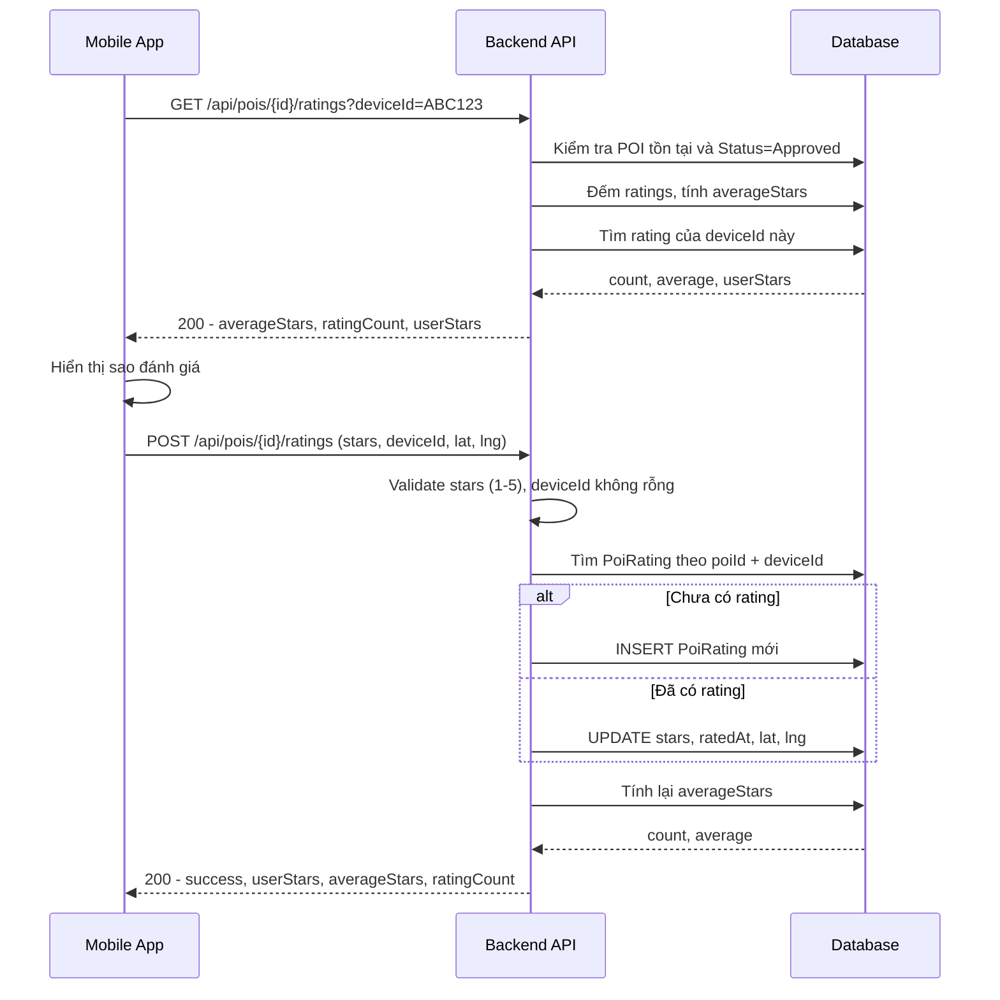

---
## 8. Activity Diagrams

### 8.1 Vòng đời POI


### 8.2 GeofenceEngine

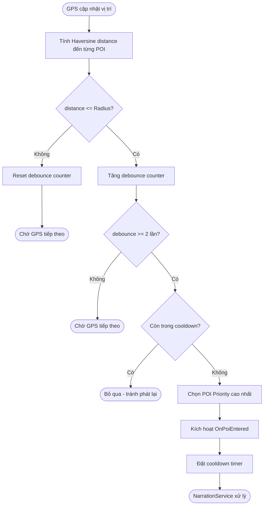

### 8.3 Kiểm soát truy cập Visitor

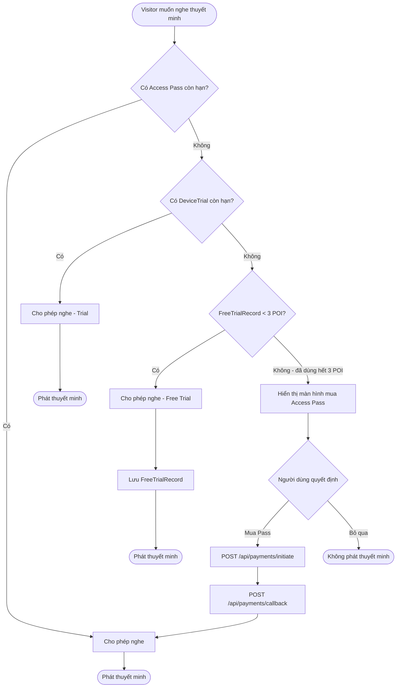

### 8.4 NarrationService


### 8.5 Đồng bộ dữ liệu Mobile


### 8.6 Quy trình xử lý Analytics

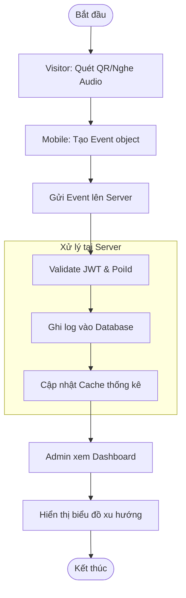

---
## 9. API Reference

### 9.1 Auth API

Base path: `/api/auth` | Không yêu cầu xác thực

| Method | Endpoint | Mô tả |
|--------|----------|-------|
| POST | `/api/auth/login` | Đăng nhập, nhận JWT token |
| POST | `/api/auth/register-shop` | Đăng ký tài khoản ShopOwner (chờ duyệt) |
| POST | `/api/auth/register-visitor` | Đăng ký tài khoản Visitor (tự động kích hoạt) |

**Ví dụ: POST /api/auth/login**

Request:
```json
{
  "email": "owner@example.com",
  "password": "Password123!"
}
```

Response `200 OK`:
```json
{
  "token": "eyJhbGciOiJIUzI1NiIsInR5cCI6IkpXVCJ9...",
  "expiration": "2026-04-18T10:00:00Z",
  "roles": ["ShopOwner"]
}
```

Response `403 Forbidden` (chưa được duyệt):
```json
"Tài khoản của bạn đang chờ Admin duyệt."
>>>>>>> Stashed changes
```

---

## 3. Cơ sở dữ liệu

### 3.1 Sơ đồ bảng chính

```
AspNetUsers (Identity)
├── Id (PK)
├── Email, PasswordHash
├── FullName, IsApproved
├── ActivationDate
├── IsPremium, PremiumExpiry
├── ShopName, ShopAddress, ShopPhone
└── PoiId (FK → Pois, nullable)

Pois
├── Id (PK, IDENTITY)
├── BasePoiId (string, unique slug)
├── Latitude, Longitude, Radius
├── CategoryCode (FOOD_STREET | FOOD_SNAIL | FOOD_BBQ | DRINK | UTILITY)
├── Status (0=Draft | 1=Pending_Approval | 2=Approved | 3=Rejected | 4=Hidden)
├── IsApproved (bit, sync với Status)
├── IsPremium (bit)
├── OwnerId (FK → AspNetUsers, nullable)
├── ImageUrl
├── RejectionReason
├── CreatedAt, UpdatedAt
└── Priority

PoiLocalizations
├── Id (PK)
├── PoiId (FK → Pois, CASCADE DELETE)
├── LanguageCode (vi | en | ja)
├── Name, Description
└── AudioUrl (đường dẫn file MP3)

AnalyticsEvents
├── Id (PK)
├── Latitude, Longitude
├── Timestamp
├── DeviceId
├── PoiId (FK → Pois, nullable)
└── EventType (visit | narration)

FreeTrialRecords
├── Id (PK)
├── DeviceId
├── PoiId (FK → Pois)
└── FirstHeardAt

Payments
├── Id (PK)
├── UserId (FK → AspNetUsers)
├── TransactionId (UNIQUE)
├── Amount, Currency
└── CreatedAt
```

### 3.2 Phân quyền người dùng

| Role | Quyền |
|---|---|
| **Admin** | Toàn quyền: quản lý POI, duyệt, xem analytics, quản lý users |
| **ShopOwner** | Tạo/sửa/xóa POI của mình, xem thống kê POI của mình |
| **Visitor** | Chỉ đọc: sync POI, nghe thuyết minh |

---

## 4. Luồng hoạt động

### 4.1 Luồng đăng ký & duyệt tài khoản ShopOwner

```
ShopOwner                    Backend                    Admin
    │                           │                          │
    │── POST /api/auth/         │                          │
    │   register-shop ─────────►│                          │
    │                           │ Tạo user, IsApproved=false│
    │◄── 200 "Chờ duyệt" ───────│                          │
    │                           │                          │
    │                           │◄── GET /api/admin/       │
    │                           │    shop-owners ──────────│
    │                           │──► Danh sách chờ duyệt ──►│
    │                           │                          │
    │                           │◄── POST /api/admin/      │
    │                           │    approve/{userId} ─────│
    │                           │ IsApproved = true        │
    │                           │──► 200 OK ───────────────►│
    │                           │                          │
    │── POST /api/auth/login ──►│                          │
    │◄── JWT Token ─────────────│                          │
```

### 4.2 Luồng tạo & duyệt POI

```
ShopOwner                    Backend                    Admin
    │                           │                          │
    │── POST /api/shop/pois ───►│                          │
    │   (form: tên, mô tả,      │ Status = Pending_Approval│
    │    ảnh, tọa độ, AI dịch)  │                          │
    │◄── 200 {poiId} ───────────│                          │
    │                           │                          │
    │                           │◄── GET /api/admin/       │
    │                           │    pois/pending ─────────│
    │                           │──► Danh sách chờ duyệt ──►│
    │                           │                          │
    │                           │◄── POST /api/admin/      │
    │                           │    pois/{id}/approve ────│
    │                           │ Status = Approved        │
    │                           │ IsApproved = true        │
    │                           │──► 200 OK ───────────────►│
    │                           │                          │
    │                           │◄── POST /api/admin/      │
    │                           │    pois/{id}/reject ─────│
    │                           │ Status = Rejected        │
    │                           │ RejectionReason = "..."  │
```

### 4.3 Luồng đồng bộ Mobile App

```
Mobile App                   Backend                  SQL Server
    │                           │                          │
    │ Khởi động app             │                          │
    │── GET /api/pois/updates   │                          │
    │   ?lastSync=<timestamp>   │                          │
    │   &includeAudio=true ────►│                          │
    │                           │── SELECT Pois WHERE      │
    │                           │   Status=Approved AND    │
    │                           │   UpdatedAt > lastSync ─►│
    │                           │◄── Danh sách POI ────────│
    │◄── SyncResponse ──────────│                          │
    │   {updatedPois, deletedIds│                          │
    │    serverTime}            │                          │
    │                           │                          │
    │ Lưu vào SQLite local      │                          │
    │ (vinhkhanh.db)            │                          │
```

### 4.4 Luồng thuyết minh tự động (Geofence)

```
Mobile App (Background)
    │
    │ GPS cập nhật vị trí liên tục
    │
    ▼
GeofenceService.CheckGeofencesAsync(lat, lon)
    │
    │ Duyệt qua tất cả POI trong SQLite
    │ Tính khoảng cách Haversine
    │
    ├── Khoảng cách ≤ Radius POI?
    │       │
    │       ▼ YES
    │   NarrationEngine.EnqueueAsync(poi)
    │       │
    │       ├── Đang cooldown (20 phút)? → Bỏ qua
    │       ├── Đã trong queue? → Bỏ qua
    │       │
    │       ▼
    │   PlayNextAsync()
    │       │
    │       ├── Có AudioPath (MP3)? → PlayAudioAsync()
    │       └── Không có? → TextToSpeech.SpeakAsync()
    │               │
    │               └── Locale: LanguageCode POI → Preferences → System
    │
    └── POST /api/analytics/visit
        {eventType: "narration", poiId, deviceId}
```

### 4.5 Luồng AI dịch thuật

```
Admin/ShopOwner UI           Backend                  Gemini API
    │                           │                          │
    │ Nhập tên + mô tả tiếng Việt│                         │
    │── POST /api/admin/ai/     │                          │
    │   generate (hoặc          │                          │
    │   /api/shop/ai/generate) ►│                          │
    │                           │── POST Gemini API ───────►│
    │                           │   Prompt: dịch vi→en,ja  │
    │                           │◄── JSON {en, ja} ────────│
    │◄── {nameEn, descEn,       │                          │
    │     nameJa, descJa} ──────│                          │
    │                           │                          │
    │ Tự động điền form         │                          │
```

---

## 5. API Reference

### 5.1 Authentication

| Method | Endpoint | Auth | Mô tả |
|---|---|---|---|
| POST | `/api/auth/login` | Public | Đăng nhập, trả về JWT |
| POST | `/api/auth/register-shop` | Public | Đăng ký chủ quán |
| POST | `/api/auth/register-visitor` | Public | Đăng ký du khách |

**Login Response:**
```json
{
  "token": "eyJhbGci...",
  "expiration": "2026-04-05T07:30:49Z",
  "roles": ["Admin"]
}
```

### 5.2 Admin API (`/api/admin/*`)

> Yêu cầu: `Authorization: Bearer <token>` + Role = Admin

| Method | Endpoint | Mô tả |
|---|---|---|
| GET | `/api/admin/pois` | Danh sách tất cả POI |
| GET | `/api/admin/pois/{id}` | Chi tiết POI |
| POST | `/api/admin/pois` | Tạo POI mới |
| PUT | `/api/admin/pois/{id}` | Cập nhật POI |
| GET | `/api/admin/pois/pending` | POI chờ duyệt |
| POST | `/api/admin/pois/{id}/approve` | Duyệt POI |
| POST | `/api/admin/pois/{id}/reject` | Từ chối POI |
| POST | `/api/admin/pois/{id}/hide` | Ẩn POI |
| GET | `/api/admin/dashboard-summary` | Thống kê tổng quan |
| POST | `/api/admin/ai/generate` | AI dịch thuật |

### 5.3 Shop API (`/api/shop/*`)

> Yêu cầu: Role = ShopOwner

| Method | Endpoint | Mô tả |
|---|---|---|
| GET | `/api/shop/pois` | POI của chủ quán |
| GET | `/api/shop/pois/{id}` | Chi tiết POI |
| POST | `/api/shop/pois` | Tạo POI mới |
| PUT | `/api/shop/pois/{id}` | Cập nhật POI |
| DELETE | `/api/shop/pois/{id}` | Xóa POI |
| POST | `/api/shop/ai/generate` | AI dịch thuật |

### 5.4 Mobile Sync API

| Method | Endpoint | Auth | Mô tả |
|---|---|---|---|
| GET | `/api/pois/updates` | Public | Đồng bộ POI |
| POST | `/api/analytics/visit` | Public | Ghi nhận lượt xem |
| GET | `/api/access/check` | Public | Kiểm tra quyền truy cập |

**Sync Request:**
```
GET /api/pois/updates?lastSync=2026-01-01T00:00:00Z&includeAudio=true
```

**Sync Response:**
```json
{
  "updatedPois": [
    {
      "id": 5,
      "basePoiId": "demo-001",
      "latitude": 10.763,
      "longitude": 106.702,
      "radius": 50,
      "isActive": true,
      "isPremium": false,
      "localizations": [
        {
          "languageCode": "vi",
          "name": "Quán Ốc Bà Nam",
          "description": "Quán ốc nổi tiếng...",
          "audioFile": "/media/audio_vi_5.mp3"
        }
      ]
    }
  ],
  "deletedIds": [],
  "serverTime": "2026-04-04T07:00:00Z"
}
```

### 5.5 Analytics API

| Method | Endpoint | Auth | Mô tả |
|---|---|---|---|
| POST | `/api/analytics/visit` | Public | Ghi nhận sự kiện |
| GET | `/api/analytics/heatmap` | Admin | Bản đồ nhiệt |
| GET | `/api/analytics/content-performance` | Admin | Hiệu suất nội dung |

---

## 6. Hạ tầng & Vận hành

### 6.1 Cấu hình server EC2

```
IP:           18.139.184.43
Domain:       enormitpham.me
OS:           Ubuntu 22.04 LTS
Instance:     t3.medium (2 vCPU, 4GB RAM)
Disk:         30GB gp3
Region:       ap-southeast-1 (Singapore)
```

**Các service đang chạy:**

| Service | Mô tả | Lệnh kiểm tra |
|---|---|---|
| `nginx` | Reverse proxy + static files | `sudo systemctl status nginx` |
| `vinhkhanh` | ASP.NET Core API | `sudo systemctl status vinhkhanh` |
| `docker` | SQL Server container | `docker ps` |
| `sqlserver` | SQL Server 2022 | `docker exec sqlserver ...` |

### 6.2 Cấu trúc thư mục trên EC2

```
/home/ubuntu/vinhkhanh/
├── backend/                  # ASP.NET Core publish output
│   ├── VinhKhanh.Admin.dll
│   ├── appsettings.Production.json
│   └── wwwroot/media/        # File ảnh, audio upload
├── frontend/                 # React build output
│   ├── index.html
│   └── assets/
└── app.env                   # Environment variables

/etc/nginx/sites-enabled/vinhkhanh  # Nginx config
/etc/systemd/system/vinhkhanh.service  # Systemd service
```

### 6.3 Environment Variables (`app.env`)

```env
ASPNETCORE_ENVIRONMENT=Production
ASPNETCORE_URLS=http://localhost:5000
DOTNET_ROOT=/home/ubuntu/.dotnet
ConnectionStrings__Default=Server=localhost,1433;Database=VinhKhanhCleanDb;...
AllowedHosts=*
```

### 6.4 Nginx Configuration

```nginx
server {
    listen 80;
    server_name _;

    root /home/ubuntu/vinhkhanh/frontend;

    location / {
        try_files $uri $uri/ /index.html;  # SPA routing
    }

    location /api/ {
        proxy_pass http://localhost:5000;  # Backend API
    }

    location /media/ {
        proxy_pass http://localhost:5000;  # Media files
    }
}
```

---

<<<<<<< Updated upstream
## 7. Hướng dẫn vận hành

### 7.1 Deploy cập nhật

```powershell
# Từ máy local Windows
.\deploy\deploy.ps1

# Script sẽ tự động:
# 1. Build backend (dotnet publish)
# 2. Build frontend (npm run build)
# 3. Upload lên EC2 qua SCP (tar.gz)
# 4. Restart service
# 5. Health check
```

### 7.2 Migrate data từ local lên EC2

```powershell
.\deploy\migrate-data.ps1

# Script sẽ:
# 1. Export Pois + PoiLocalizations + ShopOwners từ SQL Server local
# 2. Tạo SQL INSERT script
# 3. Upload và chạy trên EC2
```

### 7.3 SSH vào server

```bash
ssh -i "C:\Users\phamq\Documents\key\cs.pem" ubuntu@18.139.184.43
```

### 7.4 Xem logs

```bash
# API logs
sudo journalctl -u vinhkhanh -n 50 --no-pager

# Nginx logs
sudo tail -50 /var/log/nginx/error.log

# SQL Server logs
docker logs sqlserver --tail 20
```

### 7.5 Restart services

```bash
# Restart API
sudo systemctl restart vinhkhanh

# Restart Nginx
sudo systemctl reload nginx

# Restart SQL Server
docker restart sqlserver
```

### 7.6 Chạy SQL trực tiếp trên EC2

```bash
# Kết nối SQL Server
docker exec -it sqlserver /opt/mssql-tools18/bin/sqlcmd \
  -S localhost -U sa -P 'VinhKhanh@Ec2Strong2026!' -C -d VinhKhanhCleanDb

# Hoặc chạy file SQL
docker cp myfile.sql sqlserver:/myfile.sql
docker exec sqlserver /opt/mssql-tools18/bin/sqlcmd \
  -S localhost -U sa -P 'VinhKhanh@Ec2Strong2026!' -C -i /myfile.sql
```

### 7.7 Build & cài APK lên Android

```powershell
# Build Release APK
dotnet publish VinhKhanhFoodStreet.csproj -f net10.0-android -c Release

# Cài lên thiết bị qua ADB
$adb = "$env:USERPROFILE\AppData\Local\Android\Sdk\platform-tools\adb.exe"
& $adb install -r "bin\Release\net10.0-android\com.companyname.vinhkhanhfoodstreet-Signed.apk"
=======
*Tài liệu được cập nhật lần cuối: 2026.*

---

## 10. Hướng dẫn cài đặt nhanh (Quick Start)

### 10.1 Yêu cầu hệ thống
- **.NET SDK**: Phiên bản và 10.0 (cho Mobile).
- **Node.js**: Phiên bản 18.x trở lên.
- **Android SDK**: Để chạy ứng dụng .NET MAUI.
- **IDE**: Visual Studio 2022 (với Workload .NET MAUI) hoặc VS Code.

### 10.2 Chạy ứng dụng bằng Script (Ưu tiên)
Dự án cung cấp sẵn hai script PowerShell để khởi động nhanh:
- **Admin & API**: Chạy `powershell ./run-admin.ps1`
- **Mobile App**: Chạy `powershell ./run-mobile-fast.ps1` (Yêu cầu đã mở sẵn Emulator).

### 10.3 Chạy thủ công từng phần

#### 1. Backend (API)
```bash
cd VinhKhanh.Admin
dotnet restore
dotnet run
# API sẽ chạy tại: http://localhost:5000
# Swagger: http://localhost:5000/swagger
```

#### 2. Admin UI (React)
```bash
cd VinhKhanh.Admin.Ui
npm install
npm run dev
# Dashboard sẽ chạy tại: http://localhost:5173
```

#### 3. Mobile App (.NET MAUI)
```bash
cd VinhKhanh.Mobile
dotnet build -c Debug -f net10.0-android
# Sau đó cài đặt APK vào thiết bị/emulator qua adb
>>>>>>> Stashed changes
```

---

<<<<<<< Updated upstream
## 8. Tài khoản mặc định

| Tài khoản | Email | Mật khẩu | Role |
|---|---|---|---|
| Admin | `admin@vinhkhanh.vn` | `Admin123!` | Admin |
| ShopOwner demo 1 | `shopowner1@vinhkhanh.vn` | `ShopOwner@123` | ShopOwner |
| ShopOwner demo 2 | `shopowner2@vinhkhanh.vn` | `ShopOwner@123` | ShopOwner |

---

## 9. Cấu hình Mobile App

### 9.1 API URL

File `Configuration/AppConfig.cs`:

```csharp
public static string BaseApiUrl =>
#if DEBUG
    DeviceInfo.Platform == Android ? "http://10.0.2.2:5000/" : "http://localhost:5000/";
#else
    "https://enormitpham.me/";  // Production
#endif
```

- **Debug** (emulator): `http://10.0.2.2:5000/` (loopback Android → máy host)
- **Release** (thiết bị thật): `https://enormitpham.me/`

### 9.2 Ngôn ngữ hỗ trợ

| Code | Ngôn ngữ |
|---|---|
| `vi` | Tiếng Việt |
| `en` | Tiếng Anh |
| `ja` | Tiếng Nhật |

### 9.3 Chế độ đồng bộ

- **Full sync**: Tải cả text + audio MP3
- **Text-only mode**: Khi dung lượng trống < 200MB, chỉ tải text, dùng TTS thay MP3

---

## 10. Xử lý sự cố thường gặp

| Triệu chứng | Nguyên nhân | Cách xử lý |
|---|---|---|
| API trả về 400 "Invalid Hostname" | `AllowedHosts` không bao gồm `localhost` | Thêm `AllowedHosts=*` vào `app.env` |
| API trả về 500 "Invalid column name" | DB thiếu cột mới từ migration | Chạy ALTER TABLE thủ công hoặc `dotnet ef database update` |
| Service crash loop | Connection string sai hoặc DB chưa tạo | Kiểm tra `app.env`, tạo DB trong Docker |
| White screen trên browser | Assets 404 hoặc JS runtime error | Kiểm tra permissions `chmod -R o+rx ~/vinhkhanh/frontend` |
| Mobile không sync được | URL hardcode `10.0.2.2` trong Release | Build với `-c Release` để dùng `AppConfig` production URL |
| Login 403 "Chờ duyệt" | `IsApproved = false` | Admin duyệt tài khoản trong trang Approvals |
=======
## 11. Cấu hình hệ thống (Configuration)

Các cấu hình quan trọng nằm trong tệp `VinhKhanh.Admin/appsettings.json`:

### 11.1 Google Gemini AI
Cần có API Key từ [Google AI Studio](https://aistudio.google.com/) để sử dụng tính năng dịch thuật:
```json
"Gemini": {
  "ApiKey": "YOUR_GEMINI_API_KEY",
  "Model": "gemini-pro"
}
```

### 11.2 Cơ sở dữ liệu
Mặc định hệ thống sử dụng SQLite để phát triển nhanh. Bạn có thể thay đổi sang PostgreSQL trong `ConnectionStrings`:
```json
"ConnectionStrings": {
  "DefaultConnection": "Data Source=vinhkhanh.db"
}
```

### 11.3 JWT Security
Cấu hình Token bảo mật cho hệ thống đăng nhập:
```json
"JwtSettings": {
  "Secret": "A_VERY_SECRET_KEY_MIN_32_CHARS",
  "Issuer": "VinhKhanh",
  "Audience": "VinhKhanhUsers"
}
```

---

## 12. Cấu trúc thư mục (Workspace Structure)

Hệ thống được tổ chức theo mô hình Multi-Project Solution:

```text
VinhKhanh/
├── VinhKhanh.Admin/          # ASP.NET Core Web API (Presentation)
├── VinhKhanh.Admin.Ui/       # React Admin Dashboard (Frontend)
├── VinhKhanh.Mobile/         # .NET MAUI App (Android Presentation)
├── VinhKhanh.Application/    # Business Logic & Use Cases
├── VinhKhanh.Domain/         # Entities, Interfaces & Domain Exceptions
├── VinhKhanh.Infrastructure/ # Data Access, AI Service & Utilities
├── VinhKhanh.Shared/         # DTOs & Constants dùng chung
├── VinhKhanh.Tests/          # Unit & Integration Tests
└── Docs.md                   # Tài liệu chi tiết kỹ thuật
```

---

## 13. Luồng phát triển (Dev Workflow)

Quy trình chuẩn khi phát triển tính năng mới:
1.  **Định nghĩa thực thể**: Thêm Entity mới vào `VinhKhanh.Domain`.
2.  **Cấu hình DB**: Cập nhật `VinhKhanhDbContext` trong `Infrastructure` và chạy `dotnet ef migrations add`.
3.  **Viết Logic**: Tạo UseCase trong `VinhKhanh.Application`.
4.  **Expose API**: Tạo Controller trong `VinhKhanh.Admin`.
5.  **Cập nhật UI**: Thêm View/Component trong `VinhKhanh.Admin.Ui`.
6.  **Mobile Sync**: Cập nhật logic đồng bộ trong `VinhKhanh.Mobile`.

---

## 14. Tầm nhìn & Roadmap

### 14.1 Tầm nhìn
Trở thành nền tảng du lịch ẩm thực số 1 cho các khu phố đi bộ tại Việt Nam, giúp số hóa trải nghiệm thực tế thông qua Audio Tour và AI.

### 14.2 Roadmap phát triển
- [ ] **Giai đoạn 1**: Hoàn thiện lõi Geofence và AI Translation (Hiện tại).
- [ ] **Giai đoạn 2**: Tích hợp thanh toán QR qua Momo, VNPAY cho Access Pass.
- [ ] **Giai đoạn 3**: Hệ thống tư vấn lộ trình du lịch cá nhân hóa (Personalized Itinerary).
- [ ] **Giai đoạn 4**: Hỗ trợ môi trường thực tế ảo tăng cường (AR - Augmented Reality).

---

>>>>>>> Stashed changes
