# VinhKhanh — Tài liệu PRD Hệ thống Du lịch Ẩm thực Thông minh

> **Phiên bản:** 1.0 | **Ngày:** 24/04/2026 | **Tác giả:** Kiro AI (từ source code thực tế)

---

## Mục lục

1. [Tổng quan dự án](#1-tổng-quan-dự-án)
2. [Kiến trúc hệ thống](#2-kiến-trúc-hệ-thống)
3. [Danh sách chức năng hệ thống](#3-danh-sách-chức-năng-hệ-thống)
4. [Use Case Diagram tổng quan](#4-use-case-diagram-tổng-quan)
5. [Class Diagram tổng quan](#5-class-diagram-tổng-quan)
6. [ERD tổng quan](#6-erd-tổng-quan)
7. [Sequence Diagrams theo chức năng](#7-sequence-diagrams-theo-chức-năng)
8. [Activity Diagrams theo chức năng](#8-activity-diagrams-theo-chức-năng)

---

## 1. Tổng quan dự án

**VinhKhanh** là nền tảng du lịch ẩm thực thông minh (Food Street / POI — Point of Interest) cho phép du khách khám phá các điểm ăn uống đặc sắc thông qua thuyết minh tự động khi đến gần địa điểm. Hệ thống gồm ba thành phần chính:

| Thành phần | Công nghệ | Mô tả |
|---|---|---|
| **VinhKhanh.Admin** | ASP.NET Core 10 Web API | Backend API chính, xử lý toàn bộ nghiệp vụ |
| **VinhKhanh.Admin.Ui** | React + Vite + TailwindCSS | Giao diện quản trị cho Admin và ShopOwner |
| **VinhKhanh.Mobile** | .NET MAUI Android | Ứng dụng mobile cho Visitor |
| **VinhKhanh.Application** | C# Class Library | Use Cases (Clean Architecture) |
| **VinhKhanh.Domain** | C# Class Library | Entities + Interfaces |
| **VinhKhanh.Infrastructure** | EF Core + SQLite/PostgreSQL | Repository, GeminiAiService, EncryptionUtility |
| **VinhKhanh.Shared** | C# Class Library | DTOs dùng chung (SyncRequest, SyncResponse, Haversine) |

### Thuật ngữ

| Thuật ngữ | Ý nghĩa |
|---|---|
| **POI** | Point of Interest — điểm tham quan / quán ăn đăng ký trên hệ thống |
| **PoiStatus** | Enum vòng đời POI: `Draft=0`, `Pending_Approval=1`, `Approved=2`, `Rejected=3`, `Hidden=4` |
| **ShopOwner** | Chủ quán — role cần Admin duyệt (`IsApproved=true`) trước khi sử dụng |
| **Admin** | Quản trị viên — toàn quyền quản lý POI, người dùng, analytics |
| **Visitor** | Du khách — dùng thử 3 POI miễn phí hoặc mua Access Pass |
| **DeviceTrial** | Bản ghi dùng thử 7 ngày gắn với `DeviceId` (PK) |
| **FreeTrialRecord** | Bản ghi lần đầu nghe thuyết minh một POI (giới hạn 3 POI miễn phí) |
| **AccessPass** | Gói trả phí 7 ngày (`PaymentType.AccessPass`) cho phép nghe không giới hạn |
| **GeofenceEngine** | Dịch vụ mobile phát hiện khi người dùng vào vùng bán kính POI (Haversine + Debounce + Cooldown) |
| **NarrationService** | Dịch vụ mobile phát thuyết minh (MP3 qua `MediaElement` hoặc TTS) |
| **GeminiAiService** | Dịch vụ backend gọi Google Gemini API dịch vi → en, ja |
| **QrToken** | Mã token duy nhất dạng `poi-{guid}` (20 ký tự) gắn với POI |
| **AnalyticsEvent** | Sự kiện ghi nhận lượt xem (`visit`) hoặc lượt nghe thuyết minh (`narration`) |
| **BasePoiId** | ID gốc dùng để gom nhóm đa ngôn ngữ của cùng một quán trong SQLite mobile |

---

## 2. Kiến trúc hệ thống

### 2.1 Clean Architecture

```
┌─────────────────────────────────────────────────────────────────┐
│                      Presentation Layer                          │
│  VinhKhanh.Admin (ASP.NET Core 10 Web API — Controllers)        │
│  VinhKhanh.Admin.Ui (React + Vite + TailwindCSS)                │
│  VinhKhanh.Mobile (.NET MAUI Android — Pages + ViewModels)      │
├─────────────────────────────────────────────────────────────────┤
│                      Application Layer                           │
│  VinhKhanh.Application/UseCases/                                │
│    AdminApproveUseCase.ExecuteAsync(poiId)                      │
│    AnalyticsVisitUseCase.ExecuteAsync(command)                  │
│    PoiSyncUseCase.ExecuteAsync(request)                         │
├─────────────────────────────────────────────────────────────────┤
│                       Domain Layer                               │
│  VinhKhanh.Domain/Entities/ — Poi, ApplicationUser, Payment...  │
│  VinhKhanh.Domain/Interfaces/ — IPoiRepository, IAnalyticsRepo  │
├─────────────────────────────────────────────────────────────────┤
│                    Infrastructure Layer                          │
│  VinhKhanh.Infrastructure/Data/AppDbContext.cs (EF Core)        │
│  VinhKhanh.Infrastructure/Repositories/PoiRepository.cs         │
│  VinhKhanh.Infrastructure/Repositories/AnalyticsRepository.cs   │
│  VinhKhanh.Infrastructure/Services/GeminiAiService.cs           │
│  VinhKhanh.Infrastructure/Security/EncryptionUtility.cs         │
└─────────────────────────────────────────────────────────────────┘
```

### 2.2 Luồng dữ liệu tổng quát

```
Mobile App ──GET /api/pois/updates──► Backend API ──EF Core──► Database
                                           │
                                    GeminiAiService ──► Google Gemini API
                                           │
Admin Web UI ──REST API──► Backend API
                                           │
                                    SignalR Hub ──► Admin Dashboard (Realtime)
```

---

## 3. Danh sách chức năng hệ thống

### 3.1 Xác thực & Phân quyền (`AuthController`)

| # | Chức năng | Endpoint | Hàm xử lý | Mô tả |
|---|---|---|---|---|
| 1 | Đăng nhập JWT | `POST /api/auth/login` | `Login(LoginRequest)` | Xác thực email/password qua `userManager.FindByEmailAsync` + `CheckPasswordAsync`, kiểm tra `IsApproved`, tạo JWT 24h với claims `ClaimTypes.NameIdentifier`, `ClaimTypes.Role`, `ActivationDate` |
| 2 | Đăng ký ShopOwner | `POST /api/auth/register-shop` | `RegisterShop(RegisterShopRequest)` | Tạo `ApplicationUser` với `IsApproved=false`, gán role `ShopOwner` qua `userManager.AddToRoleAsync` |
| 3 | Đăng ký Visitor | `POST /api/auth/register-visitor` | `RegisterVisitor(RegisterVisitorRequest)` | Tạo `ApplicationUser` với `IsApproved=true`, `ActivationDate=DateTime.UtcNow`, gán role `Visitor` |

### 3.2 Quản lý POI — Admin (`AdminController`)

| # | Chức năng | Endpoint | Hàm xử lý | Mô tả |
|---|---|---|---|---|
| 4 | Xem tất cả POI | `GET /api/admin/pois` | `GetPois(CancellationToken)` | Query `dbContext.Pois.Include(Localizations).Include(Owner).OrderByDescending(Id)`, gọi `NormalizeCategoryCode()` cho từng POI |
| 5 | Xem POI chờ duyệt | `GET /api/admin/pois/pending` | `GetPendingPois(CancellationToken)` | Lọc `p.Status == PoiStatus.Pending_Approval`, sắp xếp `OrderBy(CreatedAt)` |
| 6 | Xem chi tiết POI | `GET /api/admin/pois/{poiId}` | `GetPoiById(int, CancellationToken)` | Trả kèm `qrLink = BuildQrLink(poi.QrToken)` |
| 7 | Tạo POI mới | `POST /api/admin/pois` | `CreatePoi(CreatePoiRequest, CancellationToken)` | Tạo `Poi` với `Status=Approved`, `IsApproved=true`, upload ảnh qua `UploadFileAsync()`, tạo 3 `PoiLocalization` (vi/en/ja), sinh `QrToken = "poi-{Guid:N}"[..20]` |
| 8 | Cập nhật POI | `PUT /api/admin/pois/{poiId}` | `UpdatePoi(int, CreatePoiRequest, CancellationToken)` | Gọi `UpsertLocalization()` cho 3 ngôn ngữ, upload ảnh mới nếu có |
| 9 | Duyệt POI | `POST /api/admin/pois/{poiId}/approve` | `Approve(int, CancellationToken)` | Set `poi.Status = PoiStatus.Approved`, `poi.IsApproved = true`, `poi.UpdatedAt = DateTime.UtcNow` |
| 10 | Từ chối POI | `POST /api/admin/pois/{poiId}/reject` | `RejectPoi(int, RejectPoiRequest, CancellationToken)` | Validate `reason.Length >= 10`, set `Status=Rejected`, `RejectionReason=reason` |
| 11 | Ẩn POI | `POST /api/admin/pois/{poiId}/hide` | `HidePoi(int, CancellationToken)` | Set `Status=Hidden`, `IsApproved=false` |
| 12 | Xóa POI | `DELETE /api/admin/pois/{poiId}` | `DeletePoi(int, CancellationToken)` | `dbContext.Pois.Remove(poi)` — Cascade xóa Localizations và Ratings |
| 13 | Reset QR Token | `POST /api/admin/pois/{poiId}/reset-qr` | `ResetQrToken(int, CancellationToken)` | Sinh token mới, kiểm tra unique bằng `AnyAsync(p => p.QrToken == token)` |
| 14 | Dashboard summary | `GET /api/admin/dashboard-summary` | `GetDashboardSummary(CancellationToken)` | Đếm POI, visit, narration, online (5 phút), `activitySeries` 8 giờ gần nhất |
| 15 | Duyệt ShopOwner | `POST /api/admin/approve-owner/{userId}` | `ApproveOwner(string)` | Set `user.IsApproved=true` qua `userManager.UpdateAsync` |
| 16 | Từ chối ShopOwner | `POST /api/admin/users/{userId}/reject-owner` | `RejectOwner(string)` | `userManager.DeleteAsync(user)` |
| 17 | Cập nhật ShopOwner | `PUT /api/admin/users/{userId}` | `UpdateOwner(string, UpdateOwnerRequest)` | Cập nhật `FullName`, `PhoneNumber`, xử lý Premium (`None/1Month/6Months/1Year`) |
| 18 | Toggle Premium | `POST /api/admin/users/{userId}/toggle-premium` | `TogglePremium(string)` | Bật/tắt `poi.IsPremium`, set `Priority=100` nếu Premium |
| 19 | AI dịch thuật (Admin) | `POST /api/admin/ai/generate` | `GenerateTranslations(AiTranslationRequest, CancellationToken)` | Gọi `geminiAiService.GenerateTranslationsAsync(name, description)` |

### 3.3 Cổng chủ quán (`ShopController`)

| # | Chức năng | Endpoint | Hàm xử lý | Mô tả |
|---|---|---|---|---|
| 20 | Xem danh sách POI của mình | `GET /api/shop/pois` | `GetMyPois(CancellationToken)` | Lọc `p.OwnerId == CurrentUserId`, kiểm tra `IsApprovedAsync()` |
| 21 | Xem chi tiết POI | `GET /api/shop/pois/{id}` | `GetMyPoi(int, CancellationToken)` | Kiểm tra `p.OwnerId == CurrentUserId` |
| 22 | Tạo POI nháp | `POST /api/shop/pois` | `CreatePoi(CreateShopPoiRequest, CancellationToken)` | Tạo `Poi` với `Status=Draft`, `IsApproved=false`, upload ảnh qua `UploadImageAsync()` |
| 23 | Cập nhật POI | `PUT /api/shop/pois/{id}` | `UpdatePoi(int, CreateShopPoiRequest, CancellationToken)` | Chỉ cho phép khi `Status != Pending_Approval && Status != Approved` |
| 24 | Xóa POI | `DELETE /api/shop/pois/{id}` | `DeletePoi(int, CancellationToken)` | Không xóa khi `Status == Pending_Approval` |
| 25 | Gửi duyệt | `POST /api/shop/pois/{id}/submit` | `SubmitPoi(int, CancellationToken)` | Chỉ cho phép khi `Status == Draft`, chuyển sang `Pending_Approval` |
| 26 | AI dịch thuật (Shop) | `POST /api/shop/ai/generate` | `GenerateAI(ShopAiRequest, CancellationToken)` | Gọi `gemini.GenerateTranslationsAsync()` qua DI |
| 27 | Xem thống kê cá nhân | `GET /api/shop/analytics` | `GetAnalytics(CancellationToken)` | Lọc events 30 ngày, đếm `visit` và `narration` theo từng POI |

### 3.4 Đồng bộ Mobile (`PoisController`)

| # | Chức năng | Endpoint | Hàm xử lý | Mô tả |
|---|---|---|---|---|
| 28 | Sync POI | `GET /api/pois/updates` | `GetUpdates(DateTime lastSync, CancellationToken)` | Gọi `syncUseCase.ExecuteAsync(SyncRequest)` → `PoiRepository.GetSyncPoisAsync(lastSyncAt)` |
| 29 | Sync POI (alias) | `GET /api/pois/sync` | `Sync(DateTime lastSync, CancellationToken)` | Alias của `/updates` |

### 3.5 Analytics (`AnalyticsController`)

| # | Chức năng | Endpoint | Hàm xử lý | Mô tả |
|---|---|---|---|---|
| 30 | Ghi sự kiện | `POST /api/analytics/visit` | `LogVisit(AnalyticsVisitCommand, CancellationToken)` | Gọi `visitUseCase.ExecuteAsync()`, upsert `FreeTrialRecord` nếu `eventType=narration`, gọi `PublishRealtimeUpdateAsync()` qua SignalR |
| 31 | Heatmap | `GET /api/analytics/heatmap` | `GetHeatmap(from, to, CancellationToken)` | Lọc events theo khoảng ngày, gọi `BuildHeatmapPoints()` — tính `density = uniqueDevices * 100 / 121` |
| 32 | Heatmap theo ngày | `GET /api/analytics/heatmap/daily` | `GetHeatmapByDay(date, CancellationToken)` | Lọc theo `DateOnly.TryParse(date)` |
| 33 | Heatmap lịch sử | `GET /api/analytics/heatmap/history` | `GetHeatmapHistory(from, to, CancellationToken)` | Group by `DateOnly.FromDateTime(Timestamp)` |
| 34 | Content performance | `GET /api/analytics/content-performance` | `GetContentPerformance(limit, from, to, CancellationToken)` | Group by `PoiId`, đếm visit/narration, `OrderByDescending(totalNarrations).Take(limit)` |
| 35 | Online count | `GET /api/analytics/online-count` | `GetOnlineCount(CancellationToken)` | Đếm `DeviceId` distinct trong 30 giây, loại `EventType=app_offline` |
| 36 | Realtime overview | `GET /api/analytics/realtime-overview` | `GetRealtimeOverview(CancellationToken)` | Gọi `BuildRealtimePayloadAsync()` — window 10 phút, recency weight |

### 3.6 Kiểm soát truy cập (`AccessController`)

| # | Chức năng | Endpoint | Hàm xử lý | Mô tả |
|---|---|---|---|---|
| 37 | Kiểm tra trạng thái | `GET /api/access/check` | `Check(deviceId, CancellationToken)` | Đếm `FreeTrialRecord` distinct PoiId, kiểm tra `DeviceTrial.ExpiryDate`, kiểm tra `Payment` còn hạn |
| 38 | Bắt đầu dùng thử | `POST /api/access/start-trial` | `StartTrial(deviceId, CancellationToken)` | Tạo `DeviceTrial` với `ExpiryDate = now.AddDays(7)` |

### 3.7 Thanh toán (`PaymentController`)

| # | Chức năng | Endpoint | Hàm xử lý | Mô tả |
|---|---|---|---|---|
| 39 | Khởi tạo giao dịch | `POST /api/payments/initiate` | `Initiate(InitiatePaymentRequest, CancellationToken)` | Tạo `Payment` với `Status=Pending`, kiểm tra `TransactionId` unique |
| 40 | Xác nhận thanh toán | `POST /api/payments/callback` | `Callback(PaymentCallbackRequest, CancellationToken)` | Set `Status=Completed`, `ExpiryDate = CreatedAt.AddDays(7)` nếu `AccessPass`; set `poi.IsPremium=true` nếu `PremiumUpgrade` |
| 41 | Kiểm tra trạng thái | `GET /api/payments/status` | `GetStatus(CancellationToken)` | Tìm `Payment` còn hạn của user hiện tại |

### 3.8 QR Code (`QrController`)

| # | Chức năng | Endpoint | Hàm xử lý | Mô tả |
|---|---|---|---|---|
| 42 | Redirect QR | `GET /qr/{token}` | `OpenPublicPoiPage(string, CancellationToken)` | Redirect sang `{webBaseUrl}/poi/qr/{token}` |
| 43 | Resolve QR | `GET /api/qr/{token}` | `Resolve(string, CancellationToken)` | Tìm `Poi` theo `QrToken` và `Status=Approved`, trả `deepLink = "vinhkhanh://poi/{id}?token=..."` |
| 44 | Tải QR PNG | `GET /api/qr/{token}/png` | `GetQrPng(string, CancellationToken)` | Dùng `QRCodeGenerator` + `PngByteQRCode.GetGraphic(20)` để sinh ảnh PNG |

### 3.9 Đánh giá POI (`PoiRatingsController`)

| # | Chức năng | Endpoint | Hàm xử lý | Mô tả |
|---|---|---|---|---|
| 45 | Xem điểm đánh giá | `GET /api/pois/{poiId}/ratings` | `GetSummary(int, deviceId, CancellationToken)` | Đếm ratings, tính `AverageAsync(r => r.Stars)`, tìm `userStars` theo `deviceId` |
| 46 | Gửi/cập nhật rating | `POST /api/pois/{poiId}/ratings` | `UpsertRating(int, SubmitPoiRatingRequest, CancellationToken)` | Validate `Stars 1-5`, upsert `PoiRating` theo `(poiId, deviceId)` unique index |

### 3.10 Cài đặt hệ thống (`SettingsController`)

| # | Chức năng | Endpoint | Hàm xử lý | Mô tả |
|---|---|---|---|---|
| 47 | Xem cài đặt | `GET /api/admin/settings` | `GetSettings(CancellationToken)` | `dbContext.SystemSettings.ToDictionaryAsync(Key, Value)` |
| 48 | Cập nhật cài đặt | `PUT /api/admin/settings` | `UpdateSettings(Dictionary<string,string>, CancellationToken)` | Upsert từng key-value vào `SystemSettings` |

### 3.11 Mobile Services

| # | Service | Hàm chính | Mô tả |
|---|---|---|---|
| 49 | `GeofenceEngine` | `StartAsync(languageCode)` | Khởi động engine, load POI từ `DatabaseService.GetLocalizedPoisAsync()`, đăng ký `_locationService.LocationChanged += OnLocationChanged` |
| 50 | `GeofenceEngine` | `ProcessLocationAsync(Location)` | Tính `CalculateDistance()` Haversine, phân loại `insideCandidates`/`outsidePois`, gọi `HandleExitedPois()` và `HandleInsidePoisWithPriorityAndDebounce()` |
| 51 | `GeofenceEngine` | `HandleInsidePoisWithPriorityAndDebounce()` | Tăng `_insideStableCounters[poi.Id]`, lọc `>= EnterDebounceThreshold(2)`, kiểm tra `_cooldownUntilUtc`, chọn POI `OrderByDescending(Priority).ThenBy(Id).First()`, kích hoạt `OnPoiEntered?.Invoke(selectedPoi)` |
| 52 | `NarrationService` | `PlayAudioAsync(filePath)` | Gọi `RunExclusiveNarrationAsync()` → `BeginAudioDuckingAsync()` → `PlayWithMediaElementAsync(mediaElement, assetPath, ct)` |
| 53 | `NarrationService` | `SpeakAsync(text, lang)` | Gọi `RunExclusiveNarrationAsync()` → `ResolveBestLocaleAsync()` → `TextToSpeech.Default.SpeakAsync()` |
| 54 | `LocationService` | `StartListeningAsync()` | Xin quyền `LocationWhenInUse`/`LocationAlways`, gọi `AndroidLocationForegroundController.Start()`, chạy `ListenLoopAsync()` |
| 55 | `LocationService` | `ListenLoopAsync(CancellationToken)` | Gọi `_geolocation.GetLocationAsync(GeolocationAccuracy.Best, 15s)`, kiểm tra `ShouldEmitLocationChanged()`, gọi `_analyticsService.TrackActivityAsync()` |
| 56 | `DatabaseService` | `SyncPoisFromServerAsync(CancellationToken)` | Lấy `lastSync` từ `Preferences`, GET `/api/pois/updates?lastSync=...`, gọi `ApplyServerChangesAsync()`, lưu `ServerTime` |
| 57 | `DatabaseService` | `GetLocalizedPoisAsync(langCode)` | Group by `BasePoiId`, gọi `SelectByFallback(variants, targetLang)` — Fallback chain: targetLang → en → vi → Priority cao nhất |
| 58 | `AccessService` | `SyncTrialStatusAsync()` | GET `/api/access/check?deviceId=...`, nếu user mới thì gọi `StartTrialAsync()` → POST `/api/access/start-trial` |
| 59 | `AnalyticsService` | `TrackActivityAsync(lat, lng, eventType, poiId)` | POST `/api/analytics/visit` với `DeviceId = _accessService.DeviceId` |

---
## 4. Use Case Diagram tổng quan

```mermaid
flowchart LR
  Admin["👤 Admin"]
  Shop["👤 ShopOwner"]
  Visitor["👤 Visitor / Mobile App"]

  subgraph Auth["Xác thực"]
    UC_Login["Đăng nhập JWT\nPOST /api/auth/login"]
    UC_RegShop["Đăng ký ShopOwner\nPOST /api/auth/register-shop"]
    UC_RegVisitor["Đăng ký Visitor\nPOST /api/auth/register-visitor"]
  end

  subgraph AdminMgmt["Quản trị (Admin)"]
    UC_ApprovePOI["Duyệt POI\nApprove()"]
    UC_RejectPOI["Từ chối POI\nRejectPoi()"]
    UC_HidePOI["Ẩn POI\nHidePoi()"]
    UC_ManagePOI["CRUD POI\nCreatePoi / UpdatePoi / DeletePoi"]
    UC_ApproveOwner["Duyệt ShopOwner\nApproveOwner()"]
    UC_Dashboard["Dashboard\nGetDashboardSummary()"]
    UC_Settings["Cài đặt hệ thống\nGetSettings / UpdateSettings"]
    UC_ResetQR["Reset QR Token\nResetQrToken()"]
  end

  subgraph ShopMgmt["Cổng chủ quán (ShopOwner)"]
    UC_CreateDraft["Tạo POI nháp\nCreatePoi() Status=Draft"]
    UC_EditPOI["Sửa POI\nUpdatePoi()"]
    UC_DeletePOI["Xóa POI\nDeletePoi()"]
    UC_SubmitPOI["Gửi duyệt\nSubmitPoi() → Pending_Approval"]
    UC_ShopAnalytics["Xem thống kê\nGetAnalytics()"]
  end

  subgraph AI["AI dịch thuật"]
    UC_AI["Dịch vi→en,ja\nGenerateTranslationsAsync()"]
  end

  subgraph MobileFeatures["Mobile (Visitor)"]
    UC_Sync["Đồng bộ POI\nGetUpdates() / SyncPoisFromServerAsync()"]
    UC_Narration["Thuyết minh tự động\nGeofenceEngine + NarrationService"]
    UC_Rating["Đánh giá POI\nUpsertRating()"]
    UC_QR["Quét QR\nResolve() / GetQrPng()"]
    UC_Trial["Dùng thử 7 ngày\nStartTrial()"]
    UC_Payment["Mua Access Pass\nInitiate() + Callback()"]
  end

  subgraph Analytics["Analytics"]
    UC_LogVisit["Ghi sự kiện\nLogVisit() / TrackActivityAsync()"]
    UC_Heatmap["Heatmap\nGetHeatmap()"]
    UC_ContentPerf["Content Performance\nGetContentPerformance()"]
    UC_Realtime["Realtime Dashboard\nSignalR AnalyticsHub"]
  end

  Admin --> UC_Login
  Admin --> UC_ApprovePOI
  Admin --> UC_RejectPOI
  Admin --> UC_HidePOI
  Admin --> UC_ManagePOI
  Admin --> UC_ApproveOwner
  Admin --> UC_Dashboard
  Admin --> UC_Settings
  Admin --> UC_ResetQR
  Admin --> UC_AI
  Admin --> UC_Heatmap
  Admin --> UC_ContentPerf
  Admin --> UC_Realtime

  Shop --> UC_Login
  Shop --> UC_RegShop
  Shop --> UC_CreateDraft
  Shop --> UC_EditPOI
  Shop --> UC_DeletePOI
  Shop --> UC_SubmitPOI
  Shop --> UC_ShopAnalytics
  Shop --> UC_AI

  Visitor --> UC_RegVisitor
  Visitor --> UC_Sync
  Visitor --> UC_Narration
  Visitor --> UC_Rating
  Visitor --> UC_QR
  Visitor --> UC_Trial
  Visitor --> UC_Payment
  Visitor --> UC_LogVisit
```

---

## 5. Class Diagram tổng quan

```mermaid
classDiagram
  %% ─── Domain Entities ───
  class Poi {
    +int Id
    +string BasePoiId
    +string CategoryCode
    +double Latitude
    +double Longitude
    +double Radius
    +string? ImageUrl
    +string? QrToken
    +int Priority
    +bool IsApproved
    +PoiStatus Status
    +bool IsPremium
    +DateTime? PremiumExpiryDate
    +string? OwnerId
    +string? RejectionReason
    +DateTime CreatedAt
    +DateTime UpdatedAt
    +ICollection~PoiLocalization~ Localizations
    +ApplicationUser? Owner
  }

  class PoiLocalization {
    +int Id
    +int PoiId
    +string LanguageCode
    +string Name
    +string Description
    +string? AudioUrl
    +Poi Poi
  }

  class PoiRating {
    +int Id
    +int PoiId
    +string DeviceId
    +int Stars
    +DateTime RatedAt
    +double? Latitude
    +double? Longitude
    +Poi? Poi
  }

  class ApplicationUser {
    +string Id
    +string FullName
    +int? PoiId
    +bool IsApproved
    +DateTime ActivationDate
  }

  class AnalyticsEvent {
    +int Id
    +double Latitude
    +double Longitude
    +DateTime Timestamp
    +string DeviceId
    +int? PoiId
    +string? EventType
  }

  class Payment {
    +int Id
    +string TransactionId
    +string UserId
    +decimal Amount
    +PaymentType Type
    +int? PoiId
    +PaymentStatus Status
    +DateTime? ExpiryDate
    +DateTime CreatedAt
    +ApplicationUser User
  }

  class FreeTrialRecord {
    +int Id
    +string? UserId
    +string? DeviceId
    +int PoiId
    +DateTime FirstHeardAt
  }

  class DeviceTrial {
    +string DeviceId
    +DateTime TrialStartDate
    +DateTime ExpiryDate
    +DateTime? LastCheckedAt
  }

  class SystemSetting {
    +string Key
    +string Value
  }

  class PoiStatus {
    <<enumeration>>
    Draft = 0
    Pending_Approval = 1
    Approved = 2
    Rejected = 3
    Hidden = 4
  }

  class PaymentType {
    <<enumeration>>
    AccessPass = 0
    PremiumUpgrade = 1
  }

  class PaymentStatus {
    <<enumeration>>
    Pending = 0
    Completed = 1
    Failed = 2
    Refunded = 3
  }

  %% ─── Interfaces ───
  class IPoiRepository {
    <<interface>>
    +GetSyncPoisAsync(lastSyncAt, ct) Task~IEnumerable~Poi~~
    +GetByIdAsync(id, ct) Task~Poi?~
    +ApprovePoiAsync(id, ct) Task~bool~
    +GetAllActiveBaseIdsAsync(ct) Task~List~string~~
  }

  class IAnalyticsRepository {
    <<interface>>
    +AddVisitEventAsync(evt, ct) Task
  }

  %% ─── Use Cases ───
  class AdminApproveUseCase {
    -IPoiRepository _repository
    +AdminApproveUseCase(IPoiRepository)
    +ExecuteAsync(poiId, ct) Task~bool~
  }

  class AnalyticsVisitUseCase {
    -IAnalyticsRepository _repository
    +ExecuteAsync(command, ct) Task
    -BuildAnonymousDeviceId(rawDeviceId) string
  }

  class PoiSyncUseCase {
    -IPoiRepository _repository
    +ExecuteAsync(request, ct) Task~SyncResponse~
    -NormalizeCategoryCode(code, name, desc) string
    -InferCategory(name, desc) string
  }

  class AnalyticsVisitCommand {
    +double Latitude
    +double Longitude
    +string DeviceId
    +int? PoiId
    +string? EventType
  }

  class SyncRequest {
    +DateTime LastSyncAt
  }

  class SyncResponse {
    +List~Poi~ UpdatedPois
    +List~int~ DeletedIds
    +List~string~ ActiveBasePoiIds
    +DateTime ServerTime
  }

  %% ─── Infrastructure ───
  class PoiRepository {
    -AppDbContext context
    +GetSyncPoisAsync(lastSyncAt, ct)
    +GetByIdAsync(id, ct)
    +ApprovePoiAsync(id, ct)
    +GetAllActiveBaseIdsAsync(ct)
  }

  class AnalyticsRepository {
    -AppDbContext context
    +AddVisitEventAsync(evt, ct)
  }

  class GeminiAiService {
    -HttpClient _httpClient
    -string _apiKey
    +GenerateTranslationsAsync(name, desc, ct) Task~GeminiTranslationResult?~
    -ExtractJsonPayload(rawText) string
  }

  class EncryptionUtility {
    -byte[] _key
    +EncryptionUtility(key)
    +Encrypt(plainText) string
    +Decrypt(cipherText) string
  }

  class AppDbContext {
    +DbSet~Poi~ Pois
    +DbSet~PoiLocalization~ PoiLocalizations
    +DbSet~AnalyticsEvent~ AnalyticsEvents
    +DbSet~Payment~ Payments
    +DbSet~FreeTrialRecord~ FreeTrialRecords
    +DbSet~DeviceTrial~ DeviceTrials
    +DbSet~PoiRating~ PoiRatings
    +DbSet~SystemSetting~ SystemSettings
    #OnModelCreating(ModelBuilder)
  }

  %% ─── Mobile Services ───
  class GeofenceEngine {
    -const int EnterDebounceThreshold = 2
    -TimeSpan DefaultCooldown = 10min
    -Dictionary~int,int~ _insideStableCounters
    -Dictionary~int,DateTimeOffset~ _cooldownUntilUtc
    -HashSet~int~ _activePoiIds
    -Dictionary~int,POI~ _poiMap
    +event Action~POI~ OnPoiEntered
    +event Action~POI~ OnPoiExited
    +StartAsync(languageCode) Task
    +StopAsync() Task
    +SetLanguageAsync(languageCode) Task
    +RefreshPoisAsync() Task
    +MarkPoiAsPlayed(poiId, cooldown?) void
    -OnLocationChanged(Location) void
    -ProcessLocationAsync(Location) Task
    -HandleExitedPois(outsidePois) void
    -HandleInsidePoisWithPriorityAndDebounce(candidates, now) void
    -RefreshPoisCoreAsync() Task
    -CalculateDistance(lat1,lon1,lat2,lon2) double
  }

  class NarrationService {
    -IAppLanguageService _appLanguageService
    -IAudioQueueManager _audioQueueManager
    +RegisterMediaElement(MediaElement?) void
    +SpeakAsync(text, lang) Task
    +PlayAudioAsync(filePath) Task
    +StopAll() void
    -RunExclusiveNarrationAsync(work) Task
    -SanitizeTtsText(input) string
    -ResolveBestLocaleAsync(languageCode) Task~Locale?~
    -PlayWithMediaElementAsync(mediaElement, assetPath, ct) Task
    -BeginAudioDuckingAsync() Task
    -EndAudioDucking() void
  }

  class LocationService {
    -const double DistanceFilterMeters = 1
    -TimeSpan ActiveInterval = 15s
    -TimeSpan IdleInterval = 15s
    +event Action~Location~ LocationChanged
    +StartListeningAsync() Task
    +StopListeningAsync() Task
    -ListenLoopAsync(CancellationToken) Task
    -ShouldEmitLocationChanged(Location) bool
    -UpdateAdaptiveInterval(Location) void
    -EnsureLocationPermissionsAsync() Task
  }

  class DatabaseService {
    -SQLiteAsyncConnection? _database
    -const string UpdatesEndpoint = "api/pois/updates"
    +InitializeAsync() Task
    +SyncPoisFromServerAsync(ct) Task~bool~
    +GetAllPoisAsync() Task~List~POI~~
    +GetLocalizedPoisAsync(langCode) Task~List~POI~~
    +AddPoiAsync(poi) Task~int~
    +UpdatePoiAsync(poi) Task~int~
    +DeletePoiAsync(poiId) Task~int~
    -ApplyServerChangesAsync(payload, ct) Task
    -SelectByFallback(variants, targetLang) POI?
    -NormalizeLanguageCode(code) string
    -InferCategory(name, desc) string
  }

  class AccessService {
    -const string AccessPassExpiryKey
    -string _deviceId
    +DeviceId string
    +HasActivePass() bool
    +GetExpiryDate() DateTime?
    +GetRemainingDays() int
    +SyncTrialStatusAsync() Task
    -GetPersistentDeviceId() string
    -StartTrialAsync() Task
    +PurchaseSuccess(days) void
  }

  class AnalyticsService {
    +TrackActivityAsync(lat, lng, eventType, poiId?) Task
    +TrackAppLifecycleAsync(status) Task
    -SendAnalyticsEventAsync(lat, lng, eventType, poiId?) Task
  }

  class AudioQueueManager {
    -SemaphoreSlim _queueLock
    -CancellationTokenSource? _currentCts
    +RunExclusiveAsync(work) Task
    +CancelCurrent() void
  }

  class Haversine {
    <<static>>
    +Distance(lat1,lon1,lat2,lon2) double
    -ToRad(deg) double
  }

  %% ─── Relationships ───
  Poi "1" --> "*" PoiLocalization : Localizations (Cascade)
  Poi "*" --> "1" ApplicationUser : Owner (OwnerId FK)
  Poi "1" --> "*" PoiRating : PoiRatings (Cascade)
  Poi "1" --> "*" AnalyticsEvent : PoiId FK
  Poi "1" --> "*" FreeTrialRecord : PoiId FK
  ApplicationUser "1" --> "*" Payment : UserId FK (Cascade)
  Poi --> PoiStatus
  Payment --> PaymentType
  Payment --> PaymentStatus

  AdminApproveUseCase --> IPoiRepository
  PoiSyncUseCase --> IPoiRepository
  AnalyticsVisitUseCase --> IAnalyticsRepository
  PoiSyncUseCase ..> SyncRequest
  PoiSyncUseCase ..> SyncResponse
  AnalyticsVisitUseCase ..> AnalyticsVisitCommand

  PoiRepository ..|> IPoiRepository
  AnalyticsRepository ..|> IAnalyticsRepository
  PoiRepository --> AppDbContext
  AnalyticsRepository --> AppDbContext

  GeofenceEngine --> LocationService
  GeofenceEngine --> DatabaseService
  NarrationService --> AudioQueueManager
  LocationService --> AnalyticsService
  AccessService --> AnalyticsService
  DatabaseService --> Haversine
```

---
## 6. ERD tổng quan

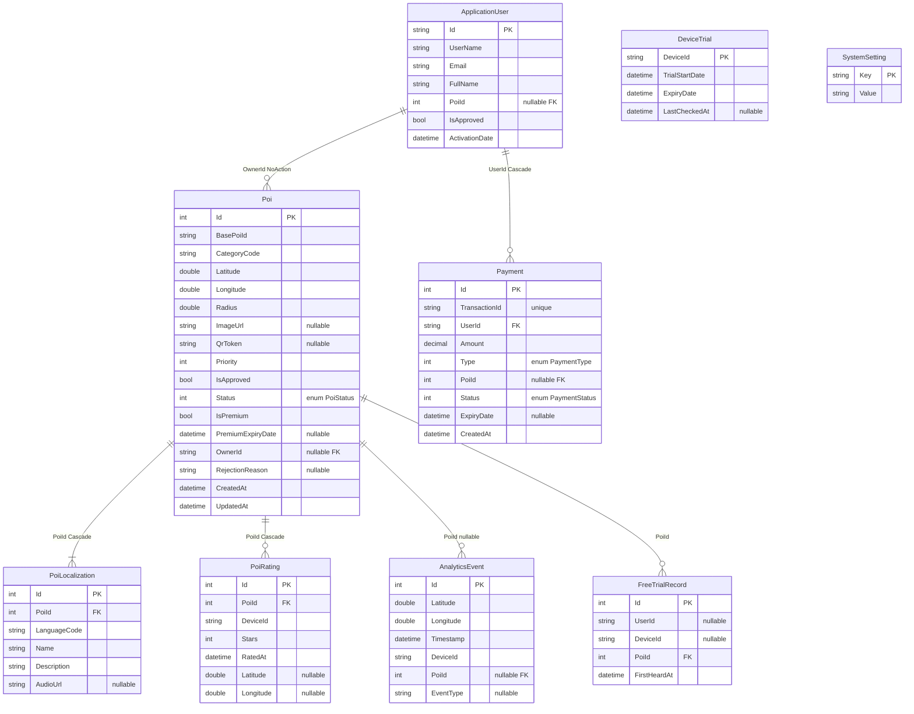

**Ràng buộc quan trọng:**

- `PoiRating`: Unique index `(DeviceId, PoiId)`, Check constraint `Stars >= 1 AND Stars <= 5`
- `FreeTrialRecord`: Unique index `(UserId, PoiId)` khi `UserId IS NOT NULL`, Unique index `(DeviceId, PoiId)` khi `DeviceId IS NOT NULL`
- `Payment`: Unique index `TransactionId`
- `Poi.Status`: Enum `Draft=0, Pending_Approval=1, Approved=2, Rejected=3, Hidden=4`
- `Payment.Type`: Enum `AccessPass=0, PremiumUpgrade=1`
- `Payment.Status`: Enum `Pending=0, Completed=1, Failed=2, Refunded=3`

---

## 7. Sequence Diagrams theo chức năng

### 7.1 Đăng nhập & Đăng ký ShopOwner

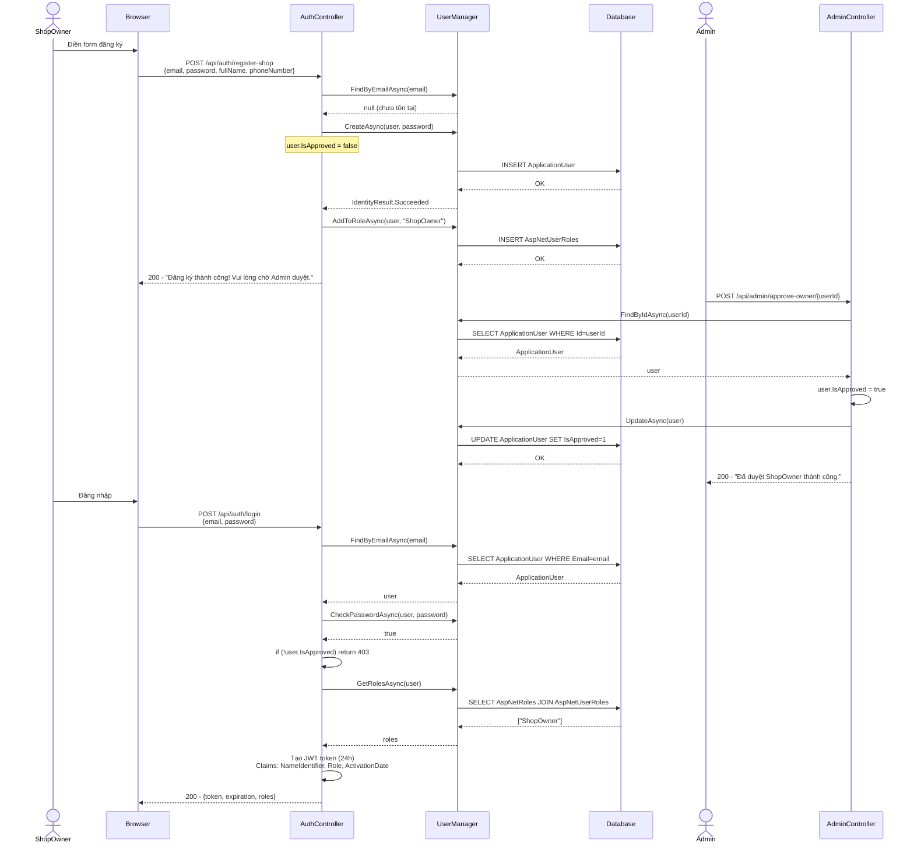

### 7.2 Tạo & Duyệt POI

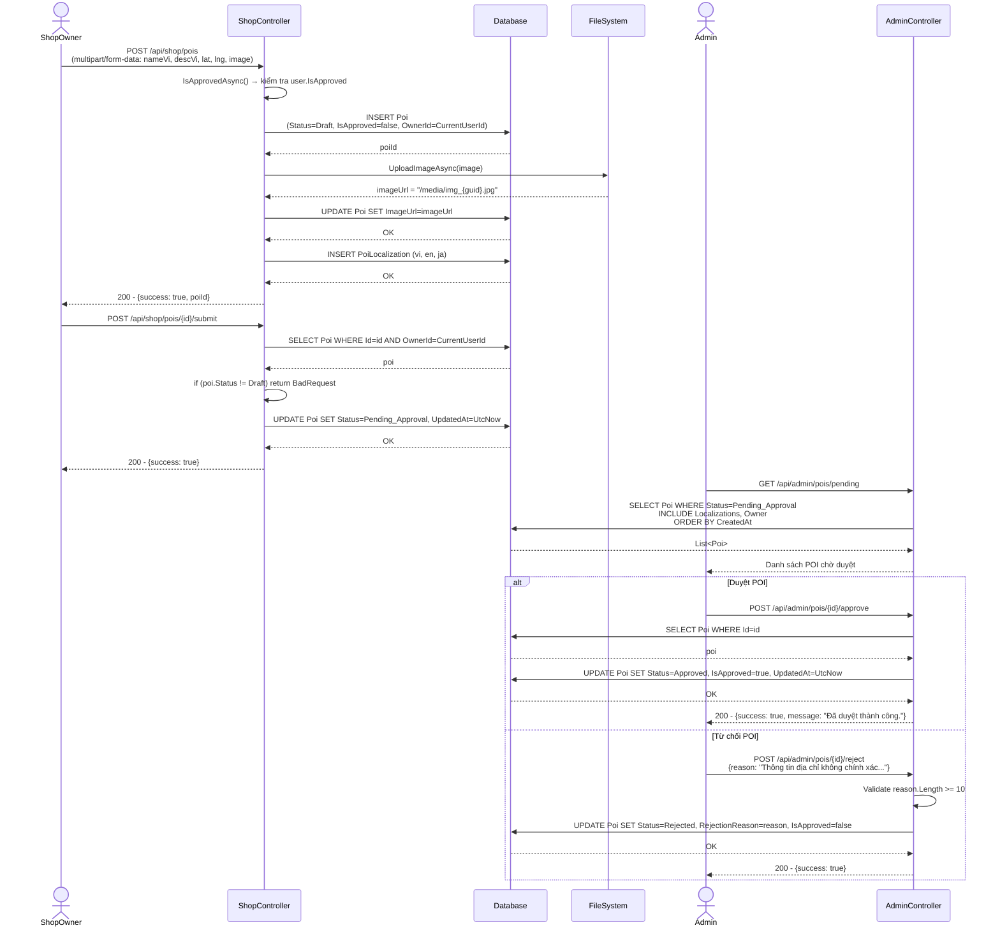

### 7.3 Đồng bộ Mobile

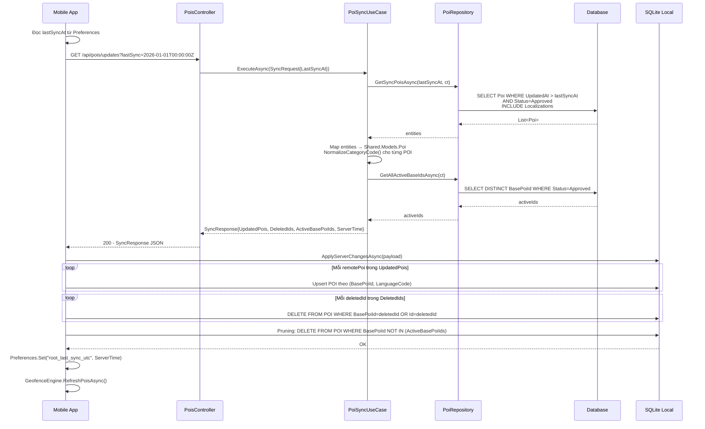

### 7.4 Thuyết minh tự động (GeofenceEngine + NarrationService)

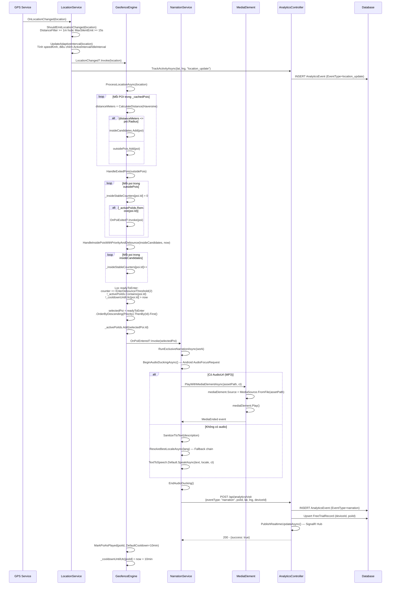

### 7.5 AI dịch thuật

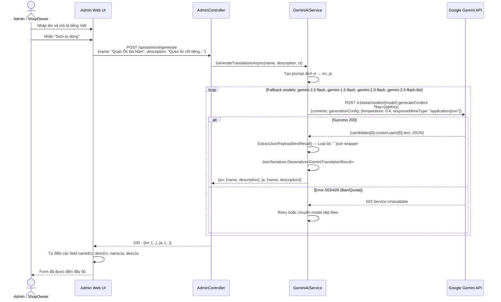

### 7.6 Kiểm soát truy cập

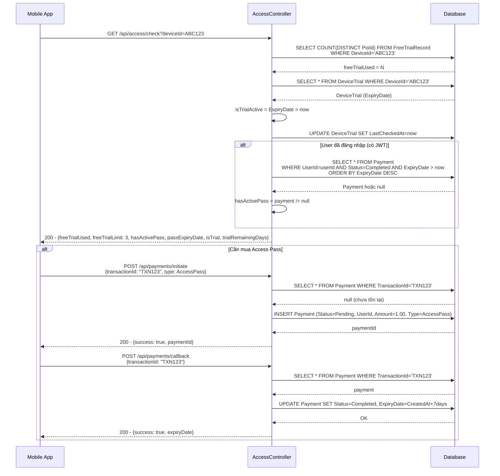

### 7.7 Quét QR

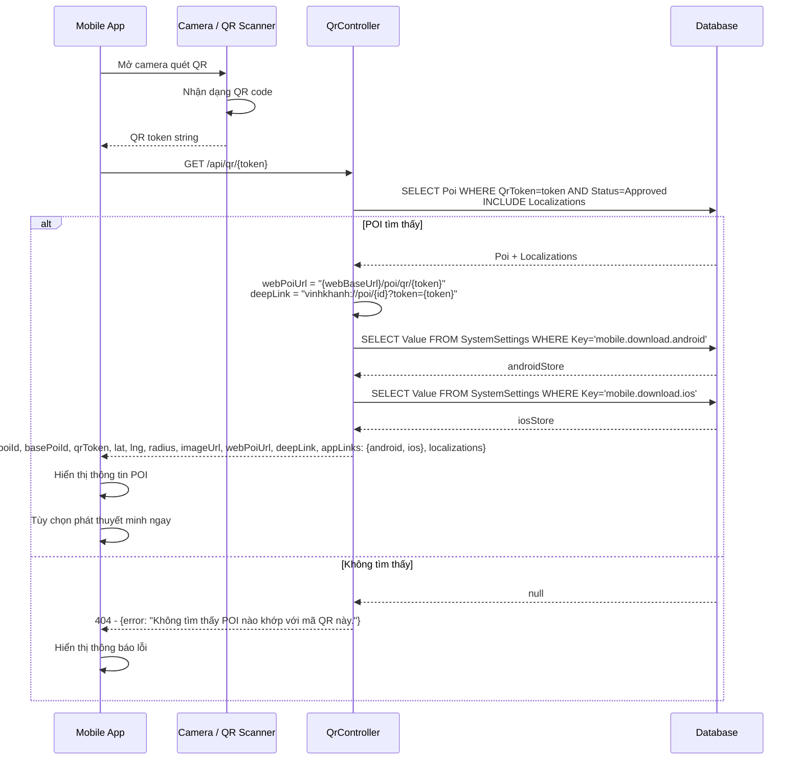

### 7.8 Đánh giá POI

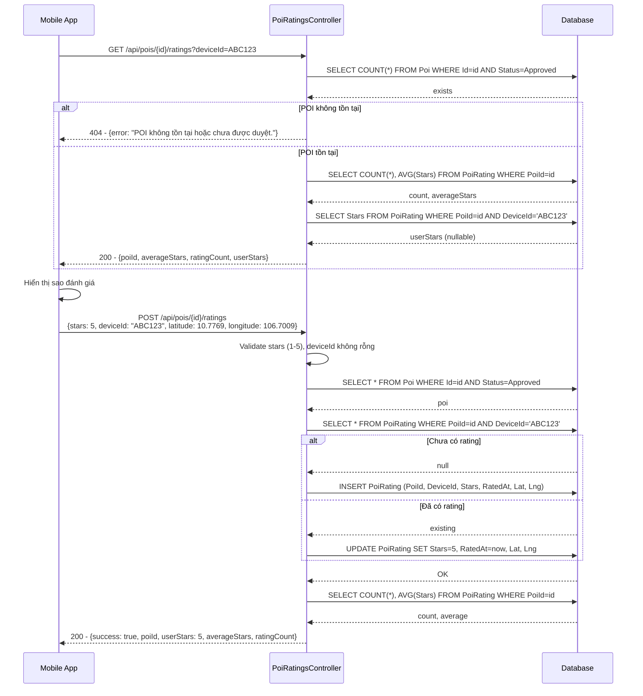

---
## 8. Activity Diagrams theo chức năng

### 8.1 Vòng đời POI (PoiStatus State Machine)

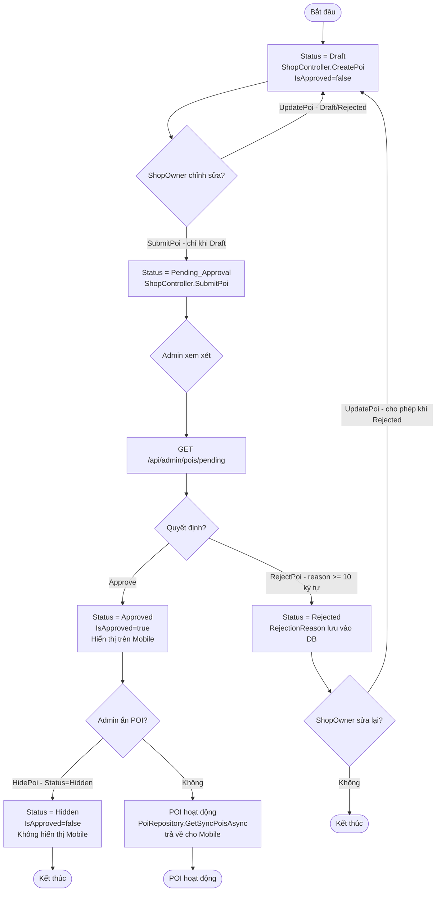

**Logic chi tiết:**
- `ShopController.UpdatePoi()`: Kiểm tra `poi.Status == Pending_Approval || poi.Status == Approved` → trả 403
- `ShopController.DeletePoi()`: Kiểm tra `poi.Status == Pending_Approval` → trả 403
- `ShopController.SubmitPoi()`: Kiểm tra `poi.Status != Draft` → trả 400
- `AdminController.RejectPoi()`: Validate `request.Reason.Length < 10` → trả 400

---

### 8.2 GeofenceEngine — Xử lý vị trí GPS

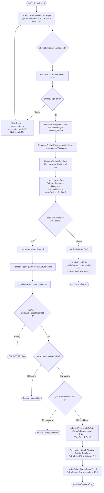

---

### 8.3 NarrationService — Phát thuyết minh

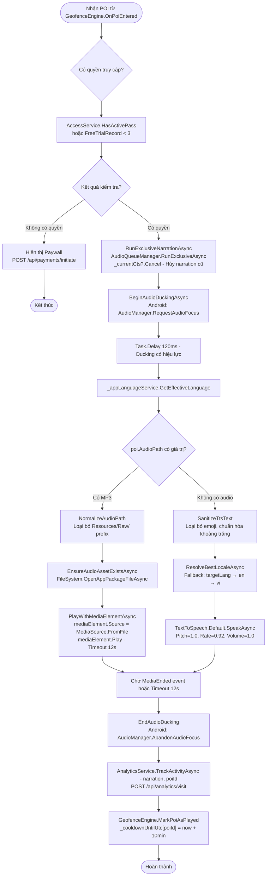

---

### 8.4 Kiểm soát truy cập Visitor

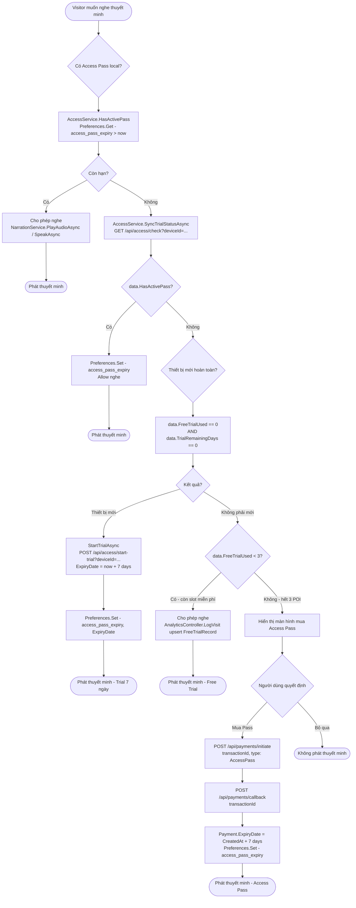

---

### 8.5 Đồng bộ dữ liệu Mobile (DatabaseService.SyncPoisFromServerAsync)

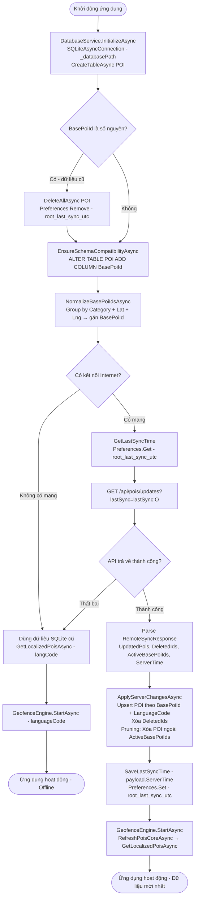

---

### 8.6 Analytics Realtime (SignalR)

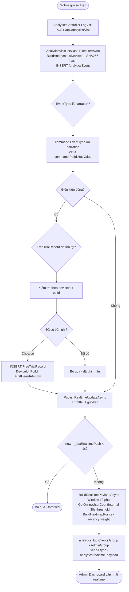

---

## Phụ lục: Cấu trúc thư mục dự án

```
VinhKhanh/
├── VinhKhanh.Admin/                    # ASP.NET Core 10 Web API
│   ├── Controllers/
│   │   ├── AuthController.cs           # Login, RegisterShop, RegisterVisitor
│   │   ├── AdminController.cs          # CRUD POI, Approve/Reject, Dashboard
│   │   ├── ShopController.cs           # ShopOwner POI management
│   │   ├── PoisController.cs           # Mobile sync endpoint
│   │   ├── AnalyticsController.cs      # Visit logging, Heatmap, SignalR
│   │   ├── AccessController.cs         # Trial/Pass check
│   │   ├── PaymentController.cs        # Initiate/Callback payment
│   │   ├── QrController.cs             # QR resolve + PNG generation
│   │   ├── PoiRatingsController.cs     # Star ratings upsert
│   │   └── SettingsController.cs       # System settings CRUD
│   ├── Hubs/
│   │   └── AnalyticsHub.cs             # SignalR hub realtime analytics
│   └── Program.cs                      # DI, JWT, EF Core, CORS config
│
├── VinhKhanh.Admin.Ui/                 # React + Vite + TailwindCSS
│   └── src/
│       ├── pages/                      # Dashboard, POI management, Analytics
│       ├── components/                 # Reusable UI components
│       └── services/                   # API service layer
│
├── VinhKhanh.Application/              # Use Cases
│   └── UseCases/
│       ├── AdminApproveUseCase.cs      # ExecuteAsync(poiId)
│       ├── AnalyticsVisitUseCase.cs    # ExecuteAsync(command) + SHA256 anonymize
│       └── PoiSyncUseCase.cs           # ExecuteAsync(request) + NormalizeCategoryCode
│
├── VinhKhanh.Domain/                   # Entities + Interfaces
│   ├── Entities/
│   │   ├── Poi.cs, PoiLocalization.cs, PoiRating.cs
│   │   ├── ApplicationUser.cs, Payment.cs
│   │   ├── AnalyticsEvent.cs, FreeTrialRecord.cs
│   │   ├── DeviceTrial.cs, SystemSetting.cs
│   │   └── PoiStatus.cs (enum)
│   └── Interfaces/
│       ├── IPoiRepository.cs
│       └── IAnalyticsRepository.cs
│
├── VinhKhanh.Infrastructure/           # EF Core + Services
│   ├── Data/AppDbContext.cs            # DbSets + OnModelCreating (Cascade, Unique indexes)
│   ├── Repositories/
│   │   ├── PoiRepository.cs            # GetSyncPoisAsync, ApprovePoiAsync
│   │   └── AnalyticsRepository.cs      # AddVisitEventAsync
│   ├── Services/GeminiAiService.cs     # GenerateTranslationsAsync + model fallback
│   └── Security/EncryptionUtility.cs   # AES-256 Encrypt/Decrypt
│
├── VinhKhanh.Mobile/                   # .NET MAUI Android
│   ├── Services/
│   │   ├── GeofenceEngine.cs           # Haversine + Debounce + Cooldown + Priority
│   │   ├── NarrationService.cs         # MP3 + TTS + AudioDucking
│   │   ├── LocationService.cs          # GPS polling + AdaptiveInterval
│   │   ├── DatabaseService.cs          # SQLite + Delta Sync + Language Fallback
│   │   ├── AccessService.cs            # DeviceId + Trial/Pass management
│   │   ├── AnalyticsService.cs         # TrackActivityAsync
│   │   └── AudioQueueManager.cs        # RunExclusiveAsync + CancelCurrent
│   └── ViewModels/
│       └── MainPageViewModel.cs        # ObservableCollection<POI> + UpdateLocalizedTextsInPlace
│
├── VinhKhanh.Shared/                   # DTOs dùng chung
│   ├── Models/Dtos.cs                  # SyncRequest, SyncResponse, NarrationEvent
│   ├── Models/Poi.cs                   # Shared Poi + PoiLocalizationDto
│   └── Haversine.cs                    # Distance(lat1,lon1,lat2,lon2) static
│
└── VinhKhanh.Tests/                    # Property-Based Tests
    ├── AccessController_Property9_Tests.cs
    ├── AdminController_Property2_Tests.cs
    ├── AnalyticsController_Property11_14_Tests.cs
    ├── AuthController_Property21_22_Tests.cs
    ├── NarrationEngine_Property15_20_Tests.cs
    ├── PaymentController_Property6_8_Tests.cs
    ├── PoisController_Property3_23_Tests.cs
    └── ShopController_Property1_10_Tests.cs
```

---

*Tài liệu được tạo tự động từ source code thực tế của dự án VinhKhanh — 24/04/2026*
