# Product Requirements Document (PRD) - Vinh Khanh Food Street

Tài liệu này cung cấp thiết kế kiến trúc chi tiết, sơ đồ UML và phân tích End-to-End (E2E) trực tiếp tới các Class/Method trong mã nguồn. 

---

## 1. Danh Sách Chức Năng Hệ Thống (Features)

### 1.1. Hệ sinh thái Mobile App (Visitor / Khách du lịch)
- **Quét QR Code POI**: Khám phá thông tin quán ăn qua mã QR.
- **Thuyết minh Tự động (Audio Narration / TTS)**: Nghe giới thiệu POI, hỗ trợ đa ngôn ngữ (VI, EN, JA).
- **Tracking Vị trí**: Tự động bắt vị trí GPS, kiểm tra vùng Geofence để kích hoạt TTS.
- **Đánh giá POI**: Rating 1-5 sao cho quán ăn.
- **Mua Access Pass**: Thanh toán In-App Purchase để mở khóa toàn bộ nội dung.

### 1.2. Hệ sinh thái Web Admin (Shop Owner / Chủ quán)
- **Đăng ký Tài khoản**: Gửi yêu cầu làm đối tác (chờ duyệt).
- **Đăng nhập**: Phân quyền truy cập `ShopOwner`.
- **Quản lý POI Của Tôi**: Thêm/Sửa thông tin quán ăn, lấy file mã QR.

### 1.3. Hệ sinh thái Web Admin (Super Admin)
- **Quản lý Phê duyệt Đối tác**: Duyệt yêu cầu tài khoản ShopOwner.
- **Quản lý Toàn bộ POI**: CRUD mọi điểm nhấn, gán "Premium" và "Bán kính quét (Radius)".
- **Dashboard Heatmap Realtime**: Quan sát mật độ đám đông di chuyển theo thời gian thực.
- **Thống kê Nội dung (Content Performance)**: Xem số lượt truy cập và lượt nghe TTS của từng quán.
- **Quản lý User Online**: Thống kê số lượng thiết bị đang trực tuyến.

---

## 2. Sơ Đồ Tổng Quan Hệ Thống

### 2.1. Use Case Diagram
Mô tả các quyền hạn và hành động của 3 nhóm người dùng.

```mermaid
usecaseDiagram
    actor "Visitor" as visitor
    actor "Shop Owner" as owner
    actor "Admin" as admin

    usecase "Listen to TTS Narration" as uc1
    usecase "Scan QR Code" as uc2
    usecase "Purchase Access Pass" as uc3
    
    usecase "Register as Partner" as uc4
    usecase "Manage Own POI" as uc5
    
    usecase "Approve Shop Owner" as uc6
    usecase "Manage All POIs" as uc7
    usecase "View Heatmap" as uc8
    usecase "View Analytics" as uc9

    visitor --> uc1
    visitor --> uc2
    visitor --> uc3

    owner --> uc4
    owner --> uc5

    admin --> uc6
    admin --> uc7
    admin --> uc8
    admin --> uc9
```

### 2.2. Entity Relationship Diagram (ERD)
Ánh xạ trực tiếp từ các entity trong `VinhKhanh.Domain.Entities`.

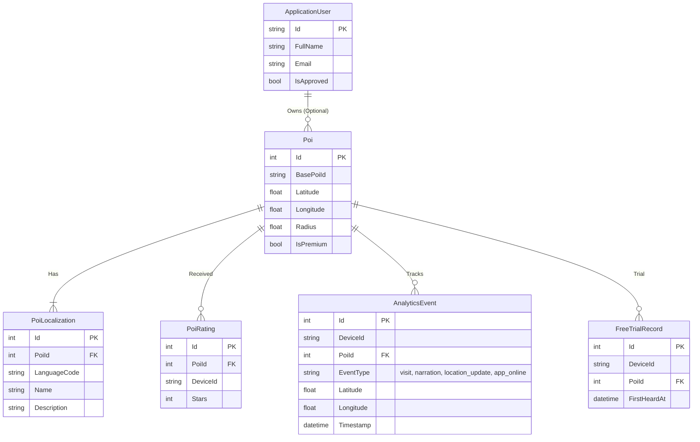

### 2.3. Class Diagram (Clean Architecture)
Sự tương tác giữa các tầng kiến trúc chính trong mã nguồn.

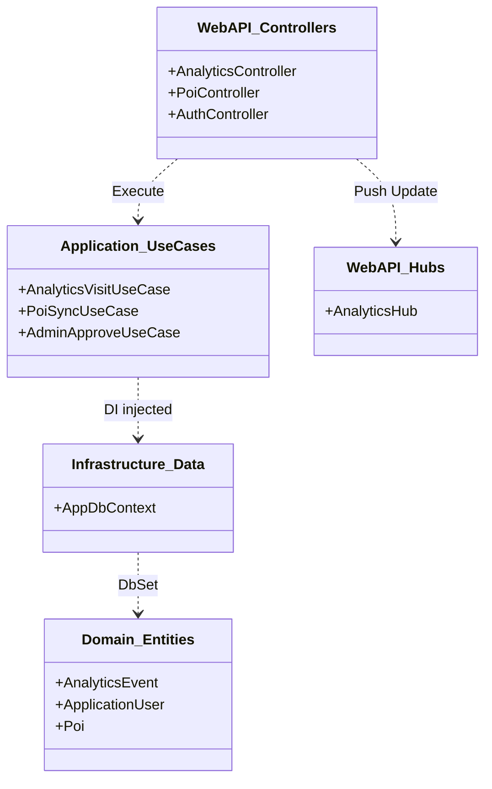

---

## 3. Phân Tích Chuyên Sâu End-to-End (E2E Tracing)

### 3.1. Chức Năng Thống Kê Lượt Nghe TTS (Audio Narration)

**Bài toán:** Khi khách du lịch quét QR hoặc đi vào vùng kích hoạt (Geofence), điện thoại phát Audio TTS. Hành động này được biểu diễn bằng "Lượt Nghe" trên Admin Dashboard như thế nào?

**Luồng dữ liệu (Data Flow):**
1. **Mobile App (Triggers)**: 
    *   **Manual**: Người dùng nhấn Play trên danh sách/bản đồ.
    *   **QR Scan**: Người dùng quét mã tại quán, OS mở Deep Link `vinhkhanh://poi/{id}`, App nhận ID và tự động phát.
    *   **Geofence**: `LocationService` phát hiện tọa độ nằm trong vùng POI.
2. **Execution**: `NarrationService.PlayAudioAsync()` được gọi. Ngay lập tức, `AnalyticsService.TrackActivityAsync(eventType: "narration")` gửi lệnh POST `/api/analytics/visit`.
3. **API Backend**: `AnalyticsController.LogVisit(AnalyticsVisitCommand)` tiếp nhận.
4. **Use Case & DB**: `AnalyticsVisitUseCase.ExecuteAsync()` ghi lại sự kiện vào bảng `AnalyticsEvents`.
5. **Realtime & Admin**: `AnalyticsHub` (SignalR) push dữ liệu về client Admin. Dashboard cập nhật biểu đồ lượt nghe.

**Activity Diagram:**
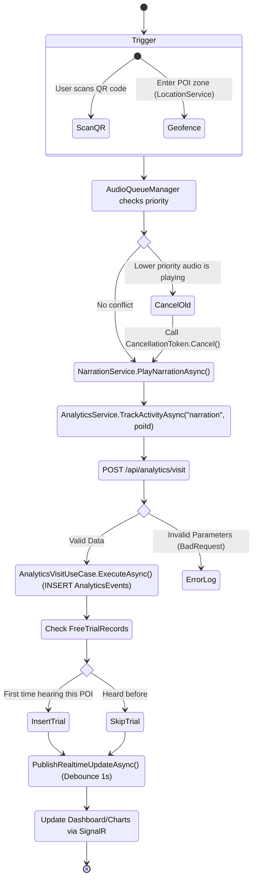

**Sequence Diagram (Detailed Method Tracing):**
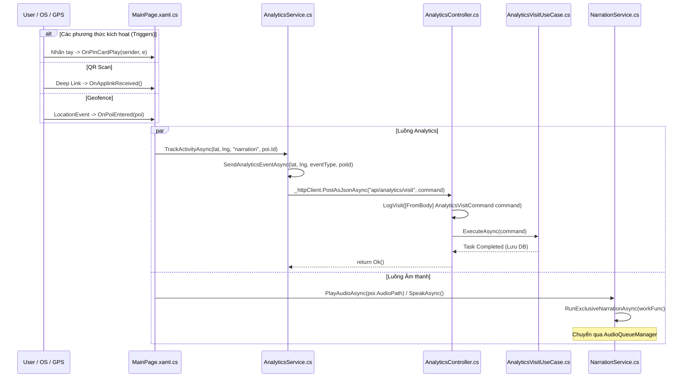

---

### 3.2. Chức Năng Tracking Vị Trí & Bản Đồ Heatmap

**Bài toán:** Quản lý xem được mật độ tụ tập của khách di chuyển thực tế trên phố Vĩnh Khánh.

**Luồng dữ liệu (Data Flow):**
1. **Mobile App**: Hàm `OnLocationChanged` trong `LocationService` định kỳ bắt tọa độ GPS. Truyền sang `AnalyticsService.TrackActivityAsync(eventType: "location_update")`.
2. **Backend**: Nhận tọa độ, lưu vào bảng `UserLocations`.
3. **Realtime Engine**: SignalR Hub (`AnalyticsHub`) phát tín hiệu về Admin Dashboard.
4. **Admin UI**: Sử dụng thư viện `Leaflet.heat` hoặc Google Maps Heatmap Layer để vẽ mật độ dựa trên dữ liệu tọa độ trong 30 phút gần nhất.

**Sequence Diagram (Real-time Data Flow Method Tracing):**
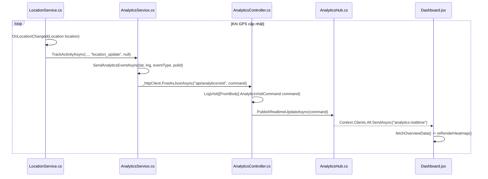

---

### 3.3. Thuật toán Xử lý Geofence & Nhường Ưu tiên (Preemption)

**Bài toán:** Xử lý trường hợp người dùng đứng ở vùng giao thoa của nhiều quán (POI) hoặc GPS nhảy nhiễu.

**Quy trình xử lý (Logic Flow):**
1. **Debounce (Chống nhiễu)**: Tọa độ phải nằm trong vùng POI ít nhất 2 lần liên tiếp mới xác nhận "Vào vùng".
2. **Cooldown (Chống lặp)**: Sau khi phát xong, POI rơi vào trạng thái chờ 10 phút để tránh đọc đi đọc lại.
3. **Priority (Ưu tiên)**: Nếu đứng giữa 2 vùng, chọn POI có `Priority` cao nhất (thường là quán Premium).
4. **Preemption (Nhường quyền)**: Nếu đang phát quán thường mà người dùng bước vào vùng quán Premium, hệ thống lập tức ngắt âm thanh cũ để phát quán Premium.

**Activity Diagram:**
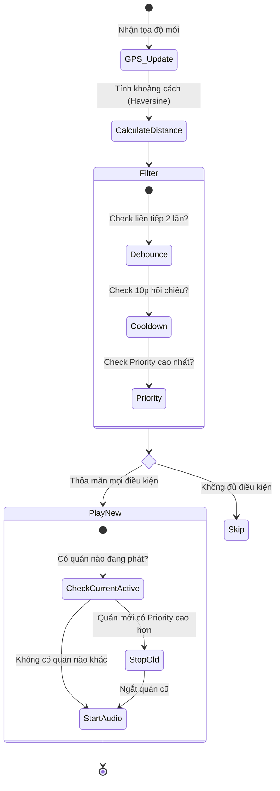

**Sequence Diagram (Preemption Method Tracing):**
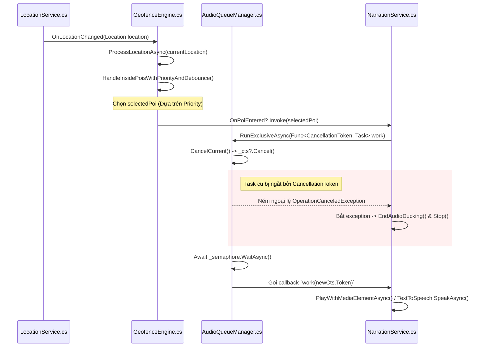

---

### 3.4. Quy trình Đăng ký & Phê duyệt Shop (Onboarding)

**Bài toán:** Quản lý vòng đời của một địa điểm ẩm thực trên hệ thống.

**Vòng đời dữ liệu (State Diagram):**
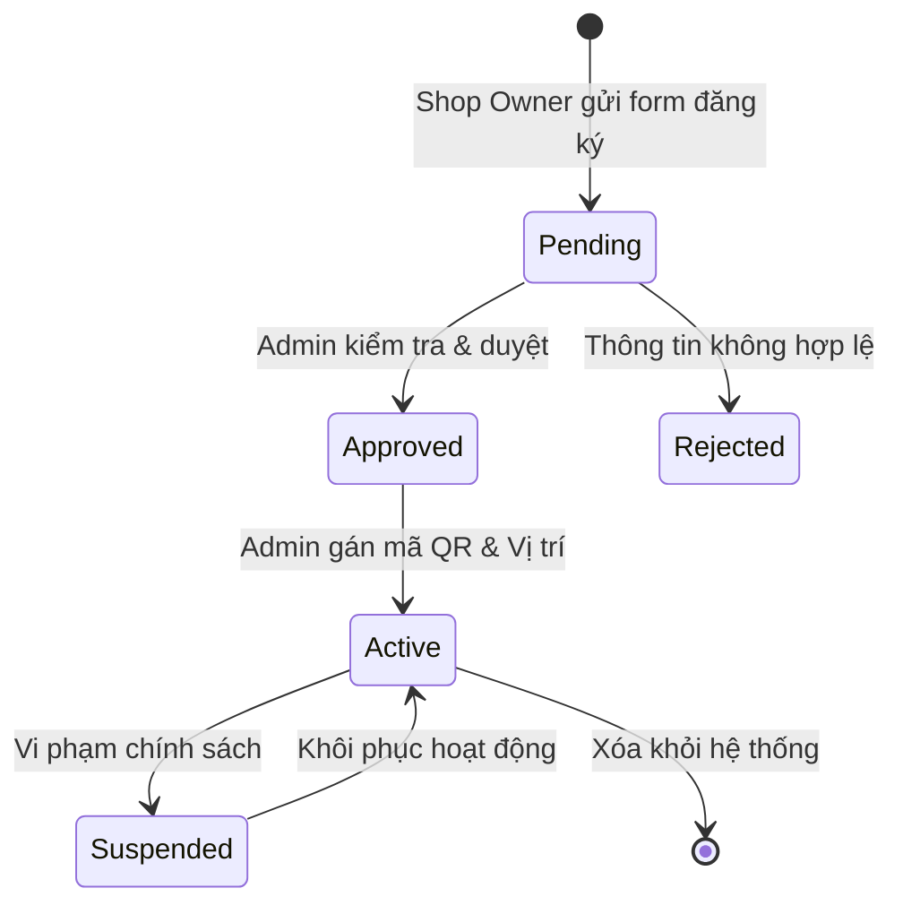

**Sequence Diagram (Shop Onboarding Method Tracing):**
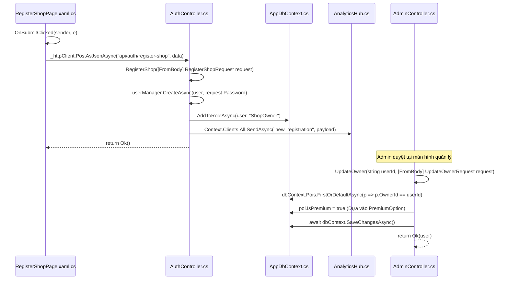

---

### 3.5. Kiến trúc Tổng thể Hệ thống (System Architecture)

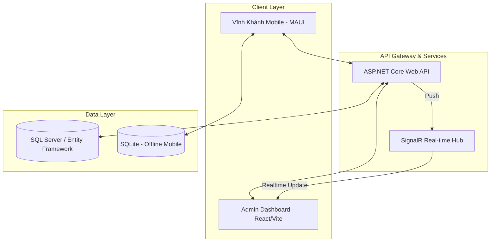
2. **API Backend**: `AnalyticsController.LogVisit()` lưu tọa độ vào `AnalyticsEvents`.
3. **Logic Heatmap**: Khi Admin mở trang chủ, `Dashboard.jsx` gọi `api.get('/analytics/realtime-overview')`.
4. **Backend Calculation**: Hàm `BuildHeatmapPoints()` phân tích các `AnalyticsEvent` mới nhất. Nó chạy thuật toán "Lực hút POI" (hút tọa độ user về trung tâm quán nếu user ở trong bán kính Radius) và cộng điểm `Weight/Intensity`.
5. **Admin UI**: Dữ liệu `points` được gán vào `leaflet.heat` plugin, render ra mảng màu gradient đỏ/vàng trên bản đồ Leaflet.

**Activity Diagram:**
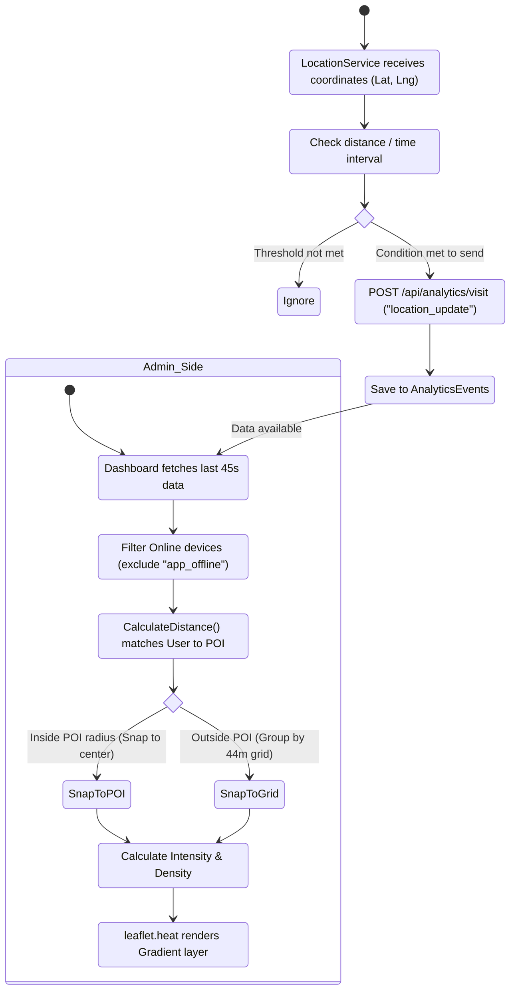

**Sequence Diagram:**
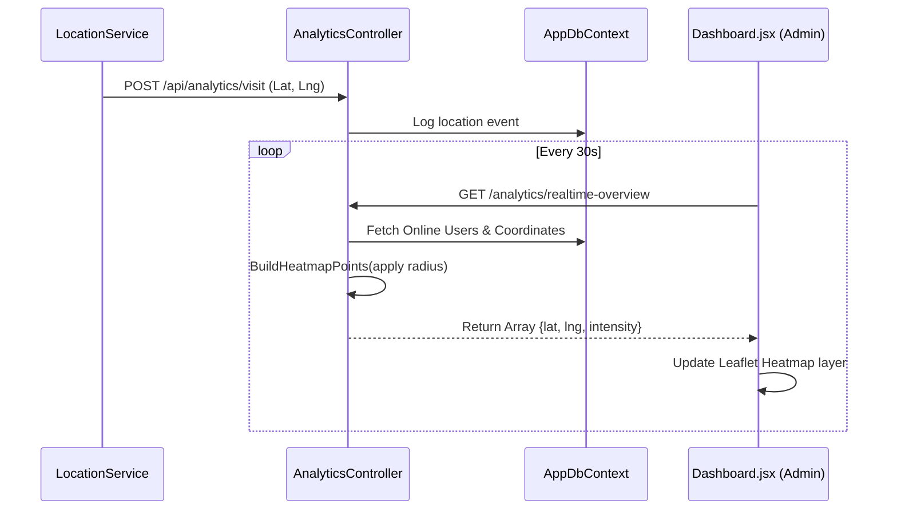

---

### 3.3. Chức Năng Đăng Ký và Phê Duyệt Chủ Quán (Shop Owner)

**Bài toán:** Ai đó muốn mở quán trên App phải đăng ký. Admin phải duyệt thì mới đăng nhập được.

**Luồng dữ liệu (Data Flow):**
1. **Đăng Ký (Web/Mobile)**: Nhập Email, Pass trên trang `Register.jsx` hoặc Mobile App. Gọi API POST `/api/auth/register-shop`.
2. **Lưu DB (Chờ Duyệt)**: `AuthController.RegisterShop()` sử dụng `UserManager.CreateAsync(user)`. Gán `IsApproved = false` và Roles = `ShopOwner`.
3. **Kiểm Tra Đăng Nhập**: Nếu cố tình đăng nhập, `AuthController.Login` chặn lại ở đoạn `if (!user.IsApproved) return Unauthorized("Đang chờ duyệt")`.
4. **Admin Phê Duyệt**: Admin vào trang `OwnerManager.jsx`, bấm nút **Approve**. Gọi API PUT `/api/approvals/{id}/approve`.
5. **Xử lý Phê duyệt**: `AdminApproveUseCase.ApproveOwnerAsync()` được chạy, đổi cờ `IsApproved = true` trong database. Lúc này tài khoản mới chính thức hoạt động.

**Activity Diagram:**
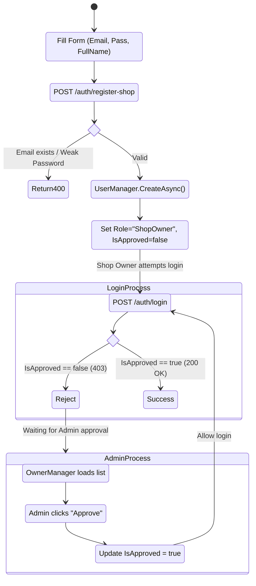

**Sequence Diagram:**
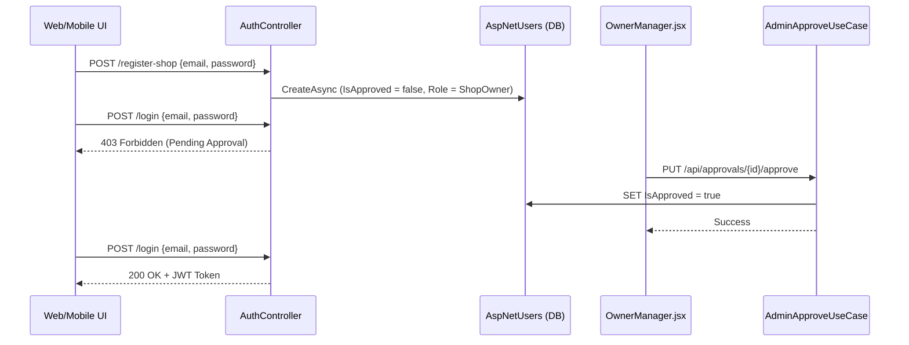

---

### 3.4. Quản Lý và Đồng Bộ POI (Points of Interest)

**Bài toán:** Khi Admin thêm/sửa một quán ăn trên Web, làm sao để Data đó hiện xuống điện thoại cực nhanh và có thể quét QR?

**Luồng dữ liệu (Data Flow):**
1. **Tạo/Sửa POI (Admin/ShopOwner)**: Trang `PoiForm.jsx` submit data lên API POST/PUT `/api/poi`. `PoiController` tiếp nhận.
2. **Database Update**: Dữ liệu lưu vào bảng `Pois` và `PoiLocalizations` trong SQL Server.
3. **Xóa Cache Mobile**: Mỗi lần có POI update, hệ thống tăng cờ `LastSyncAt`.
4. **Mobile Sync**: Khi App Mobile khởi động, `PoiSyncService` bắn GET `/api/poi/sync` kèm theo thời gian sync cuối.
5. **Backend Sync**: `PoiSyncUseCase.ExecuteAsync()` truy vấn DB trả về danh sách các POI mới hoặc đã bị thay đổi (`UpdatedPois`), và các POI đã bị xóa (`DeletedIds`).
6. **Local Storage**: App Mobile lưu dữ liệu này vào SQLite cục bộ (offline cache), đảm bảo việc hiển thị danh sách trên màn hình Home (`MainPage.xaml`) cực kỳ mượt mà.

**Activity Diagram:**
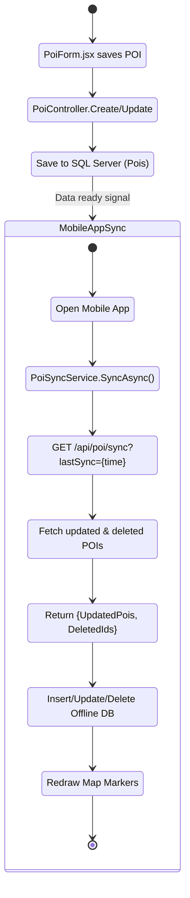

**Sequence Diagram:**
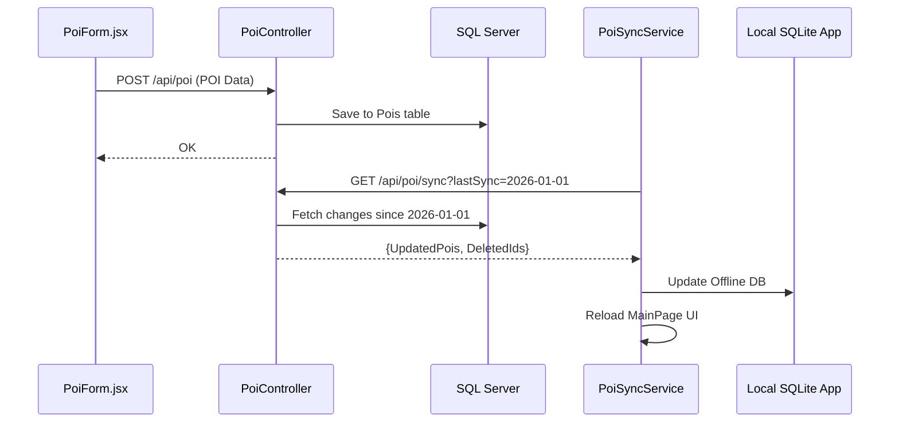

---

### 3.5. Chức Năng Thống Kê Tổng Quan (Dashboard Summary)

**Bài toán:** Hiển thị cho Admin các con số tổng quát về hệ thống bao gồm: Tổng số POI, Tổng số ShopOwner (và số lượng đang chờ duyệt), Lượt truy cập hôm nay, Lượt nghe TTS hôm nay, và số người đang Online.

**Luồng dữ liệu (Data Flow):**
1. **Truy cập Dashboard**: Admin mở trang `Analytics.jsx` hoặc `Dashboard.jsx`. Giao diện Frontend gọi API GET `/api/admin/dashboard-summary`.
2. **Xử lý Backend**: Hàm `AdminController.GetDashboardSummary()` được thực thi.
3. **Tính toán Thống kê**:
   - `poisCount`: Lấy số lượng từ bảng `Pois`.
   - `totalShops` & `pendingOwnersCount`: Dùng `UserManager.GetUsersInRoleAsync("ShopOwner")` để lấy tổng số và lọc ra những user có `IsApproved == false`.
   - `visitsToday` & `narrationCountToday`: Lọc bảng `AnalyticsEvents` theo mốc thời gian từ đầu ngày hiện tại (múi giờ +7).
   - `onlineCount`: Gom nhóm các thiết bị gửi event trong 5 phút gần nhất.
4. **Trả dữ liệu về UI**: Dữ liệu JSON trả về được cập nhật vào State `stats`, truyền xuống các component `<StatCard>` để hiển thị số lớn (ví dụ: "Đối tác Shop", "Địa điểm POI").

**Activity Diagram:**
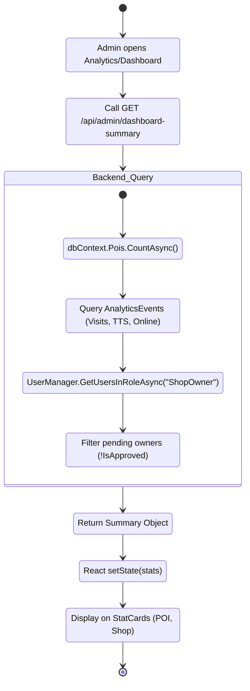

**Sequence Diagram:**
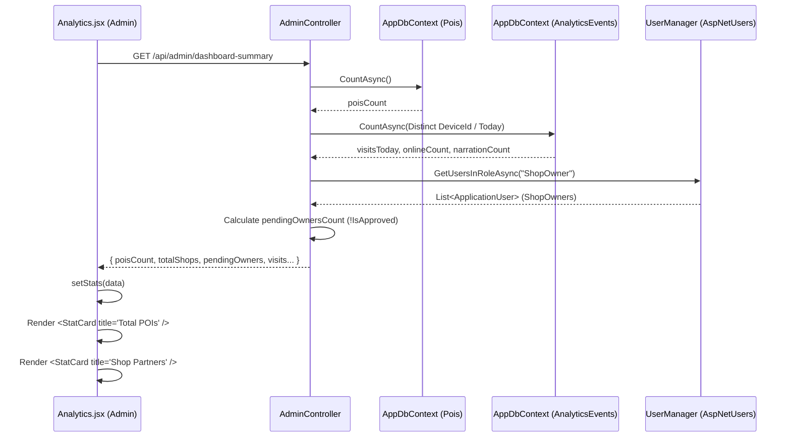

---

### 3.6. Chức Năng Quản Lý Quyền Truy Cập (Access Pass & Free Trial)

**Bài toán:** Khách du lịch tải App Mobile lần đầu sẽ được dùng thử miễn phí 7 ngày mà không cần tạo tài khoản đăng nhập. Khi hết hạn, hệ thống tự động khóa tính năng Thuyết minh.

**Luồng dữ liệu (Data Flow):**
1. **Khởi tạo Device ID**: `AccessService` trên Mobile ưu tiên đọc `AndroidId` (hoặc tạo ra một GUID lưu ngầm vào `Preferences` của thiết bị) để định danh duy nhất (Device Identification).
2. **Đồng bộ trạng thái**: App gọi GET `/api/access/check?deviceId=...` để kiểm tra gói cước trên Server.
3. **Tự động Start Trial**: Nếu Backend trả về là "Chưa từng dùng thử", Mobile tự động gọi POST `/api/access/start-trial`. Backend kích hoạt gói 7 ngày và trả về `ExpiryDate`.
4. **Lưu trữ Offline**: Thời hạn dùng thử được lưu vào bộ nhớ cục bộ `Preferences` (khóa `access_pass_expiry`).
5. **Cổng chặn Tính năng**: Mỗi lần khách quét QR hoặc bước vào vùng Geofence, hàm `AccessService.HasActivePass()` sẽ kiểm tra thời hạn Local. Nếu hết hạn, chặn phát âm thanh và hiện thông báo yêu cầu mua gói VIP.

**Activity Diagram:**
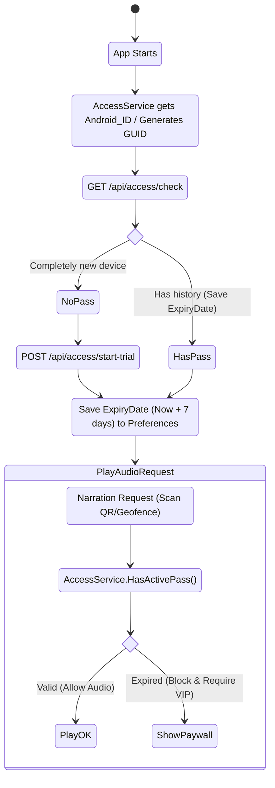

**Sequence Diagram:**
```mermaid
sequenceDiagram
    participant App as Mobile App
    participant AccessService
    participant Prefs as Local Preferences
    participant API as AccessController (Backend)
    participant DB as SQL Server

    App->>AccessService: Start (Get DeviceId)
    AccessService->>API: GET /api/access/check?deviceId=...
    API->>DB: Query FreeTrial / Payment
    DB-->>API: Result (Never used trial)
    API-->>AccessService: { HasActivePass: false }
    
    AccessService->>API: POST /api/access/start-trial
    API->>DB: Activate 7-day trial
    API-->>AccessService: { ExpiryDate: "2026-05-12T..." }
    AccessService->>Prefs: Save 'access_pass_expiry'
    
    Note over App, Prefs: User scans QR or enters Geofence
    App->>AccessService: Call HasActivePass()
    AccessService->>Prefs: Check Local expiry
    Prefs-->>AccessService: Still valid
    AccessService-->>App: Return TRUE (Allow audio)
```

---

### 3.7. Kích Hoạt Thuyết Minh Bằng Geofence & Khóa Luồng (Priority Preemption)

**Bài toán:** Khách đang nghe giới thiệu về "Quán A" (Bình thường). Đột nhiên khách bước vào vùng của "Quán B" (Premium - Trả tiền chạy QC). App phải lập tức ngắt tiếng "Quán A" để ưu tiên phát "Quán B". Đồng thời, App phải chống hiện tượng nhiễu sóng GPS (Debounce) và chống việc phát đi phát lại một bài liên tục (Cooldown).

**Luồng dữ liệu (Data Flow):**
1. **Lắng nghe Tọa độ**: `LocationService` nhận GPS đưa vào `GeofenceEngine.ProcessLocationAsync()`.
2. **So khớp Bán kính**: Dùng công thức lượng giác *Haversine* tính khoảng cách. Nếu khoảng cách <= `Radius` -> Khách đang ở trong ranh giới POI.
3. **Chống nhiễu (Debounce)**: Tọa độ phải nằm trong vùng POI >= 2 lần liên tiếp (`EnterDebounceThreshold`) mới xác nhận là thực sự vào quán.
4. **Xử lý Ưu tiên (Priority Preemption)**: 
   - Lọc các POI hợp lệ. Chọn POI có `Priority` lớn nhất (Premium).
   - Nếu đang phát bài cũ có Priority thấp hơn, gọi hủy (`OnPoiExited`) bài cũ lập tức để nhường luồng.
5. **Khóa Cooldown**: Sau khi phát sự kiện `OnPoiEntered` (đọc tiếng), gọi hàm `MarkPoiAsPlayed()` khóa POI đó trong 10 phút. Ngăn chặn việc khách đứng yên một chỗ mà App cứ lặp đi lặp lại một bài duy nhất.

**Activity Diagram:**
```mermaid
stateDiagram-v2
    [*] --> OnLocationChanged
    OnLocationChanged: Receive new GPS signal
    OnLocationChanged --> Haversine
    Haversine: Calculate distance to all Cached POIs
    
    Haversine --> FilterRadius
    FilterRadius: Distance <= Radius
    
    FilterRadius --> DebounceCheck
    DebounceCheck: Count stable hits >= 2 (Debounce)
    
    state if_debounce <<choice>>
    DebounceCheck --> if_debounce
    if_debounce --> Drop: GPS noise or Cooldown active (10m)
    if_debounce --> CheckPriority: Filter passed
    
    CheckPriority: Compare Priority (New POI vs Playing POI)
    
    state if_priority <<choice>>
    CheckPriority --> if_priority
    if_priority --> CancelOld: New POI has Higher Priority (Preemption)
    if_priority --> PlayNew: Channel is idle
    if_priority --> Drop: New POI has Lower Priority -> Ignore
    
    CancelOld --> EmitExit
    EmitExit: Emit OnPoiExited (Stop old Audio)
    EmitExit --> PlayNew
    
    PlayNew --> EmitEnter
    EmitEnter: Emit OnPoiEntered (Play new Audio)
    EmitEnter --> MarkCooldown
    MarkCooldown: Lock POI in Cooldown for 10 mins
    MarkCooldown --> [*]
```

**Sequence Diagram:**
```mermaid
sequenceDiagram
    participant GPS as LocationService
    participant Engine as GeofenceEngine
    participant RAM as POI Cache (RAM)
    participant Audio as NarrationService
    
    GPS->>Engine: OnLocationChanged(lat, lng)
    Engine->>RAM: Scan distance (Haversine)
    RAM-->>Engine: Detect [Shop A (Pri 0), Shop B (Pri 100)]
    
    Engine->>Engine: Increase Debounce counter >= 2
    
    Note over Engine, Audio: Priority Preemption
    Engine->>Engine: Notice Shop B is Premium (Higher Priority)
    
    Engine->>Audio: Emit OnPoiExited(Shop A)
    Audio->>Audio: CancellationToken.Cancel() to interrupt
    
    Engine->>Audio: Emit OnPoiEntered(Shop B)
    Audio->>Audio: PlayNarrationAsync(Shop B Audio)
    
    Engine->>Engine: MarkPoiAsPlayed(Shop B)
    Note over Engine: Freeze (Cooldown) Shop B for 10 mins
```
