# VinhKhanh — Nền tảng Du lịch Ẩm thực Thông minh

   

VinhKhanh là nền tảng du lịch ẩm thực thông minh (Food Street / POI — Point of Interest) cho phép du khách khám phá các điểm ăn uống đặc sắc thông qua thuyết minh tự động khi đến gần địa điểm. Hệ thống gồm ba thành phần chính: **Backend API** (ASP.NET Core), **Admin Web UI** (React + Vite), và **Mobile App** (.NET MAUI Android).

---

## Mục lục

1. [Tổng quan dự án](#1-tổng-quan-dự-án)
2. [Kiến trúc hệ thống](#2-kiến-trúc-hệ-thống)
3. [Chức năng hệ thống](#3-chức-năng-hệ-thống)
4. [Use Case Diagram](#4-use-case-diagram)
5. [Mô hình dữ liệu (ERD)](#5-mô-hình-dữ-liệu-erd)
6. [Class Diagram](#6-class-diagram)
7. [Sequence Diagrams](#7-sequence-diagrams)
8. [Activity Diagrams](#8-activity-diagrams)
9. [API Reference](#9-api-reference)

---

## 1. Tổng quan dự án

### 1.1 Mô tả

VinhKhanh là ứng dụng hướng dẫn du lịch ẩm thực tự động. Khi du khách đến gần một điểm ăn uống (POI) đã đăng ký, ứng dụng mobile tự động phát thuyết minh bằng giọng nói (MP3 hoặc TTS) giới thiệu về địa điểm đó. Nội dung hỗ trợ đa ngôn ngữ (Tiếng Việt, Tiếng Anh, Tiếng Nhật) nhờ tích hợp Google Gemini AI.

### 1.2 Thành phần hệ thống

| Thành phần | Công nghệ | Mô tả |
|-----------|-----------|-------|
| **VinhKhanh.Admin** | ASP.NET Core 8 Web API | Backend API chính, xử lý toàn bộ nghiệp vụ |
| **VinhKhanh.Admin.Ui** | React + Vite + TailwindCSS | Giao diện quản trị cho Admin và ShopOwner |
| **VinhKhanh.Mobile** | .NET MAUI Android | Ứng dụng mobile cho Visitor |
| **VinhKhanh.Application** | C# Class Library | Use Cases (Clean Architecture) |
| **VinhKhanh.Domain** | C# Class Library | Entities + Interfaces |
| **VinhKhanh.Infrastructure** | EF Core + SQLite/PostgreSQL | Repository, GeminiAiService, EncryptionUtility |

### 1.3 Thuật ngữ

| Thuật ngữ | Ý nghĩa |
|-----------|---------|
| **POI** | Point of Interest — điểm tham quan / quán ăn đăng ký trên hệ thống |
| **PoiStatus** | Trạng thái vòng đời POI: Draft → Pending_Approval → Approved / Rejected / Hidden |
| **ShopOwner** | Chủ quán — role cần Admin duyệt trước khi sử dụng |
| **Admin** | Quản trị viên — toàn quyền quản lý POI, người dùng, analytics |
| **Visitor** | Du khách — dùng thử 3 POI miễn phí hoặc mua Access Pass |
| **DeviceTrial** | Bản ghi thử nghiệm 7 ngày gắn với DeviceId |
| **FreeTrialRecord** | Bản ghi lần đầu nghe thuyết minh một POI (giới hạn 3 POI miễn phí) |
| **AccessPass** | Gói trả phí 7 ngày cho phép nghe không giới hạn |
| **GeofenceEngine** | Dịch vụ mobile phát hiện khi người dùng vào vùng bán kính POI |
| **NarrationService** | Dịch vụ mobile phát thuyết minh (MP3 hoặc TTS) |
| **GeminiAiService** | Dịch vụ backend gọi Google Gemini API dịch vi → en, ja |
| **QrToken** | Mã token duy nhất gắn với POI để tra cứu qua QR code |
| **AnalyticsEvent** | Sự kiện ghi nhận lượt xem (visit) hoặc lượt nghe thuyết minh (narration) |

---

## 2. Kiến trúc hệ thống

### 2.1 Clean Architecture

Dự án theo mô hình **Clean Architecture** với 4 tầng tách biệt:

```
┌─────────────────────────────────────────────────────┐
│                  Presentation Layer                  │
│  VinhKhanh.Admin (ASP.NET Core Web API)             │
│  VinhKhanh.Admin.Ui (React + Vite + TailwindCSS)    │
│  VinhKhanh.Mobile (.NET MAUI Android)               │
├─────────────────────────────────────────────────────┤
│                 Application Layer                    │
│  VinhKhanh.Application (Use Cases)                  │
│  AdminApproveUseCase / AnalyticsVisitUseCase        │
│  PoiSyncUseCase                                     │
├─────────────────────────────────────────────────────┤
│                   Domain Layer                       │
│  VinhKhanh.Domain (Entities + Interfaces)           │
│  IPoiRepository / IAnalyticsRepository              │
├─────────────────────────────────────────────────────┤
│               Infrastructure Layer                   │
│  VinhKhanh.Infrastructure (EF Core, SQLite/SQL)     │
│  PoiRepository / AnalyticsRepository                │
│  GeminiAiService / EncryptionUtility                │
└─────────────────────────────────────────────────────┘
```

### 2.2 Luồng dữ liệu tổng quát

```
Mobile App ──sync──► Backend API ──query──► Database (EF Core)
                          │
                     GeminiAiService ──► Google Gemini API
                          │
Admin Web UI ──manage──► Backend API
```

---
## 3. Chức năng hệ thống

### 3.1 Xác thực & Phân quyền

| Chức năng | Endpoint | Mô tả |
|-----------|----------|-------|
| Đăng nhập JWT | `POST /api/auth/login` | Xác thực email/password, trả JWT token 24h |
| Đăng ký ShopOwner | `POST /api/auth/register-shop` | Tạo tài khoản chủ quán, chờ Admin duyệt |
| Đăng ký Visitor | `POST /api/auth/register-visitor` | Tạo tài khoản du khách, tự động kích hoạt |
| Phân quyền 3 role | — | Admin / ShopOwner / Visitor với quyền hạn khác nhau |

### 3.2 Quản lý POI (Admin)

| Chức năng | Endpoint | Mô tả |
|-----------|----------|-------|
| Xem danh sách POI | `GET /api/admin/pois` | Lấy tất cả POI kèm thông tin chủ quán |
| Xem POI chờ duyệt | `GET /api/admin/pois/pending` | Lọc POI có status Pending_Approval |
| Xem chi tiết POI | `GET /api/admin/pois/{id}` | Chi tiết POI kèm QR link |
| Tạo mới POI | `POST /api/admin/pois` | Tạo POI với upload ảnh, tự động Approved |
| Cập nhật POI | `PUT /api/admin/pois/{id}` | Cập nhật thông tin và ảnh POI |
| Duyệt POI | `POST /api/admin/pois/{id}/approve` | Chuyển status → Approved |
| Từ chối POI | `POST /api/admin/pois/{id}/reject` | Chuyển status → Rejected kèm lý do (≥10 ký tự) |
| Ẩn POI | `POST /api/admin/pois/{id}/hide` | Chuyển status → Hidden |
| Dashboard summary | `GET /api/admin/dashboard-summary` | Tổng số POI, lượt visit, narration, activity series |

### 3.3 Cổng chủ quán (ShopOwner)

| Chức năng | Endpoint | Mô tả |
|-----------|----------|-------|
| Xem danh sách POI của mình | `GET /api/shop/pois` | Chỉ POI thuộc OwnerId hiện tại |
| Xem chi tiết POI | `GET /api/shop/pois/{id}` | Chi tiết POI của mình |
| Tạo POI mới | `POST /api/shop/pois` | Tạo POI ở trạng thái Draft |
| Cập nhật POI | `PUT /api/shop/pois/{id}` | Chỉ được sửa khi status là Draft/Rejected |
| Xóa POI | `DELETE /api/shop/pois/{id}` | Không xóa được khi đang Pending_Approval |
| Gửi duyệt | `POST /api/shop/pois/{id}/submit` | Chuyển Draft → Pending_Approval |
| AI dịch thuật | `POST /api/shop/ai/generate` | Dịch vi → en, ja qua Gemini API |
| Xem thống kê | `GET /api/shop/analytics` | Thống kê visit/narration 30 ngày gần nhất |

### 3.4 Đồng bộ Mobile

| Chức năng | Endpoint | Mô tả |
|-----------|----------|-------|
| Sync POI theo timestamp | `GET /api/pois/updates?lastSync=...` | Trả danh sách POI đã cập nhật sau lastSync |
| Hỗ trợ audio mode | `includeAudio=true/false` | Bao gồm hoặc bỏ qua AudioUrl trong response |
| SyncResponse | — | Trả UpdatedPois, DeletedIds, ServerTime |

### 3.5 Thuyết minh tự động

- **GeofenceEngine**: Tính khoảng cách Haversine giữa GPS hiện tại và tọa độ POI. Yêu cầu debounce ≥2 lần liên tiếp trong vùng bán kính trước khi kích hoạt. Áp dụng cooldown để tránh phát lại ngay. Ưu tiên POI theo trường `Priority`.
- **NarrationService**: Phát file MP3 từ `AudioUrl` nếu có; fallback sang TextToSpeech (TTS) nếu không có audio. Hỗ trợ audio ducking trên Android (giảm âm lượng nhạc nền khi phát thuyết minh).
- **Ghi AnalyticsEvent**: Sau mỗi lần phát thuyết minh, ghi sự kiện `narration` kèm tọa độ GPS và PoiId.

### 3.6 Kiểm soát truy cập

| Chức năng | Endpoint | Mô tả |
|-----------|----------|-------|
| Kiểm tra trạng thái | `GET /api/access/check` | Trả freeTrialUsed, hasActivePass, passExpiryDate |
| Bắt đầu DeviceTrial | `POST /api/access/start-trial?deviceId=...` | Kích hoạt 7 ngày dùng thử cho thiết bị |
| Free Trial | — | 3 POI đầu tiên miễn phí (FreeTrialRecord) |
| Access Pass | `POST /api/payments/initiate` + `POST /api/payments/callback` | Mua gói 7 ngày |

### 3.7 Analytics

| Chức năng | Endpoint | Mô tả |
|-----------|----------|-------|
| Ghi nhận sự kiện | `POST /api/analytics/visit` | Ghi visit hoặc narration kèm tọa độ GPS |
| Heatmap | `GET /api/analytics/heatmap` | Điểm nhiệt theo tọa độ, hỗ trợ lọc theo ngày |
| Content performance | `GET /api/analytics/content-performance` | Top POI theo lượt nghe, hỗ trợ lọc theo ngày |
| Dashboard summary | `GET /api/admin/dashboard-summary` | Tổng quan số liệu cho Admin |

### 3.8 AI dịch thuật

- Gọi **Google Gemini API** để dịch tên và mô tả POI từ Tiếng Việt sang Tiếng Anh và Tiếng Nhật.
- **Admin**: `POST /api/admin/ai/generate` (role Admin hoặc ShopOwner)
- **ShopOwner**: `POST /api/shop/ai/generate`
- Kết quả dịch tự động điền vào form tạo/sửa POI.

### 3.9 QR Code

| Chức năng | Endpoint | Mô tả |
|-----------|----------|-------|
| Tạo QrToken | Tự động khi Admin tạo/xem POI | Token duy nhất dạng `poi-{guid}` (20 ký tự) |
| Tra cứu POI qua QR | `GET /api/qr/{token}` | Trả thông tin POI kèm localizations |
| Hiển thị QR link | Admin UI | Link dạng `{host}/api/qr/{token}` |

### 3.10 Đánh giá POI

| Chức năng | Endpoint | Mô tả |
|-----------|----------|-------|
| Gửi / cập nhật rating | `POST /api/pois/{id}/ratings` | Upsert rating 1–5 sao theo DeviceId |
| Xem điểm trung bình | `GET /api/pois/{id}/ratings` | Trả averageStars, ratingCount, userStars |

> Mỗi DeviceId chỉ có 1 rating per POI (upsert). Rating kèm tọa độ GPS tùy chọn.

---
## 4. Use Case Diagram

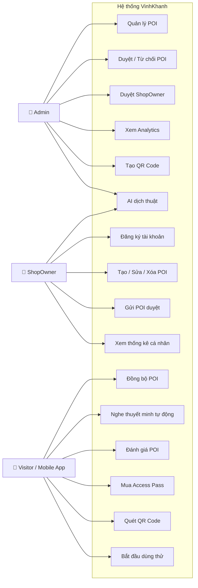

---
## 5. Mô hình dữ liệu (ERD)

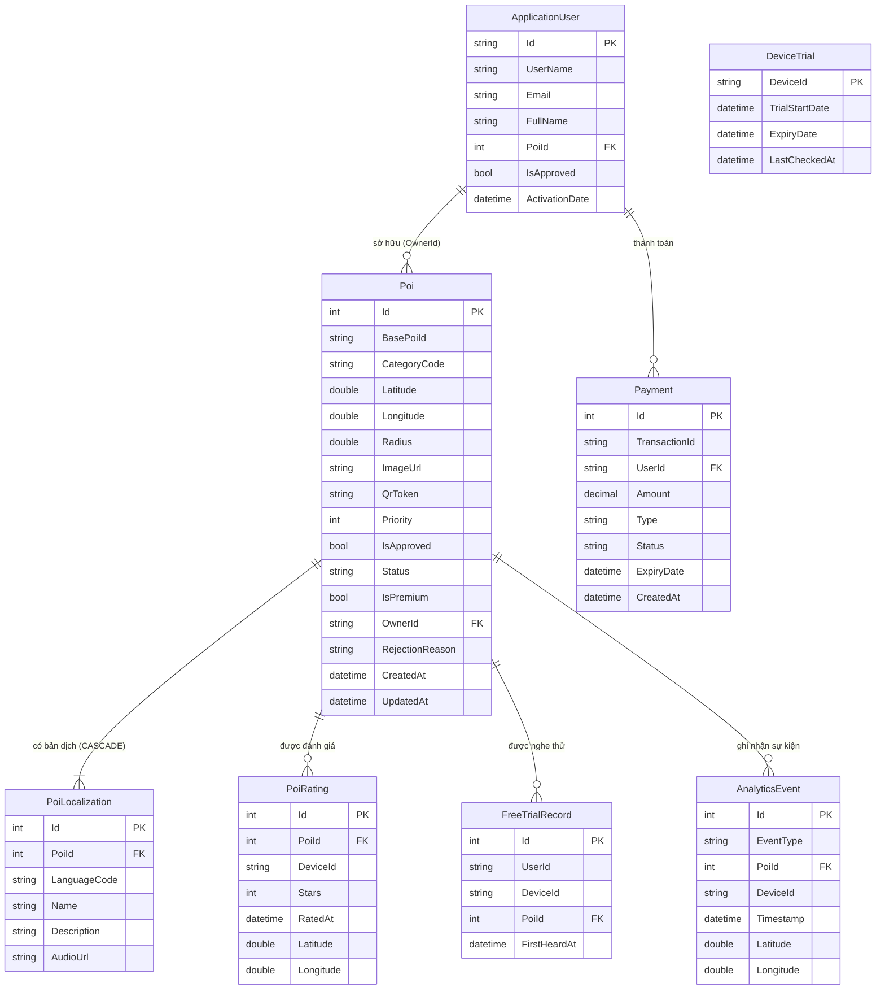

---
## 6. Class Diagram


---
## 7. Sequence Diagrams

### 7.1 Đăng nhập & Đăng ký

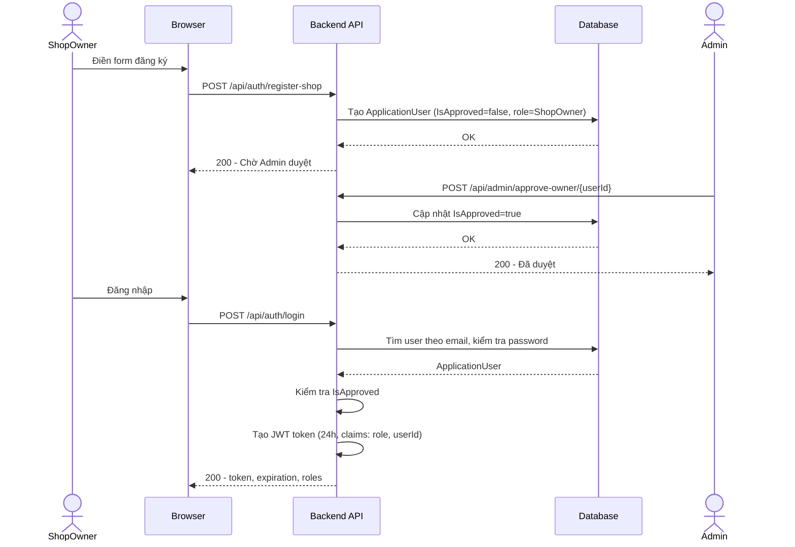

### 7.2 Tạo & Duyệt POI

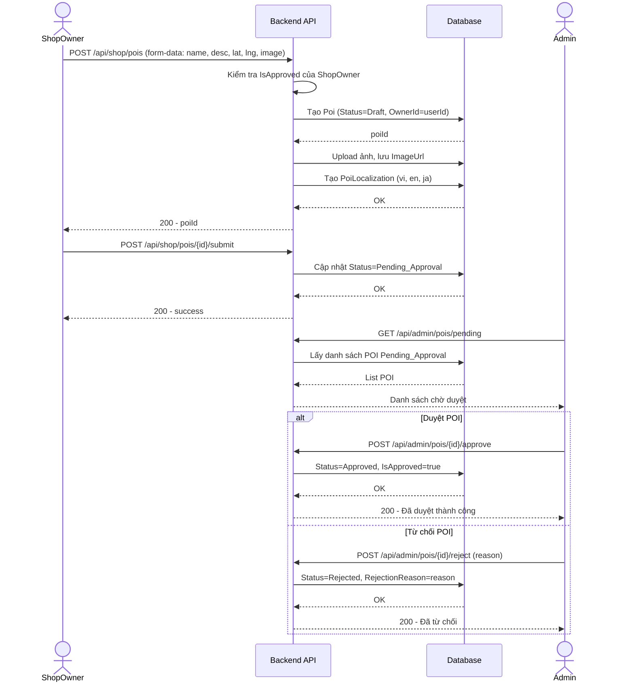

### 7.3 Đồng bộ Mobile

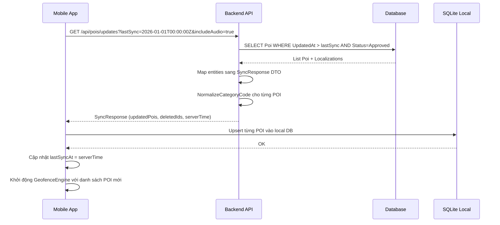

### 7.4 Thuyết minh tự động

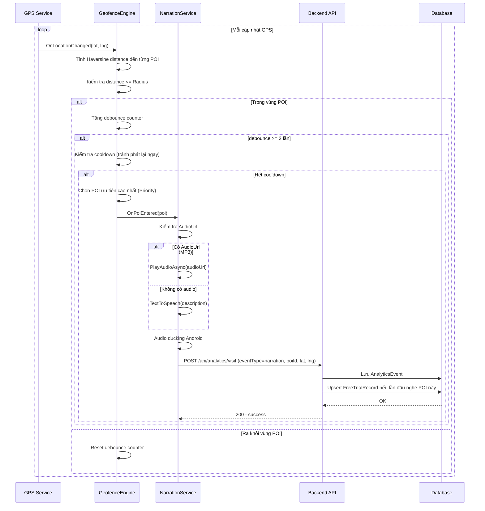

### 7.5 AI dịch thuật

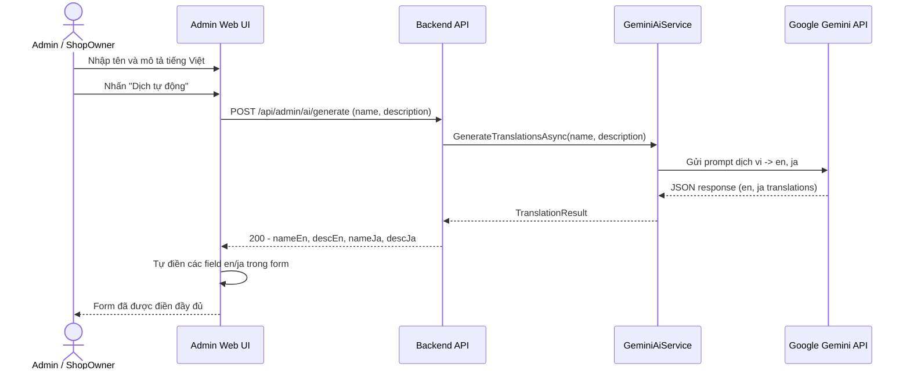

### 7.6 Kiểm soát truy cập

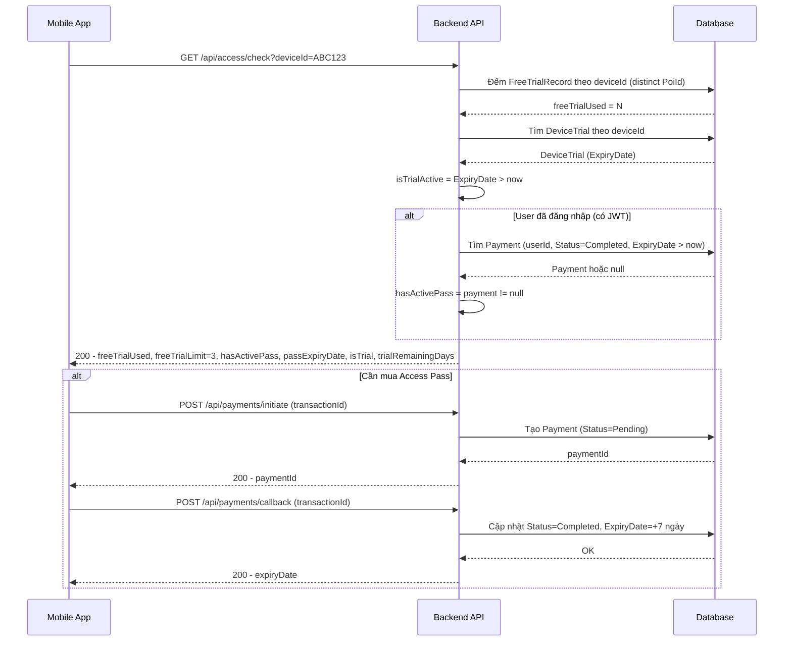

### 7.7 Quét QR

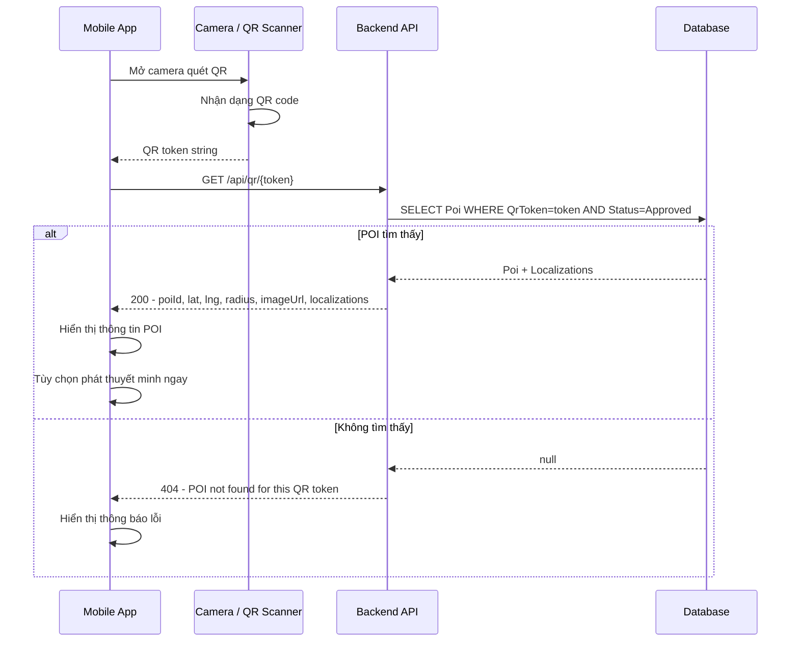

### 7.8 Đánh giá POI

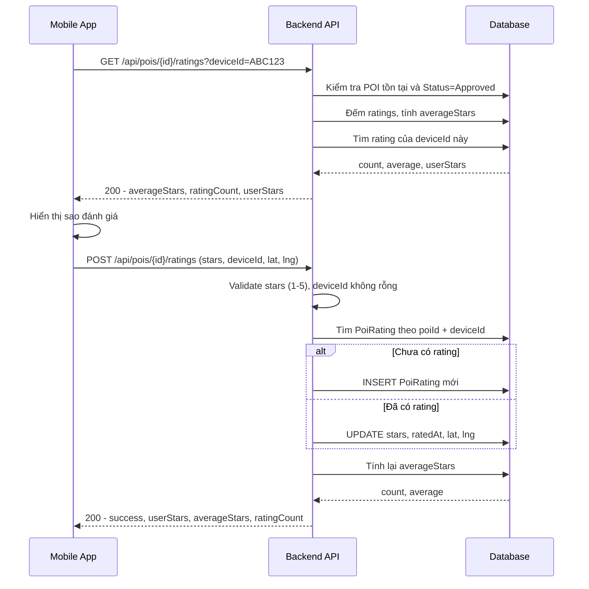

---
## 8. Activity Diagrams

### 8.1 Vòng đời POI

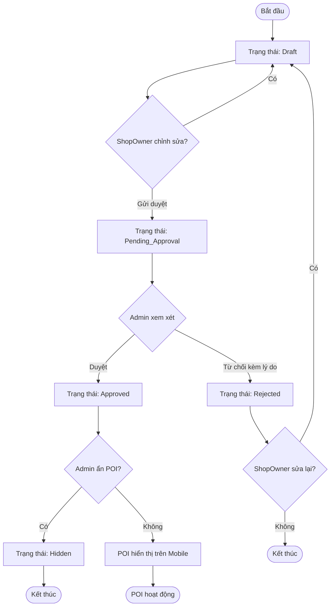

### 8.2 GeofenceEngine


### 8.3 Kiểm soát truy cập Visitor


### 8.4 NarrationService

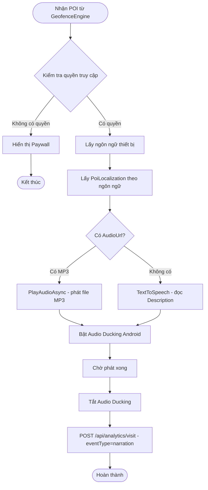

### 8.5 Đồng bộ dữ liệu Mobile

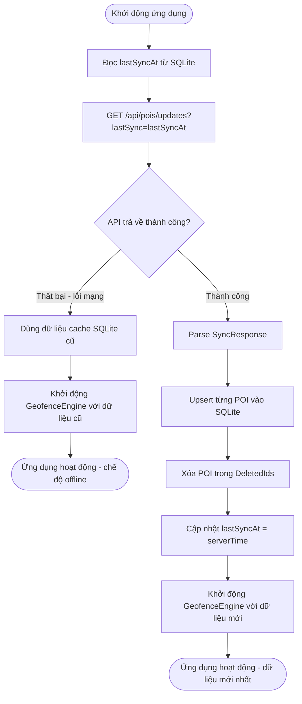

---
## 9. API Reference

### 9.1 Auth API

Base path: `/api/auth` | Không yêu cầu xác thực

| Method | Endpoint | Mô tả |
|--------|----------|-------|
| POST | `/api/auth/login` | Đăng nhập, nhận JWT token |
| POST | `/api/auth/register-shop` | Đăng ký tài khoản ShopOwner (chờ duyệt) |
| POST | `/api/auth/register-visitor` | Đăng ký tài khoản Visitor (tự động kích hoạt) |

**Ví dụ: POST /api/auth/login**

Request:
```json
{
  "email": "owner@example.com",
  "password": "Password123!"
}
```

Response `200 OK`:
```json
{
  "token": "eyJhbGciOiJIUzI1NiIsInR5cCI6IkpXVCJ9...",
  "expiration": "2026-04-18T10:00:00Z",
  "roles": ["ShopOwner"]
}
```

Response `403 Forbidden` (chưa được duyệt):
```json
"Tài khoản của bạn đang chờ Admin duyệt."
```

---

### 9.2 Admin API

Base path: `/api/admin` | Yêu cầu: `Bearer Token [role: Admin]`

| Method | Endpoint | Mô tả |
|--------|----------|-------|
| GET | `/api/admin/pois` | Lấy tất cả POI kèm thông tin chủ quán |
| GET | `/api/admin/pois/pending` | Lấy danh sách POI chờ duyệt |
| GET | `/api/admin/pois/{id}` | Chi tiết POI kèm QR link |
| POST | `/api/admin/pois` | Tạo POI mới (multipart/form-data) |
| PUT | `/api/admin/pois/{id}` | Cập nhật POI (multipart/form-data) |
| POST | `/api/admin/pois/{id}/approve` | Duyệt POI |
| POST | `/api/admin/pois/{id}/reject` | Từ chối POI kèm lý do |
| POST | `/api/admin/pois/{id}/hide` | Ẩn POI |
| GET | `/api/admin/dashboard-summary` | Tổng quan số liệu dashboard |
| POST | `/api/admin/ai/generate` | Dịch nội dung vi → en, ja qua Gemini |

**Ví dụ: POST /api/admin/pois/{id}/reject**

Request:
```json
{
  "reason": "Thông tin địa chỉ không chính xác, vui lòng cập nhật lại tọa độ."
}
```

Response `200 OK`:
```json
{
  "success": true
}
```

---

### 9.3 Shop API

Base path: `/api/shop` | Yêu cầu: `Bearer Token [role: ShopOwner, IsApproved=true]`

| Method | Endpoint | Mô tả |
|--------|----------|-------|
| GET | `/api/shop/pois` | Danh sách POI của ShopOwner hiện tại |
| GET | `/api/shop/pois/{id}` | Chi tiết POI của mình |
| POST | `/api/shop/pois` | Tạo POI mới (Status=Draft) |
| PUT | `/api/shop/pois/{id}` | Cập nhật POI (chỉ Draft/Rejected) |
| DELETE | `/api/shop/pois/{id}` | Xóa POI (không xóa khi Pending) |
| POST | `/api/shop/pois/{id}/submit` | Gửi POI để Admin duyệt |
| POST | `/api/shop/ai/generate` | Dịch nội dung vi → en, ja |
| GET | `/api/shop/analytics` | Thống kê visit/narration 30 ngày |

---
### 9.4 Mobile API

#### POI Sync

| Method | Endpoint | Auth | Mô tả |
|--------|----------|------|-------|
| GET | `/api/pois/updates` | Không | Sync POI theo timestamp |
| GET | `/api/pois/sync` | Không | Alias của /updates |

**Query params:** `lastSync` (DateTime ISO 8601), `includeAudio` (bool, default=true)

**Ví dụ: GET /api/pois/updates?lastSync=2026-01-01T00:00:00Z&includeAudio=true**

Response `200 OK`:
```json
{
  "updatedPois": [
    {
      "id": 1,
      "basePoiId": "abc123def4",
      "latitude": 10.7769,
      "longitude": 106.7009,
      "radius": 50,
      "imageUrl": "/media/img_abc123.jpg",
      "priority": 1,
      "isActive": true,
      "isPremium": false,
      "categoryCode": "FOOD_STREET",
      "updatedAt": "2026-04-17T10:00:00Z",
      "localizations": [
        {
          "languageCode": "vi",
          "name": "Quán Ốc Bà Năm",
          "description": "Quán ốc nổi tiếng với hơn 20 năm kinh nghiệm",
          "audioFile": "/media/audio_vi_abc123.mp3"
        },
        {
          "languageCode": "en",
          "name": "Ba Nam Snail Restaurant",
          "description": "Famous snail restaurant with over 20 years of experience",
          "audioFile": null
        }
      ]
    }
  ],
  "deletedIds": [],
  "serverTime": "2026-04-17T12:00:00Z"
}
```

#### Analytics

| Method | Endpoint | Auth | Mô tả |
|--------|----------|------|-------|
| POST | `/api/analytics/visit` | Không | Ghi nhận sự kiện visit/narration |
| GET | `/api/analytics/heatmap` | Admin | Dữ liệu heatmap theo tọa độ |
| GET | `/api/analytics/content-performance` | Admin | Top POI theo lượt nghe |

**Ví dụ: POST /api/analytics/visit**

Request:
```json
{
  "latitude": 10.7769,
  "longitude": 106.7009,
  "deviceId": "device-uuid-abc123",
  "poiId": 1,
  "eventType": "narration"
}
```

Response `200 OK`:
```json
{
  "success": true
}
```

#### Access Control

| Method | Endpoint | Auth | Mô tả |
|--------|----------|------|-------|
| GET | `/api/access/check` | Tùy chọn JWT | Kiểm tra trạng thái truy cập |
| POST | `/api/access/start-trial` | Không | Bắt đầu DeviceTrial 7 ngày |

**Ví dụ: GET /api/access/check?deviceId=device-uuid-abc123**

Response `200 OK`:
```json
{
  "freeTrialUsed": 2,
  "freeTrialLimit": 3,
  "hasActivePass": false,
  "passExpiryDate": null,
  "isTrial": false,
  "trialRemainingDays": 0
}
```

Response khi có DeviceTrial:
```json
{
  "freeTrialUsed": 5,
  "freeTrialLimit": 3,
  "hasActivePass": true,
  "passExpiryDate": "2026-04-24T10:00:00Z",
  "isTrial": true,
  "trialRemainingDays": 6
}
```

#### QR Code

| Method | Endpoint | Auth | Mô tả |
|--------|----------|------|-------|
| GET | `/api/qr/{token}` | Không | Tra cứu POI theo QrToken |

#### POI Ratings

| Method | Endpoint | Auth | Mô tả |
|--------|----------|------|-------|
| GET | `/api/pois/{id}/ratings` | Không | Xem điểm trung bình và rating của thiết bị |
| POST | `/api/pois/{id}/ratings` | Không | Gửi hoặc cập nhật rating |

#### Payments

| Method | Endpoint | Auth | Mô tả |
|--------|----------|------|-------|
| POST | `/api/payments/initiate` | JWT | Khởi tạo giao dịch Access Pass |
| POST | `/api/payments/callback` | JWT | Xác nhận thanh toán thành công |
| GET | `/api/payments/status` | JWT | Kiểm tra trạng thái Access Pass |

---

### 9.5 HTTP Status Codes

| Status | Ý nghĩa |
|--------|---------|
| 200 OK | Thành công |
| 400 Bad Request | Dữ liệu đầu vào không hợp lệ |
| 401 Unauthorized | Chưa xác thực (thiếu hoặc sai JWT) |
| 403 Forbidden | Không có quyền (tài khoản chưa duyệt, sai role) |
| 404 Not Found | Không tìm thấy resource |
| 409 Conflict | Trùng lặp (email đã tồn tại, giao dịch đã tồn tại) |
| 500 Internal Server Error | Lỗi server |

---

*Tài liệu được tạo tự động từ spec `project-documentation`. Cập nhật lần cuối: 2026.*
