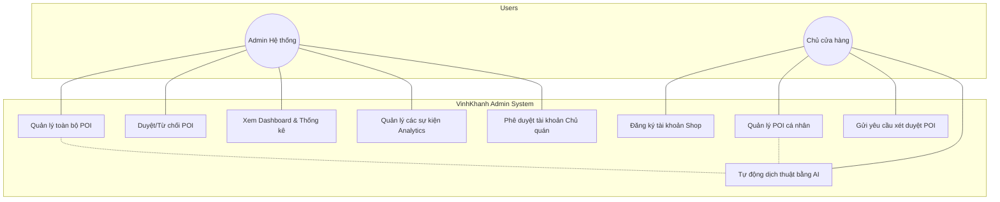
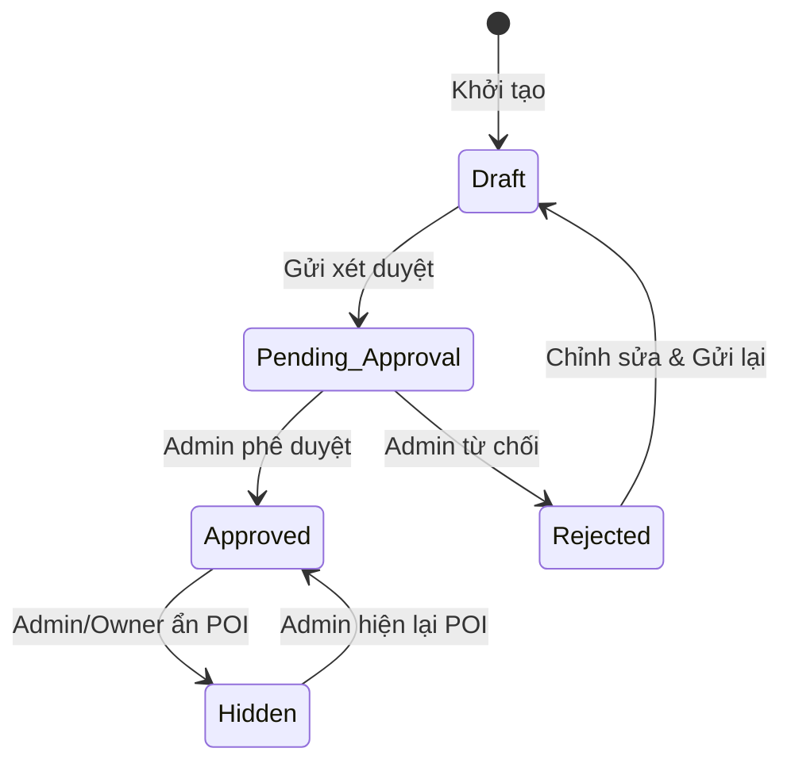
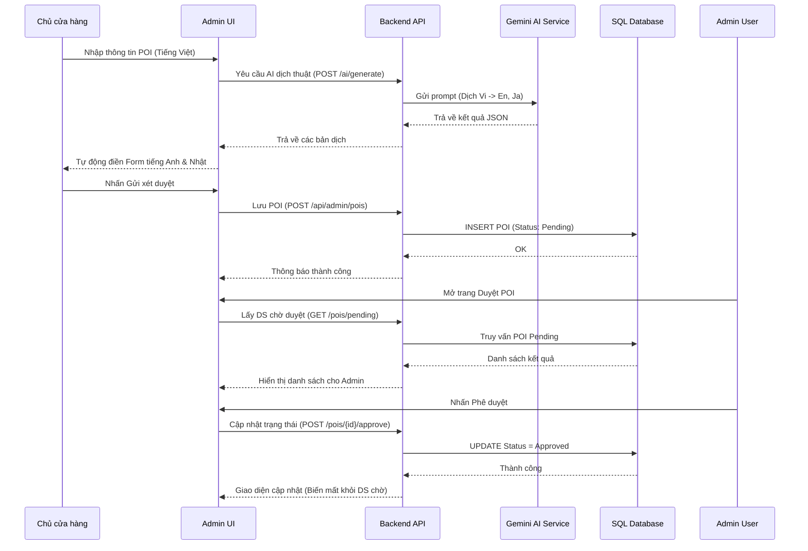
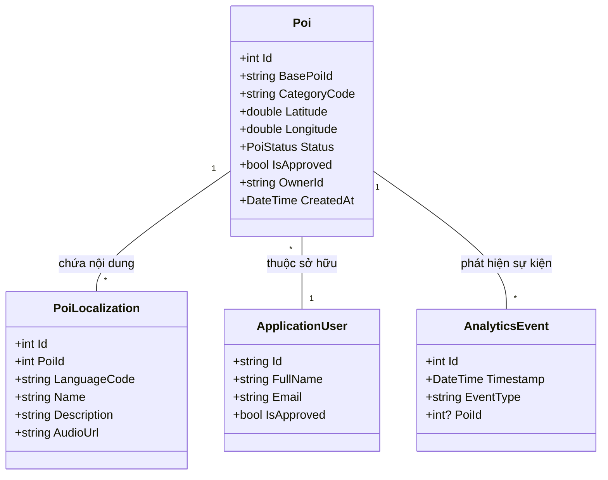

# VinhKhanh Admin Module

Đây là phân hệ quản trị của hệ thống **Vĩnh Khánh Digital Tour Guide**, được xây dựng để dành cho hai đối tượng chính: **Admin hệ thống** và **Chủ cửa hàng (Shop Owner)**.

## 1. Tổng quan kỹ thuật
- **Backend**: ASP.NET Core 8.0 (Web API).
- **Frontend**: React (Vite) + Tailwind CSS + Lucide Icons.
- **AI Integration**: Google Gemini AI (Dùng cho dịch thuật tự động).
- **Database**: SQL Server (Entity Framework Core).

---

## 2. Sơ đồ Chức năng (Use Case Diagram)
Sơ đồ dưới đây mô tả các chức năng chính và quyền hạn của hai nhóm người dùng chính trong hệ thống Admin.

---

## 3. Sơ đồ Trạng thái POI (State Diagram)
Mô tả vòng đời của một điểm tham quan (POI) từ khi khởi tạo đến khi được hiển thị trên bản đồ mobile.

---

## 4. Quy trình tạo và duyệt POI (Sequence Diagram)
Quy trình tương tác giữa Chủ cửa hàng, Hệ thống Admin, và AI Gemini khi tạo mới một địa điểm.

---

## 5. Cấu trúc dữ liệu chính (Class Diagram)
Mối quan hệ giữa các thực thể cốt lõi trong Domain.

---

## 6. Danh sách các chức năng chi tiết
### Đối với Admin:
- **Tổng quan**: Theo dõi biểu đồ lượt nghe và lượt ghé thăm POI theo giờ.
- **Duyệt POI**: Phê duyệt hoặc từ chối các địa điểm mới đăng ký.
- **Quản lý POI**: Có quyền can thiệp vào bất kỳ POI nào trên hệ thống.
- **Quản lý Owner**: Phê duyệt tài khoản cho các quán ăn tham gia hệ thống.

### Đối với Chủ quán (Shop Owner):
- **Dashboard**: Xem thống kê riêng cho quán của mình.
- **Quản lý POI cá nhân**: Chỉ xem và sửa được các POI do mình tạo ra.
- **AI Tool**: Dùng AI để dịch mô tả quán sang tiếng Anh và Nhật một cách chuyên nghiệp.
