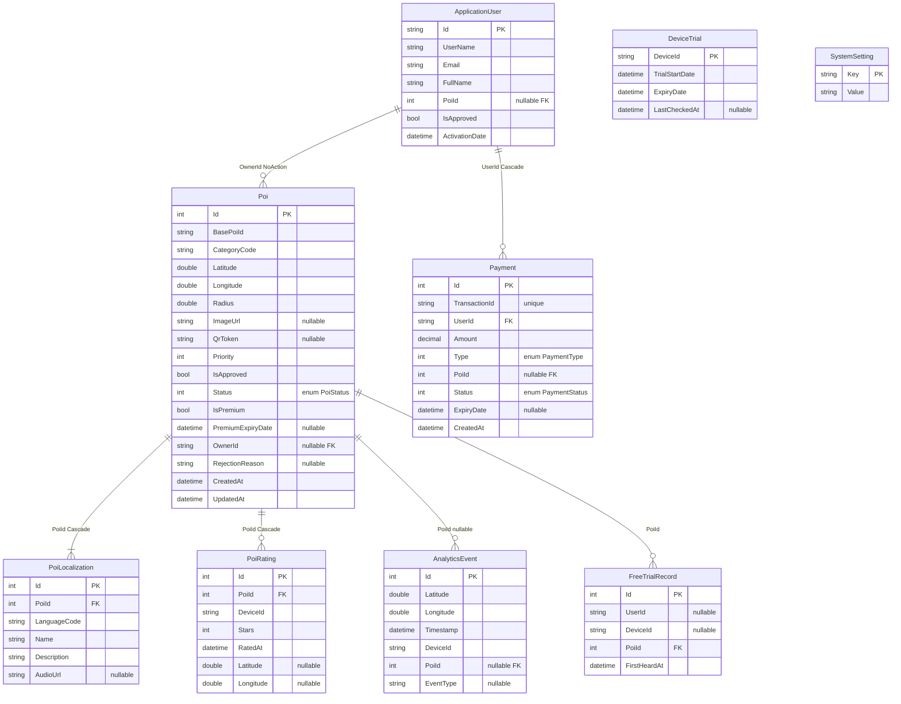

# VinhKhanh — Tài liệu PRD Tổng quan

> **Phiên bản:** 2.0 | **Ngày:** 24/04/2026

Tài liệu được tách thành các file riêng theo nhóm chức năng để dễ đọc và bảo trì.

---

## Danh sách tài liệu

| File | Nội dung |
|---|---|
| [01-auth.md](./01-auth.md) | Xác thực & Phân quyền — Login, RegisterShop, RegisterVisitor |
| [02-admin-poi.md](./02-admin-poi.md) | Quản lý POI (Admin) — CRUD, Approve, Reject, Hide, QR |
| [03-shop-owner.md](./03-shop-owner.md) | Cổng chủ quán (ShopOwner) — Draft, Submit, AI dịch thuật |
| [04-mobile-sync.md](./04-mobile-sync.md) | Đồng bộ Mobile — Delta Sync, SQLite, Language Fallback |
| [05-geofence-narration.md](./05-geofence-narration.md) | Geofence & Thuyết minh — GPS, Debounce, Cooldown, MP3/TTS |
| [06-access-payment.md](./06-access-payment.md) | Kiểm soát truy cập & Thanh toán — Trial, FreeTrial, AccessPass |
| [07-analytics.md](./07-analytics.md) | Analytics & Realtime — Heatmap, Content Performance, SignalR |
| [08-ratings-qr-settings.md](./08-ratings-qr-settings.md) | Đánh giá POI, QR Code, Cài đặt hệ thống |

---

## Kiến trúc tổng quan

```
┌─────────────────────────────────────────────────────────────────┐
│                      Presentation Layer                          │
│  VinhKhanh.Admin (ASP.NET Core 10 — Controllers)                │
│  VinhKhanh.Admin.Ui (React + Vite + TailwindCSS)                │
│  VinhKhanh.Mobile (.NET MAUI Android)                           │
├─────────────────────────────────────────────────────────────────┤
│                      Application Layer                           │
│  AdminApproveUseCase / AnalyticsVisitUseCase / PoiSyncUseCase   │
├─────────────────────────────────────────────────────────────────┤
│                       Domain Layer                               │
│  Entities: Poi, ApplicationUser, Payment, AnalyticsEvent...     │
│  Interfaces: IPoiRepository, IAnalyticsRepository               │
├─────────────────────────────────────────────────────────────────┤
│                    Infrastructure Layer                          │
│  AppDbContext (EF Core) / PoiRepository / AnalyticsRepository   │
│  GeminiAiService / EncryptionUtility                            │
└─────────────────────────────────────────────────────────────────┘
```

## ERD tổng quan



**Ràng buộc DB quan trọng:**
- `PoiRating`: Unique index `(DeviceId, PoiId)` — mỗi thiết bị chỉ có 1 rating/POI; Check `Stars >= 1 AND Stars <= 5`
- `FreeTrialRecord`: Unique index `(UserId, PoiId)` khi `UserId IS NOT NULL`; Unique index `(DeviceId, PoiId)` khi `DeviceId IS NOT NULL`
- `Payment.TransactionId`: Unique index — tránh duplicate transaction
- `PoiStatus` enum: `Draft=0, Pending_Approval=1, Approved=2, Rejected=3, Hidden=4`
- `PaymentType` enum: `AccessPass=0, PremiumUpgrade=1`
- `PaymentStatus` enum: `Pending=0, Completed=1, Failed=2, Refunded=3`
