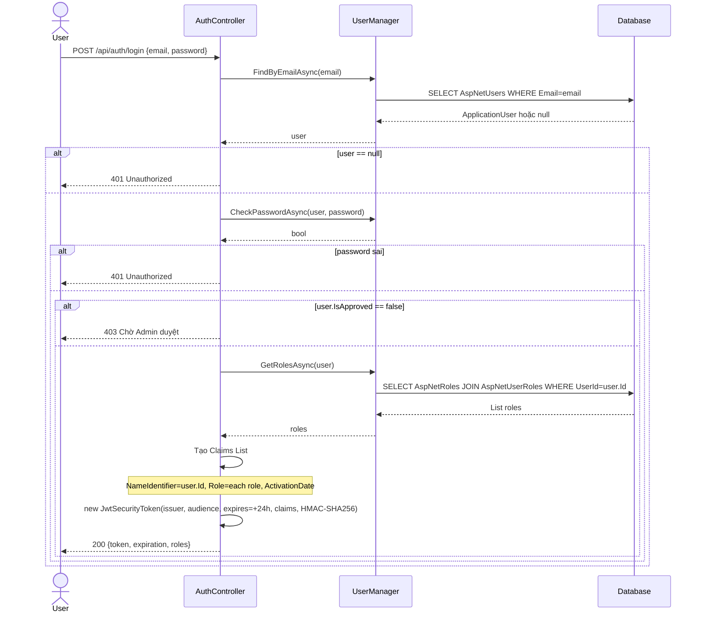
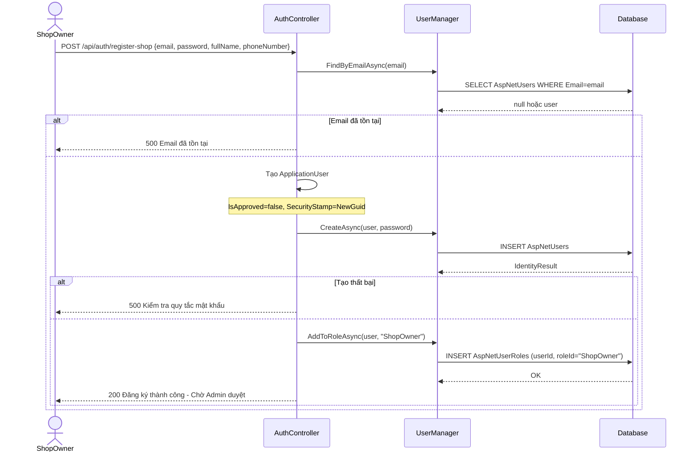
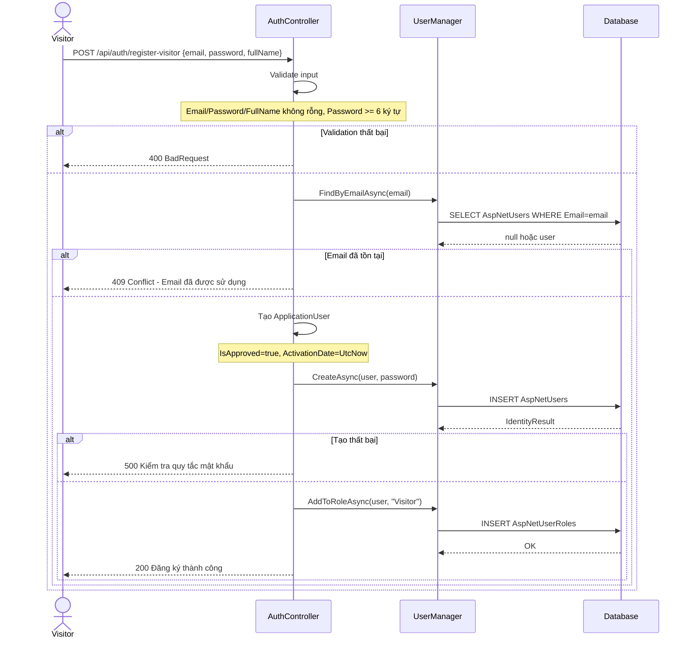
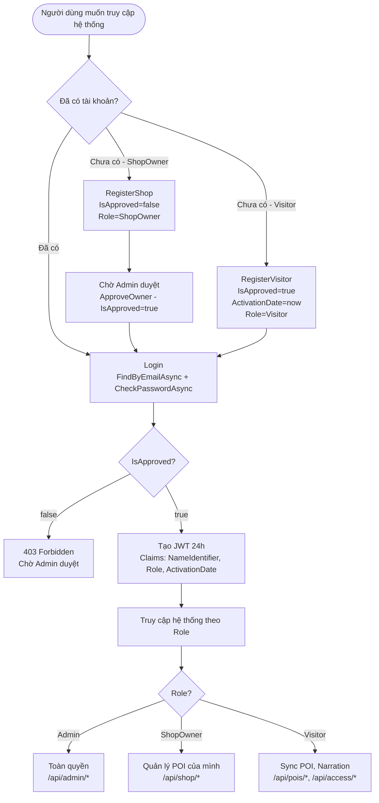

# 01 — Xác thực & Phân quyền

**Controller:** `AuthController` — Route: `api/auth`  
**Không yêu cầu xác thực** (public endpoints)

---

## Danh sách chức năng

| # | Endpoint | Hàm | Mô tả ngắn |
|---|---|---|---|
| 1 | `POST /api/auth/login` | `Login(LoginRequest)` | Đăng nhập, nhận JWT 24h |
| 2 | `POST /api/auth/register-shop` | `RegisterShop(RegisterShopRequest)` | Đăng ký ShopOwner, chờ Admin duyệt |
| 3 | `POST /api/auth/register-visitor` | `RegisterVisitor(RegisterVisitorRequest)` | Đăng ký Visitor, tự động kích hoạt |

---

## 1. Login — `POST /api/auth/login`

### Logic chi tiết

```
1. userManager.FindByEmailAsync(request.Email)
   → Nếu null hoặc CheckPasswordAsync trả false → return Unauthorized("Tài khoản hoặc mật khẩu không chính xác.")

2. Kiểm tra user.IsApproved
   → Nếu false → return StatusCode(403, "Tài khoản của bạn đang chờ Admin duyệt.")
   → Lý do: ShopOwner cần Admin duyệt trước khi đăng nhập được

3. userManager.GetRolesAsync(user)
   → Lấy danh sách role: ["Admin"] | ["ShopOwner"] | ["Visitor"]

4. Tạo JWT Claims:
   - ClaimTypes.Name = user.UserName
   - ClaimTypes.NameIdentifier = user.Id  ← dùng để lấy CurrentUserId trong các controller khác
   - ClaimTypes.Role = mỗi role một claim riêng
   - "ActivationDate" = user.ActivationDate.ToString("o")  ← dùng cho logic tính phí Visitor

5. Tạo JwtSecurityToken:
   - Key: configuration["Jwt:Key"] (HMAC-SHA256)
   - Issuer/Audience: từ appsettings
   - Expires: DateTime.Now.AddHours(24)

6. Return: { token, expiration, roles }
```

### Request / Response

```json
// Request
{ "email": "owner@example.com", "password": "Password123!" }

// Response 200
{ "token": "eyJ...", "expiration": "2026-04-25T10:00:00Z", "roles": ["ShopOwner"] }

// Response 401
"Tài khoản hoặc mật khẩu không chính xác."

// Response 403
"Tài khoản của bạn đang chờ Admin duyệt."
```

### Sequence Diagram



---

## 2. RegisterShop — `POST /api/auth/register-shop`

### Logic chi tiết

```
1. userManager.FindByEmailAsync(request.Email)
   → Nếu đã tồn tại → return StatusCode(500, "Tài khoản với Email này đã tồn tại!")

2. Tạo ApplicationUser mới:
   - Email = request.Email
   - UserName = request.Email  ← Identity dùng UserName để login
   - FullName = request.FullName
   - PhoneNumber = request.PhoneNumber
   - SecurityStamp = Guid.NewGuid().ToString()  ← bắt buộc của ASP.NET Identity
   - IsApproved = false  ← QUAN TRỌNG: ShopOwner phải chờ Admin duyệt

3. userManager.CreateAsync(user, request.Password)
   → Nếu thất bại (password không đủ mạnh, v.v.) → return StatusCode(500, "Kiểm tra lại quy tắc mật khẩu.")

4. userManager.AddToRoleAsync(user, "ShopOwner")
   → Ghi vào bảng AspNetUserRoles

5. Return: { success: true, message: "Đăng ký thành công! Vui lòng chờ Admin duyệt." }
   → Không tự động đăng nhập được vì IsApproved=false
```

### Sequence Diagram



---

## 3. RegisterVisitor — `POST /api/auth/register-visitor`

### Logic chi tiết

```
1. Validate input:
   - Email, Password, FullName không được rỗng → BadRequest
   - Password.Length < 6 → BadRequest "Mật khẩu phải có ít nhất 6 ký tự."

2. userManager.FindByEmailAsync(request.Email)
   → Nếu đã tồn tại → return Conflict({ error: "Email đã được sử dụng." })
   → Dùng Conflict(409) thay vì 500 để FE phân biệt được lỗi

3. Tạo ApplicationUser mới:
   - IsApproved = true  ← Visitor tự động kích hoạt, không cần duyệt
   - ActivationDate = DateTime.UtcNow  ← Mốc tính 7 ngày dùng thử

4. userManager.CreateAsync(user, request.Password)

5. userManager.AddToRoleAsync(user, "Visitor")

6. Return: { success: true, message: "Đăng ký thành công!" }
   → Visitor có thể đăng nhập ngay lập tức
```

### Sự khác biệt giữa ShopOwner và Visitor

| Thuộc tính | ShopOwner | Visitor |
|---|---|---|
| `IsApproved` | `false` (chờ Admin) | `true` (tự động) |
| `ActivationDate` | `DateTime.UtcNow` (mặc định) | `DateTime.UtcNow` (ghi rõ) |
| Role | `ShopOwner` | `Visitor` |
| Đăng nhập ngay | ❌ | ✅ |
| Validation | Không validate password length | Validate >= 6 ký tự |

### Sequence Diagram



---

## Activity Diagram — Luồng xác thực tổng quát


