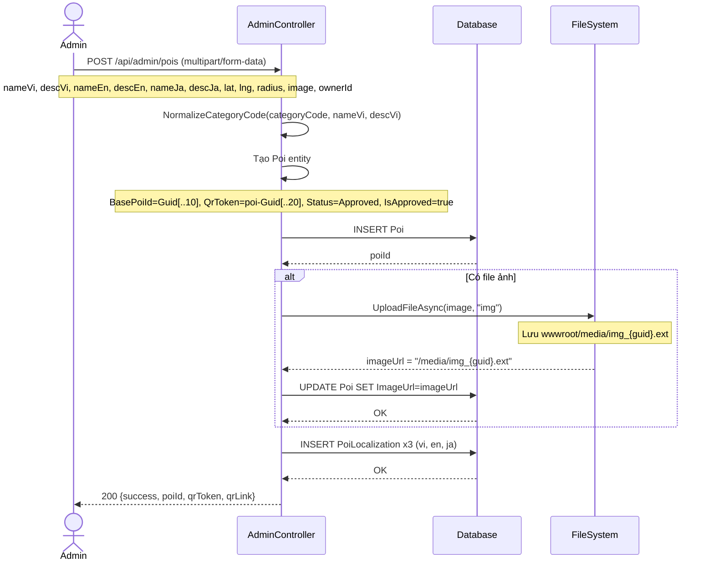
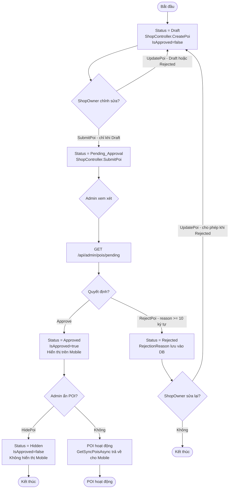
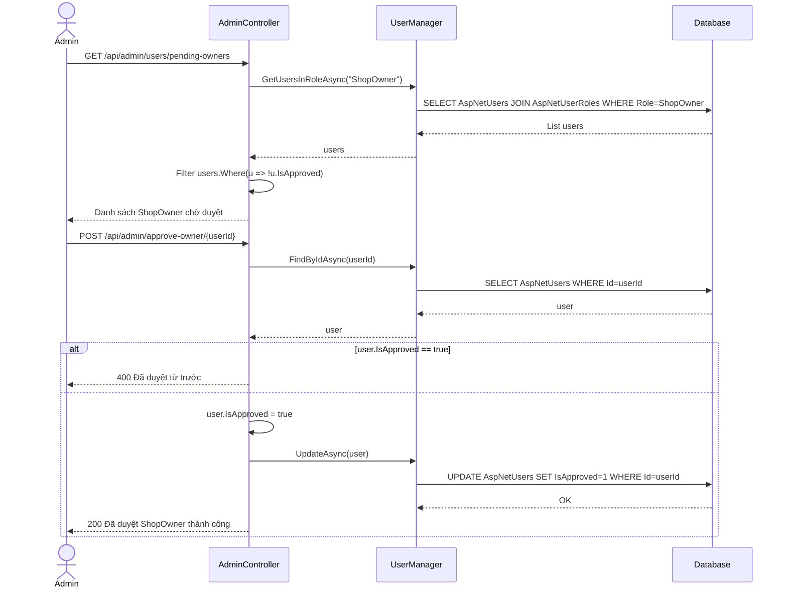

# 02 — Quản lý POI (Admin)

**Controller:** `AdminController` — Route: `api/admin`  
**Yêu cầu:** `[Authorize(Roles = "Admin")]`

---

## Danh sách chức năng

| # | Endpoint | Hàm | Mô tả ngắn |
|---|---|---|---|
| 1 | `GET /api/admin/pois` | `GetPois` | Lấy tất cả POI kèm owner |
| 2 | `GET /api/admin/pois/pending` | `GetPendingPois` | POI đang chờ duyệt |
| 3 | `GET /api/admin/pois/{id}` | `GetPoiById` | Chi tiết POI + QR link |
| 4 | `POST /api/admin/pois` | `CreatePoi` | Tạo POI mới (Admin tạo = Approved ngay) |
| 5 | `PUT /api/admin/pois/{id}` | `UpdatePoi` | Cập nhật POI |
| 6 | `DELETE /api/admin/pois/{id}` | `DeletePoi` | Xóa POI + cascade |
| 7 | `POST /api/admin/pois/{id}/approve` | `Approve` | Duyệt POI |
| 8 | `POST /api/admin/pois/{id}/reject` | `RejectPoi` | Từ chối POI kèm lý do |
| 9 | `POST /api/admin/pois/{id}/hide` | `HidePoi` | Ẩn POI |
| 10 | `POST /api/admin/pois/{id}/reset-qr` | `ResetQrToken` | Sinh QR token mới |
| 11 | `GET /api/admin/dashboard-summary` | `GetDashboardSummary` | Tổng quan số liệu |
| 12 | `POST /api/admin/approve-owner/{userId}` | `ApproveOwner` | Duyệt ShopOwner |
| 13 | `POST /api/admin/users/{userId}/reject-owner` | `RejectOwner` | Từ chối + xóa ShopOwner |
| 14 | `PUT /api/admin/users/{userId}` | `UpdateOwner` | Cập nhật thông tin + Premium |
| 15 | `POST /api/admin/users/{userId}/toggle-premium` | `TogglePremium` | Bật/tắt Premium |
| 16 | `GET /api/admin/users/owners` | `GetOwners` | Danh sách tất cả ShopOwner |
| 17 | `GET /api/admin/users/pending-owners` | `GetPendingOwners` | ShopOwner chờ duyệt |
| 18 | `POST /api/admin/ai/generate` | `GenerateTranslations` | AI dịch vi→en,ja |

---

## 1. GetPois — `GET /api/admin/pois`

### Logic chi tiết

```
1. dbContext.Pois
     .Include(p => p.Localizations)   ← eager load bản dịch
     .Include(p => p.Owner)           ← eager load thông tin chủ quán
     .OrderByDescending(p => p.Id)    ← POI mới nhất lên đầu
     .ToListAsync()

2. Với mỗi POI, lấy bản dịch tiếng Việt:
   viLocalization = p.Localizations.FirstOrDefault(l => l.LanguageCode == "vi")

3. Gọi NormalizeCategoryCode(p.CategoryCode, viName, viDesc):
   - Nếu CategoryCode hợp lệ (trong set: FOOD_SNAIL, FOOD_BBQ, FOOD_STREET, DRINK, UTILITY)
     → trả về CategoryCode.ToUpperInvariant()
   - Nếu không hợp lệ → gọi InferCategory(name, description):
     * Chứa "oc/ốc/oyster/snail/hai san" → FOOD_SNAIL
     * Chứa "bbq/nuong/nướng/lau/lẩu/hotpot" → FOOD_BBQ
     * Chứa "coffee/ca phe/cà phê/drink/tra sua" → DRINK
     * Mặc định → FOOD_STREET

4. Return mảng: { id, name, categoryCode, category, imageUrl, lat, lng, isApproved, status, isPremium, ownerName }
```

---

## 2. GetPendingPois — `GET /api/admin/pois/pending`

### Logic chi tiết

```
1. dbContext.Pois
     .Include(p => p.Localizations)
     .Include(p => p.Owner)
     .Where(p => p.Status == PoiStatus.Pending_Approval)  ← chỉ lấy POI đang chờ
     .OrderBy(p => p.CreatedAt)   ← cũ nhất lên đầu (FIFO — duyệt theo thứ tự nộp)
     .ToListAsync()

2. Return: { id, name, description, imageUrl, lat, lng, ownerName, createdAt }
   → Không trả về toàn bộ localizations để giảm payload
```

---

## 3. CreatePoi — `POST /api/admin/pois`

### Logic chi tiết

```
1. Tạo thư mục media nếu chưa có:
   mediaFolder = Path.Combine(env.WebRootPath, "media")
   Directory.CreateDirectory(mediaFolder)

2. Tạo Poi entity:
   - BasePoiId = Guid.NewGuid().ToString("N")[..10].ToLower()  ← 10 ký tự hex, dùng để gom nhóm đa ngôn ngữ trên Mobile
   - QrToken = $"poi-{Guid.NewGuid():N}"[..20].ToLowerInvariant()  ← 20 ký tự, unique
   - CategoryCode = NormalizeCategoryCode(request.CategoryCode, nameVi, descVi)
   - Status = PoiStatus.Approved  ← Admin tạo = duyệt ngay, không qua Pending
   - IsApproved = true
   - OwnerId = request.OwnerId  ← Admin có thể gán cho ShopOwner cụ thể

3. dbContext.Pois.Add(poi) → SaveChangesAsync()  ← lấy poiId

4. Upload ảnh (nếu có):
   UploadFileAsync(request.Image, "img"):
   - ext = Path.GetExtension(file.FileName)
   - newName = $"img_{Guid.NewGuid():N}{ext}"
   - Lưu vào wwwroot/media/
   - Return "/media/{newName}"
   → UPDATE Poi SET ImageUrl = imageUrl

5. Tạo 3 PoiLocalization:
   dbContext.PoiLocalizations.AddRange(
     { PoiId, LanguageCode="vi", Name=nameVi, Description=descVi },
     { PoiId, LanguageCode="en", Name=nameEn, Description=descEn },
     { PoiId, LanguageCode="ja", Name=nameJa, Description=descJa }
   )

6. Return: { success, message, poiId, qrToken, qrLink }
   qrLink = BuildQrLink(qrToken) = "{scheme}://{host}/qr/{token}"
```

### Sequence Diagram



---

## 4. Approve / Reject / Hide POI

### Approve — `POST /api/admin/pois/{id}/approve`

```
Logic:
1. dbContext.Pois.FirstOrDefaultAsync(p => p.Id == poiId)
   → Nếu null → 404

2. poi.Status = PoiStatus.Approved   (enum value = 2)
   poi.IsApproved = true
   poi.UpdatedAt = DateTime.UtcNow   ← quan trọng: Mobile sync dựa vào UpdatedAt

3. SaveChangesAsync()
4. Return: { success: true, message: "Đã duyệt thành công." }

Tác động: POI sẽ xuất hiện trong kết quả của PoiRepository.GetSyncPoisAsync()
→ Mobile sẽ nhận được POI này trong lần sync tiếp theo
```

### Reject — `POST /api/admin/pois/{id}/reject`

```
Logic:
1. Validate: request.Reason.Length < 10 → BadRequest "Lý do từ chối phải có ít nhất 10 ký tự."
   → Bắt buộc lý do đủ dài để ShopOwner hiểu cần sửa gì

2. dbContext.Pois.FirstOrDefaultAsync(p => p.Id == poiId)
   → Nếu null → 404

3. poi.Status = PoiStatus.Rejected   (enum value = 3)
   poi.RejectionReason = request.Reason   ← lưu lý do để ShopOwner đọc
   poi.IsApproved = false
   poi.UpdatedAt = DateTime.UtcNow

4. SaveChangesAsync()
5. Return: { success: true }

Tác động: ShopOwner có thể sửa lại POI (UpdatePoi) và gửi duyệt lại (SubmitPoi)
```

### Hide — `POST /api/admin/pois/{id}/hide`

```
Logic:
1. dbContext.Pois.FirstOrDefaultAsync(p => p.Id == poiId)
   → Nếu null → 404

2. poi.Status = PoiStatus.Hidden   (enum value = 4)
   poi.IsApproved = false
   poi.UpdatedAt = DateTime.UtcNow

3. SaveChangesAsync()
4. Return: { success: true }

Tác động: POI bị ẩn khỏi Mobile (GetSyncPoisAsync chỉ lấy Status=Approved)
Khác với Reject: Hidden không có RejectionReason, thường dùng khi quán tạm đóng cửa
```

### Activity Diagram — Vòng đời POI



---

## 5. DeletePoi — `DELETE /api/admin/pois/{id}`

```
Logic:
1. dbContext.Pois.FirstOrDefaultAsync(p => p.Id == poiId)
   → Nếu null → 404

2. dbContext.Pois.Remove(poi)
   → EF Core tự động cascade delete:
     - PoiLocalization (DeleteBehavior.Cascade trong OnModelCreating)
     - PoiRating (DeleteBehavior.Cascade)
   → AnalyticsEvent.PoiId sẽ thành NULL (nullable FK, không cascade)
   → FreeTrialRecord.PoiId: không cascade, cần xử lý riêng nếu cần

3. SaveChangesAsync()
4. Return: { success: true, message: "Đã xóa POI thành công." }
```

---

## 6. ResetQrToken — `POST /api/admin/pois/{id}/reset-qr`

```
Logic:
1. dbContext.Pois.FirstOrDefaultAsync(p => p.Id == poiId)
   → Nếu null → 404

2. Sinh token mới đảm bảo unique:
   do {
     token = $"poi-{Guid.NewGuid():N}"[..20].ToLowerInvariant()
   } while (await dbContext.Pois.AnyAsync(p => p.QrToken == token))
   → Vòng lặp do-while đảm bảo không trùng với token đang tồn tại

3. poi.QrToken = token
   poi.UpdatedAt = DateTime.UtcNow

4. SaveChangesAsync()
5. Return: { success, newQrToken, newQrLink }
   → QR cũ lập tức vô hiệu, QR mới có hiệu lực ngay
```

---

## 7. GetDashboardSummary — `GET /api/admin/dashboard-summary`

```
Logic:
1. poisCount = dbContext.Pois.CountAsync()

2. visitCount = dbContext.AnalyticsEvents.CountAsync()
   narrationCount = dbContext.AnalyticsEvents.CountAsync(e => e.EventType == "narration")

3. onlineCount (active trong 5 phút qua):
   onlineThreshold = DateTime.UtcNow - 5 phút
   dbContext.AnalyticsEvents
     .Where(e => e.Timestamp >= onlineThreshold)
     .Select(e => e.DeviceId)
     .Distinct()
     .CountAsync()

4. hourlyActivity (8 giờ gần nhất):
   startHourUtc = DateTime.UtcNow.AddHours(-7).Date.AddHours(hour-7)
   GROUP BY e.Timestamp.Hour
   → Tạo activitySeries: 8 điểm dữ liệu theo giờ

5. visitsToday = CountAsync(e => e.Timestamp >= todayUtc)

6. totalShops = userManager.GetUsersInRoleAsync("ShopOwner")
   pendingOwnersCount = totalShops.Count(u => !u.IsApproved)

7. Return: { poisCount, visitCount, narrationCount, visitsToday, onlineCount,
             totalShopsCount, pendingOwnersCount, activitySeries }
```

---

## 8. ApproveOwner / RejectOwner / UpdateOwner

### ApproveOwner — `POST /api/admin/approve-owner/{userId}`

```
Logic:
1. userManager.FindByIdAsync(userId) → 404 nếu không tìm thấy
2. Kiểm tra user.IsApproved == true → BadRequest "Đã duyệt từ trước"
3. user.IsApproved = true
4. userManager.UpdateAsync(user) → UPDATE AspNetUsers SET IsApproved=1
5. Return: { success: true, message: "Đã duyệt ShopOwner thành công." }
→ Sau khi duyệt, ShopOwner có thể đăng nhập (Login kiểm tra IsApproved)
```

### UpdateOwner — `PUT /api/admin/users/{userId}`

```
Logic:
1. userManager.FindByIdAsync(userId) → 404 nếu không tìm thấy
2. Cập nhật: user.FullName, user.PhoneNumber (nếu có trong request)
3. userManager.UpdateAsync(user)

4. Xử lý Premium (nếu request.PremiumOption != null):
   poi = dbContext.Pois.FirstOrDefaultAsync(p => p.OwnerId == userId)
   
   if PremiumOption == "None":
     poi.IsPremium = false
     poi.Priority = 0
     poi.PremiumExpiryDate = null
   else:
     poi.IsPremium = true
     poi.Priority = 100  ← POI Premium được ưu tiên phát thuyết minh trước
     months = switch PremiumOption:
       "1Month" → 1
       "6Months" → 6
       "1Year" → 12
     poi.PremiumExpiryDate = DateTime.UtcNow.AddMonths(months)
     → Luôn gia hạn từ thời điểm hiện tại (không cộng dồn)

5. poi.UpdatedAt = DateTime.UtcNow → SaveChangesAsync()
6. Return: { success: true }
```

### Sequence Diagram — Duyệt ShopOwner


