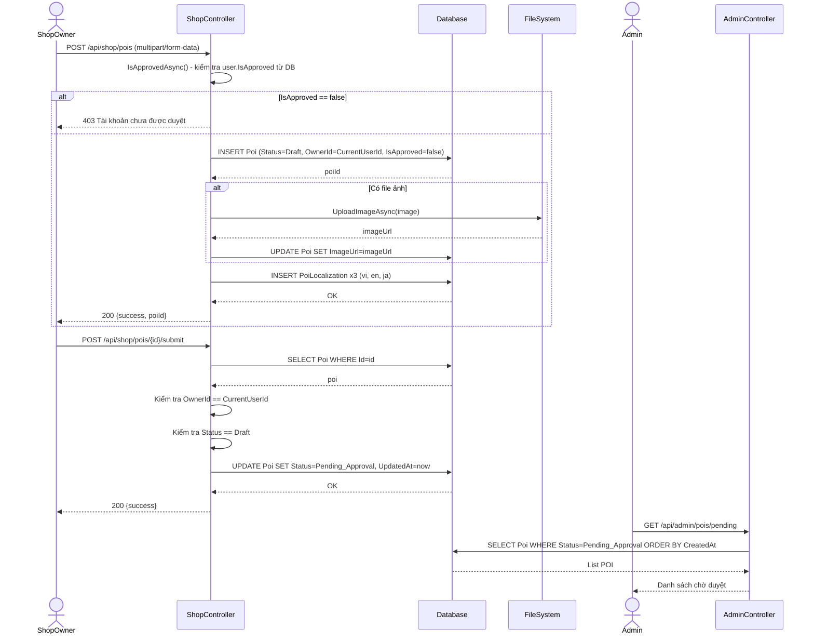
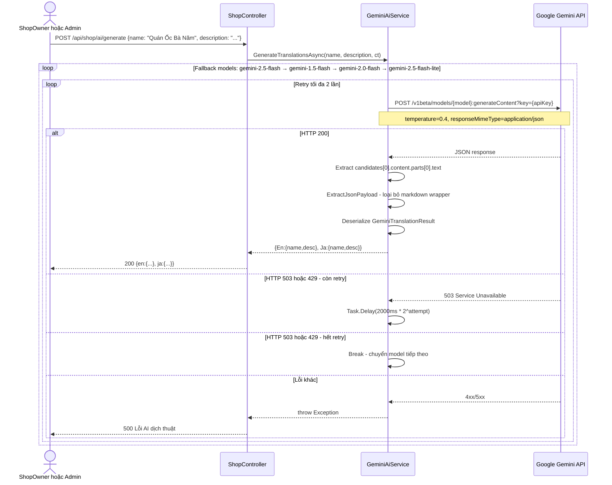
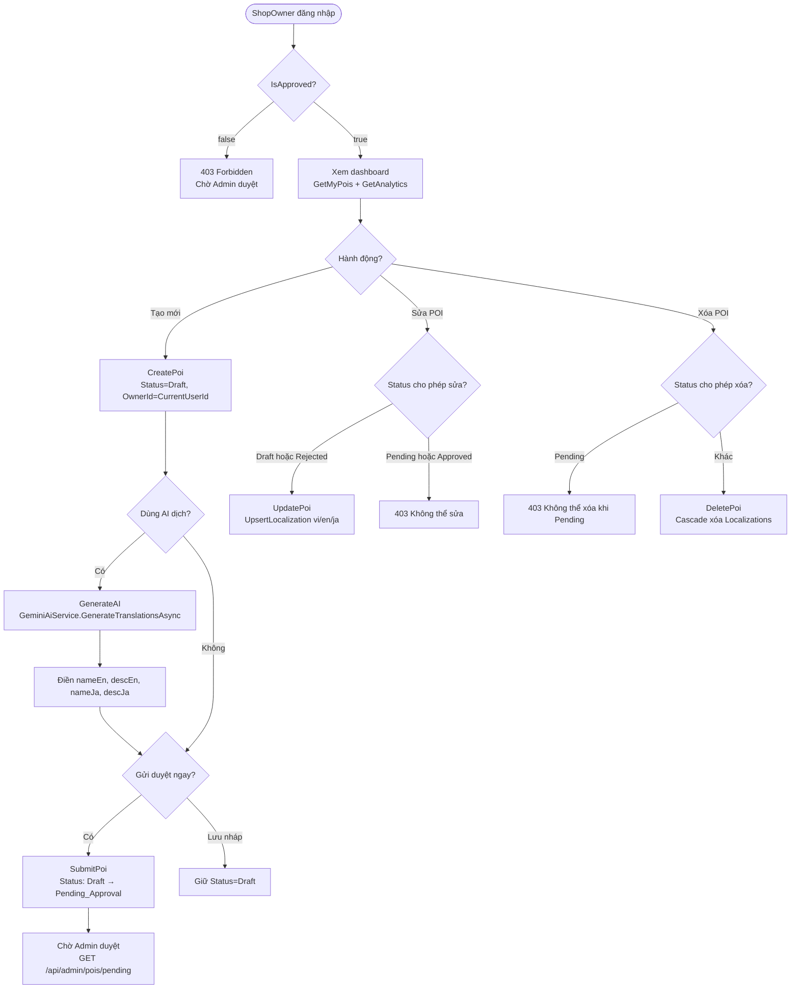

# 03 — Cổng chủ quán (ShopOwner)

**Controller:** `ShopController` — Route: `api/shop`  
**Yêu cầu:** `[Authorize(Roles = "ShopOwner")]` + `IsApproved == true`

---

## Danh sách chức năng

| # | Endpoint | Hàm | Mô tả ngắn |
|---|---|---|---|
| 1 | `GET /api/shop/pois` | `GetMyPois` | Danh sách POI của mình |
| 2 | `GET /api/shop/pois/{id}` | `GetMyPoi` | Chi tiết POI của mình |
| 3 | `POST /api/shop/pois` | `CreatePoi` | Tạo POI nháp (Draft) |
| 4 | `PUT /api/shop/pois/{id}` | `UpdatePoi` | Sửa POI (chỉ Draft/Rejected) |
| 5 | `DELETE /api/shop/pois/{id}` | `DeletePoi` | Xóa POI (không xóa khi Pending) |
| 6 | `POST /api/shop/pois/{id}/submit` | `SubmitPoi` | Gửi duyệt (Draft → Pending) |
| 7 | `POST /api/shop/ai/generate` | `GenerateAI` | AI dịch vi→en,ja |
| 8 | `GET /api/shop/analytics` | `GetAnalytics` | Thống kê 30 ngày |

---

## Cơ chế kiểm tra quyền

Mọi endpoint đều gọi `IsApprovedAsync()` trước khi xử lý:

```csharp
private string? CurrentUserId => User.FindFirstValue(ClaimTypes.NameIdentifier);

private async Task<bool> IsApprovedAsync(CancellationToken ct)
{
    var user = await userManager.FindByIdAsync(CurrentUserId!);
    return user?.IsApproved == true;
}
```

**Lý do:** JWT token được cấp khi đăng nhập và có hiệu lực 24h. Nếu Admin thu hồi quyền ShopOwner trong thời gian đó, token vẫn còn hạn. Việc kiểm tra `IsApproved` từ DB mỗi request đảm bảo quyền được thu hồi ngay lập tức.

---

## 1. CreatePoi — `POST /api/shop/pois`

### Logic chi tiết

```
1. IsApprovedAsync() → 403 nếu chưa được duyệt

2. Tạo Poi entity:
   - BasePoiId = Guid.NewGuid().ToString("N")[..10].ToLower()
   - CategoryCode = request.CategoryCode ?? "FOOD_STREET"  ← mặc định nếu không chỉ định
   - Status = PoiStatus.Draft   ← KHÁC với Admin: ShopOwner tạo = Draft, cần gửi duyệt
   - IsApproved = false
   - OwnerId = CurrentUserId   ← gắn với ShopOwner hiện tại
   - Radius = request.Radius > 0 ? request.Radius : 50  ← mặc định 50m

3. dbContext.Pois.Add(poi) → SaveChangesAsync() → lấy poiId

4. Upload ảnh (nếu có):
   UploadImageAsync(request.Image, ct):
   - Lưu vào wwwroot/media/img_{guid}.ext
   - UPDATE Poi SET ImageUrl

5. Tạo 3 PoiLocalization (vi, en, ja)
   → Cho phép để trống en/ja, ShopOwner có thể dùng AI dịch sau

6. Return: { success: true, poiId }
   → Không có qrToken vì POI chưa được duyệt
```

### So sánh CreatePoi: Admin vs ShopOwner

| Thuộc tính | Admin.CreatePoi | Shop.CreatePoi |
|---|---|---|
| `Status` | `Approved` | `Draft` |
| `IsApproved` | `true` | `false` |
| `QrToken` | Sinh ngay | Không sinh |
| Hiển thị Mobile | Ngay lập tức | Sau khi Admin duyệt |
| `OwnerId` | Từ `request.OwnerId` | Từ `CurrentUserId` |

---

## 2. UpdatePoi — `PUT /api/shop/pois/{id}`

### Logic chi tiết

```
1. IsApprovedAsync() → 403

2. dbContext.Pois.Include(Localizations).FirstOrDefaultAsync(p => p.Id == id)
   → 404 nếu không tìm thấy

3. Kiểm tra quyền sở hữu:
   if (poi.OwnerId != CurrentUserId) → 403 "Bạn không có quyền chỉnh sửa POI này."

4. Kiểm tra trạng thái:
   if (poi.Status == PoiStatus.Pending_Approval || poi.Status == PoiStatus.Approved)
     → 403 "Không thể chỉnh sửa POI đang chờ duyệt hoặc đã được duyệt."
   
   → Chỉ cho phép sửa khi Status = Draft hoặc Rejected
   → Lý do: Nếu đang Pending, Admin đang xem xét → không cho sửa để tránh thay đổi nội dung giữa chừng
   → Nếu đã Approved, POI đang hoạt động → không cho sửa tùy tiện

5. Cập nhật fields:
   poi.Latitude, poi.Longitude, poi.Radius, poi.CategoryCode
   poi.UpdatedAt = DateTime.UtcNow

6. Upload ảnh mới nếu có

7. UpsertLocalization(poi.Localizations, "vi", nameVi, descVi):
   - Tìm existing = localizations.FirstOrDefault(l => l.LanguageCode == lang)
   - Nếu null → Add mới
   - Nếu có → Update Name, Description

8. SaveChangesAsync()
9. Return: { success: true }
```

---

## 3. DeletePoi — `DELETE /api/shop/pois/{id}`

### Logic chi tiết

```
1. IsApprovedAsync() → 403

2. dbContext.Pois.Include(Localizations).FirstOrDefaultAsync(p => p.Id == id)
   → 404 nếu không tìm thấy

3. Kiểm tra quyền sở hữu:
   if (poi.OwnerId != CurrentUserId) → 403

4. Kiểm tra trạng thái:
   if (poi.Status == PoiStatus.Pending_Approval)
     → 403 "Không thể xóa POI đang chờ duyệt."
   
   → Lý do: Admin đang xem xét POI này, không cho xóa để tránh mất dữ liệu đang review
   → Cho phép xóa khi: Draft, Rejected, Approved, Hidden

5. dbContext.Pois.Remove(poi) → Cascade xóa Localizations
6. SaveChangesAsync()
7. Return: { success: true }
```

---

## 4. SubmitPoi — `POST /api/shop/pois/{id}/submit`

### Logic chi tiết

```
1. IsApprovedAsync() → 403

2. dbContext.Pois.FirstOrDefaultAsync(p => p.Id == id)
   → 404 nếu không tìm thấy

3. Kiểm tra quyền sở hữu:
   if (poi.OwnerId != CurrentUserId) → 403

4. Kiểm tra trạng thái:
   if (poi.Status != PoiStatus.Draft)
     → BadRequest "Chỉ có thể gửi duyệt POI ở trạng thái Draft."
   
   → Chỉ Draft mới được submit, không submit lại khi đang Pending hoặc Approved

5. poi.Status = PoiStatus.Pending_Approval
   poi.UpdatedAt = DateTime.UtcNow

6. SaveChangesAsync()
7. Return: { success: true }
→ POI sẽ xuất hiện trong GetPendingPois của Admin
```

### Sequence Diagram — Tạo và gửi duyệt POI



---

## 5. GenerateAI — `POST /api/shop/ai/generate`

### Logic chi tiết

```
1. Validate: name và description không được rỗng → BadRequest

2. Lấy GeminiAiService từ DI:
   var gemini = HttpContext.RequestServices.GetRequiredService<GeminiAiService>()

3. gemini.GenerateTranslationsAsync(request.Name, request.Description, ct):
   → Xem chi tiết trong file 03-shop-owner.md phần GeminiAiService

4. Nếu result == null → 500 "Gemini không trả về dữ liệu."

5. Return: { en: { name, description }, ja: { name, description } }
   → FE tự điền vào form các field nameEn, descEn, nameJa, descJa
```

### GeminiAiService.GenerateTranslationsAsync — Logic chi tiết

```
1. Kiểm tra _apiKey không rỗng → throw nếu chưa cấu hình

2. Danh sách model fallback (thử lần lượt):
   ["gemini-2.5-flash", "gemini-1.5-flash", "gemini-2.0-flash", "gemini-2.5-flash-lite"]

3. Tạo prompt:
   - Yêu cầu dịch vi → en, ja
   - Yêu cầu trả về JSON thuần (không có markdown wrapper)
   - responseMimeType = "application/json" để Gemini trả JSON trực tiếp

4. Với mỗi model, retry tối đa 2 lần:
   - Gọi POST https://generativelanguage.googleapis.com/v1beta/models/{model}:generateContent?key={apiKey}
   - Nếu 200: parse JSON từ candidates[0].content.parts[0].text
   - Nếu 503/429 và còn retry: Task.Delay(2000ms * 2^attempt) rồi thử lại
   - Nếu 503/429 sau retry: break → chuyển sang model tiếp theo
   - Nếu lỗi khác: throw

5. ExtractJsonPayload(textResult):
   - Loại bỏ ```json ... ``` wrapper nếu có
   - Tìm { ... } đầu tiên và cuối cùng để extract JSON thuần

6. JsonSerializer.Deserialize<GeminiTranslationResult>(jsonPayload)
   → { En: { Name, Description }, Ja: { Name, Description } }

7. Nếu tất cả model đều thất bại → throw "Tất cả các model Gemini bận."
```

### Sequence Diagram — AI dịch thuật



---

## 6. GetAnalytics — `GET /api/shop/analytics`

### Logic chi tiết

```
1. IsApprovedAsync() → 403

2. Lấy danh sách POI của ShopOwner:
   myPois = dbContext.Pois
     .Include(p => p.Localizations)
     .Where(p => p.OwnerId == userId)
     .ToListAsync()

3. Lấy tập hợp poiIds:
   poiIds = myPois.Select(p => p.Id).ToHashSet()

4. Lấy events 30 ngày gần nhất:
   since = DateTime.UtcNow.AddDays(-30)
   events = dbContext.AnalyticsEvents
     .Where(e => e.PoiId.HasValue && poiIds.Contains(e.PoiId.Value) && e.Timestamp >= since)
     .ToListAsync()

5. Tính tổng:
   totalVisits = events.Count(e => e.EventType == "visit")
   totalNarrations = events.Count(e => e.EventType == "narration")

6. Tính theo từng POI:
   Với mỗi poi:
     pe = events.Where(e => e.PoiId == poi.Id)
     visits = pe.Count(e => e.EventType == "visit")
     narrations = pe.Count(e => e.EventType == "narration")

7. Return: { totalVisits, totalNarrations, pois: [{poiId, poiName, visits, narrations}] }
```

---

## Activity Diagram — Luồng ShopOwner quản lý POI


