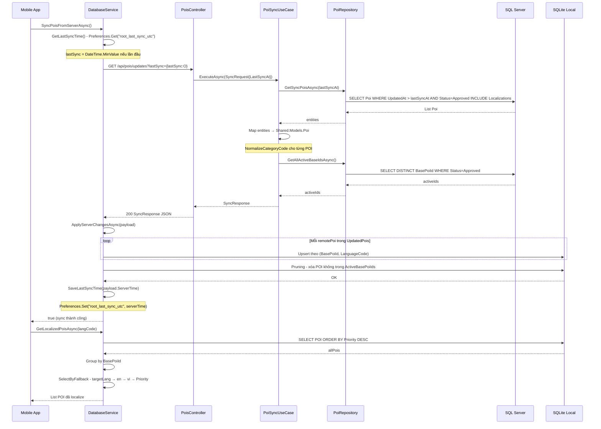
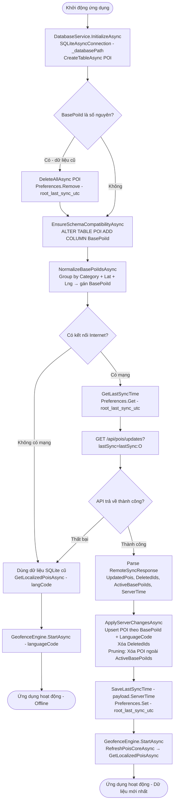

# 04 — Đồng bộ Mobile (Delta Sync)

**Controller:** `PoisController` — Route: `api/pois`  
**Không yêu cầu xác thực** (public — Mobile không cần đăng nhập để sync POI)

**Mobile Services:** `DatabaseService`, `GeofenceEngine.RefreshPoisCoreAsync`

---

## Danh sách chức năng

| # | Endpoint / Service | Hàm | Mô tả ngắn |
|---|---|---|---|
| 1 | `GET /api/pois/updates` | `GetUpdates(lastSync)` | Lấy POI thay đổi sau lastSync |
| 2 | `GET /api/pois/sync` | `Sync(lastSync)` | Alias của /updates |
| 3 | Mobile | `DatabaseService.SyncPoisFromServerAsync` | Gọi API + lưu SQLite |
| 4 | Mobile | `DatabaseService.GetLocalizedPoisAsync` | Lấy POI theo ngôn ngữ |
| 5 | Mobile | `DatabaseService.ApplyServerChangesAsync` | Upsert + Pruning |

---

## 1. GetUpdates — `GET /api/pois/updates?lastSync=...`

### Logic chi tiết

```
1. Parse lastSync từ query string:
   req = new SyncRequest {
     LastSyncAt = DateTime.SpecifyKind(lastSync, DateTimeKind.Utc)
   }
   → Bắt buộc chỉ định UTC để tránh lỗi timezone

2. Gọi PoiSyncUseCase.ExecuteAsync(req):

   a. PoiRepository.GetSyncPoisAsync(lastSyncAt):
      SELECT Poi
        INCLUDE Localizations
        WHERE UpdatedAt > lastSyncAt
          AND Status = PoiStatus.Approved
      → Chỉ trả POI đã duyệt và có thay đổi sau mốc lastSync
      → Cơ chế Delta: chỉ gửi dữ liệu thay đổi, không gửi toàn bộ

   b. Map entities → Shared.Models.Poi:
      - IsActive = (e.Status == PoiStatus.Approved)
      - CategoryCode = NormalizeCategoryCode(code, viName, viDesc)
        * Nếu code hợp lệ → trả về code.ToUpperInvariant()
        * Nếu không → InferCategory từ nội dung text

   c. PoiRepository.GetAllActiveBaseIdsAsync():
      SELECT DISTINCT BasePoiId WHERE Status=Approved
      → Dùng để Mobile pruning: xóa POI local không còn trong danh sách active

3. Return SyncResponse:
   {
     UpdatedPois: [...],      ← POI cần upsert
     DeletedIds: [],          ← Luôn rỗng (dùng ActiveBasePoiIds thay thế)
     ActiveBasePoiIds: [...], ← Tất cả BasePoiId đang active
     ServerTime: DateTime.UtcNow  ← Mobile lưu làm lastSync cho lần sau
   }
```

### Request / Response

```
GET /api/pois/updates?lastSync=2026-01-01T00:00:00Z

Response 200:
{
  "updatedPois": [
    {
      "id": 1,
      "basePoiId": "abc123def4",
      "latitude": 10.7769,
      "longitude": 106.7009,
      "radius": 50,
      "imageUrl": "/media/img_abc123.jpg",
      "priority": 0,
      "isActive": true,
      "isPremium": false,
      "categoryCode": "FOOD_SNAIL",
      "updatedAt": "2026-04-17T10:00:00Z",
      "localizations": [
        { "languageCode": "vi", "name": "Quán Ốc Bà Năm", "description": "..." },
        { "languageCode": "en", "name": "Ba Nam Snail", "description": "..." },
        { "languageCode": "ja", "name": "バーナムカタツムリ", "description": "..." }
      ]
    }
  ],
  "deletedIds": [],
  "activeBasePoiIds": ["abc123def4", "xyz789ghi0"],
  "serverTime": "2026-04-24T12:00:00Z"
}
```

---

## 2. DatabaseService.SyncPoisFromServerAsync

### Logic chi tiết

```
1. EnsureInitializedAsync() — khởi tạo SQLite nếu chưa

2. Kiểm tra mạng:
   if (Connectivity.NetworkAccess != NetworkAccess.Internet)
     → return false (dùng cache cũ)

3. _syncLock.WaitAsync() — đảm bảo chỉ 1 tiến trình sync tại một thời điểm

4. GetLastSyncTime():
   stored = Preferences.Get("root_last_sync_utc", "")
   → Parse DateTime với DateTimeStyles.RoundtripKind
   → Nếu không có → DateTime.MinValue (lần đầu sync = lấy tất cả)

5. Gọi API:
   GET api/pois/updates?lastSync={lastSync:O}
   → Format "O" = ISO 8601 roundtrip: "2026-01-01T00:00:00.0000000Z"

6. Parse RemoteSyncResponse

7. ApplyServerChangesAsync(payload):
   → Xem chi tiết bên dưới

8. SaveLastSyncTime(payload.ServerTime):
   Preferences.Set("root_last_sync_utc", serverTime.ToString("O"))
   → Lần sync sau sẽ dùng ServerTime này làm lastSync

9. return true
```

---

## 3. DatabaseService.ApplyServerChangesAsync

### Logic chi tiết — Upsert

```
1. Lấy tất cả POI hiện có trong SQLite:
   existingPois = _database.Table<POI>().ToListAsync()

2. Với mỗi remotePoi trong payload.UpdatedPois:
   basePoiId = remotePoi.BasePoiId ?? remotePoi.Id.ToString()

   Với mỗi localization trong remotePoi.Localizations:
     normalizedLang = NormalizeLanguageCode(localization.LanguageCode)
     → "vi-VN" → "vi", "ja-JP" → "ja", "jp" → "ja"

     Tìm matched = existingPois.FirstOrDefault(x =>
       x.BasePoiId == basePoiId &&
       NormalizeLanguageCode(x.LanguageCode) == normalizedLang)

     Nếu matched == null → tạo POI mới, thêm vào existingPois
     
     Cập nhật matched:
       .BasePoiId = basePoiId
       .Latitude, .Longitude, .Radius, .Priority = từ remotePoi
       .Category = remotePoi.CategoryCode ?? InferCategory(name, desc)
       .Name = localization.Name.Trim()
       .Description = localization.Description.Trim()
       .AudioPath = localization.AudioFile ?? ""
       .LanguageCode = normalizedLang
       .ImagePath = ResolveRemoteMediaPath(remotePoi.ImageUrl)
       .IsDownloaded = !string.IsNullOrWhiteSpace(AudioPath)

     if matched.Id > 0 → _database.UpdateAsync(matched)
     else → _database.InsertAsync(matched)
```

### Logic chi tiết — Pruning

```
3. Xóa theo DeletedIds (legacy support):
   foreach deletedId in payload.DeletedIds:
     DELETE FROM POI WHERE BasePoiId=deletedId OR Id=deletedId

4. PRUNING — xóa POI stale:
   if payload.ActiveBasePoiIds.Count > 0:
     localPois = _database.Table<POI>().ToListAsync()
     toDelete = localPois.Where(lp => !payload.ActiveBasePoiIds.Contains(lp.BasePoiId))
     
     foreach poi in toDelete:
       _database.DeleteAsync(poi)
   
   → Lý do: Nếu Admin xóa POI trên server, Mobile cần xóa khỏi SQLite
   → ActiveBasePoiIds là danh sách "whitelist" — POI nào không có trong đây thì xóa
```

### ResolveRemoteMediaPath — Xử lý URL ảnh

```
Logic:
1. Nếu mediaPath là URL tuyệt đối (http/https):
   → NormalizeAndroidLoopbackUri(uri):
     - Nếu host là "localhost" hoặc "127.0.0.1" và platform là Android:
       → Đổi host thành "10.0.2.2" (Android Emulator loopback)
     - Lý do: Android Emulator không hiểu "localhost" là máy host

2. Nếu mediaPath là đường dẫn tương đối ("/media/img_xxx.jpg"):
   → Ghép với AppConfig.BaseApiUrl
   → Ví dụ: "https://api.vinhkhanh.com/media/img_xxx.jpg"
```

---

## 4. DatabaseService.GetLocalizedPoisAsync

### Logic chi tiết — Language Fallback Algorithm

```
1. Lấy tất cả POI từ SQLite, sắp xếp theo Priority giảm dần

2. Group by BasePoiId:
   → Mỗi quán có thể có 3 bản ghi (vi, en, ja) với cùng BasePoiId
   → Nếu không có BasePoiId → group by Id.ToString()

3. Với mỗi group, gọi SelectByFallback(variants, targetLang):

   Tier 1: Tìm bản dịch khớp targetLang
     variants.FirstOrDefault(p => NormalizeLanguageCode(p.LanguageCode) == targetLang)
   
   Tier 2: Nếu không có → tìm tiếng Anh ("en")
     → Tiếng Anh là ngôn ngữ trung gian phổ biến nhất
   
   Tier 3: Nếu không có → tìm tiếng Việt ("vi")
     → Tiếng Việt là ngôn ngữ gốc của hệ thống
   
   Tier 4: Nếu không có → lấy bản ghi Priority cao nhất
     variants.OrderByDescending(p => p.Priority).FirstOrDefault()

4. CloneForDisplay(selected):
   → Tạo object mới để tránh side-effect khi UI thay đổi

5. Return danh sách đã localize, sắp xếp theo Priority giảm dần
```

### Sequence Diagram — Đồng bộ Mobile



---

## Activity Diagram — Khởi động ứng dụng Mobile



---

## NormalizeBasePoiIdsAsync — Xử lý dữ liệu cũ

```
Mục đích: Gán BasePoiId cho các bản ghi cũ chưa có thông tin gom nhóm

Logic:
1. Lấy tất cả POI từ SQLite
2. Group by BuildLegacyGroupKey(poi):
   - Nếu đã có BasePoiId → "base:{BasePoiId}"
   - Nếu chưa có → "{category}:{roundedLat}:{roundedLng}"
     * roundedLat/Lng = Math.Round(4 chữ số thập phân) ≈ độ chính xác 11m
     * Các quán cùng vị trí ± 11m được gom nhóm

3. Với mỗi group:
   existingBase = group.FirstOrDefault(x => !string.IsNullOrEmpty(x.BasePoiId))
   effectiveBaseId = existingBase ?? group.Min(p => p.Id).ToString()
   
   Cập nhật tất cả bản ghi trong group có BasePoiId khác effectiveBaseId
```
