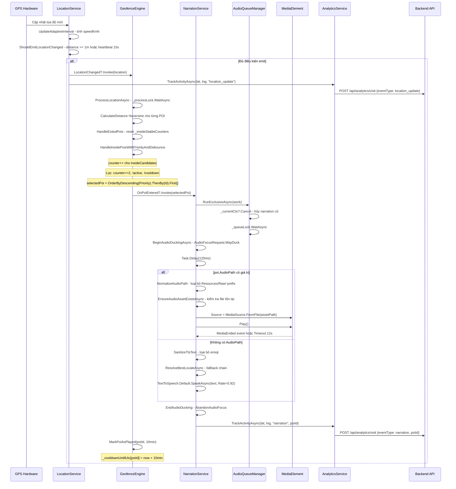
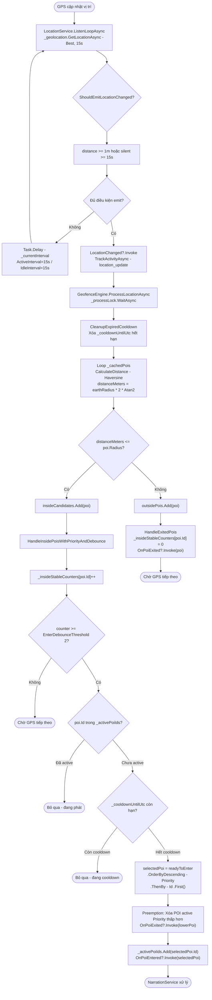

# 05 — Geofence & Thuyết minh tự động

**Mobile Services:** `GeofenceEngine`, `NarrationService`, `LocationService`, `AudioQueueManager`

---

## Tổng quan luồng

```
GPS → LocationService → GeofenceEngine → NarrationService → AnalyticsService
                              ↓
                    Haversine + Debounce + Cooldown + Priority
```

---

## 1. LocationService — Theo dõi GPS

### Các hằng số quan trọng

| Hằng số | Giá trị | Ý nghĩa |
|---|---|---|
| `DistanceFilterMeters` | 1m | Khoảng cách tối thiểu để emit sự kiện |
| `MaxSilentEmitInterval` | 15s | Heartbeat khi đứng yên (cho Debounce) |
| `ActiveInterval` | 15s | Chu kỳ lấy mẫu khi di chuyển |
| `IdleInterval` | 15s | Chu kỳ lấy mẫu khi đứng yên |
| `StationarySpeedThresholdKmh` | 1 km/h | Ngưỡng tốc độ coi là đứng yên |
| `StationaryDurationThreshold` | 1 phút | Thời gian đứng yên để chuyển IdleInterval |

### StartListeningAsync — Logic chi tiết

```
1. _stateLock.WaitAsync() — thread-safe

2. EnsureLocationPermissionsAsync():
   - Xin quyền LocationWhenInUse (bắt buộc)
   - Xin quyền LocationAlways (tùy chọn, cho background mode)
   - Nếu LocationWhenInUse bị từ chối → throw PermissionException

3. ConfigurePlatformBackgroundModeAsync():
   - iOS: iOSLocationBackgroundConfigurator.Configure()

4. StartPlatformBackgroundModeAsync():
   - Android: AndroidLocationForegroundController.Start()
   → Hiển thị Foreground Service Notification (không thể xóa)
   → Cho phép GPS tiếp tục khi tắt màn hình

5. Khởi tạo CancellationTokenSource
6. Chạy ListenLoopAsync(_cts.Token) trên Task riêng
```

### ListenLoopAsync — Logic chi tiết

```
while (!cancellationToken.IsCancellationRequested):

  1. Gọi GPS:
     request = new GeolocationRequest(GeolocationAccuracy.Best, TimeSpan.FromSeconds(15))
     location = await _geolocation.GetLocationAsync(request, cancellationToken)
     → GeolocationAccuracy.Best = độ chính xác cao nhất (GPS hardware)
     → Timeout 15s: nếu không lấy được GPS trong 15s → null

  2. UpdateAdaptiveInterval(location):
     elapsed = now - _lastRawTimestampUtc
     speedKmh = ResolveSpeedKmh(location, elapsed):
       - Ưu tiên location.Speed (từ GPS hardware, m/s → km/h)
       - Fallback: tính từ khoảng cách / thời gian

     if speedKmh < 1 km/h:
       _stationaryDuration += elapsed
     else:
       _stationaryDuration = TimeSpan.Zero  ← reset khi di chuyển

     _currentInterval = _stationaryDuration >= 1min ? IdleInterval : ActiveInterval

  3. ShouldEmitLocationChanged(location):
     - Nếu _lastEmittedLocation == null → true (lần đầu)
     - Nếu distance >= 1m → true (đã di chuyển đủ)
     - Nếu silent >= 15s → true (Heartbeat cho Debounce)
     - Ngược lại → false (bỏ qua, tiết kiệm tài nguyên)

  4. Nếu ShouldEmit:
     LocationChanged?.Invoke(location)  ← GeofenceEngine lắng nghe
     _analyticsService.TrackActivityAsync(lat, lng, "location_update")  ← Backend

  5. Task.Delay(_currentInterval, cancellationToken)
```

---

## 2. GeofenceEngine — Phát hiện vùng POI

### Các hằng số quan trọng

| Hằng số | Giá trị | Ý nghĩa |
|---|---|---|
| `EnterDebounceThreshold` | 2 | Số lần liên tiếp trong vùng để xác nhận |
| `DefaultCooldown` | 10 phút | Thời gian chờ sau khi phát xong |

### Cấu trúc dữ liệu nội bộ

```
_cachedPois: List<POI>                    ← Cache RAM, load từ SQLite
_poiMap: Dictionary<int, POI>             ← Tra cứu nhanh theo Id
_insideStableCounters: Dictionary<int, int>  ← Bộ đếm debounce theo PoiId
_cooldownUntilUtc: Dictionary<int, DateTimeOffset>  ← Thời điểm hết cooldown
_activePoiIds: HashSet<int>               ← POI đang "active" (đã qua debounce)
```

### ProcessLocationAsync — Logic cốt lõi

```
1. _processLock.WaitAsync() — đảm bảo xử lý tuần tự, không song song

2. CleanupExpiredCooldown(now):
   Xóa các entry trong _cooldownUntilUtc đã hết hạn
   → Giải phóng bộ nhớ

3. Phân loại POI:
   foreach poi in _cachedPois:
     distanceMeters = CalculateDistance(currentLat, currentLng, poi.Lat, poi.Lng)
     
     if distanceMeters <= poi.Radius:
       insideCandidates.Add(poi)
     else:
       outsidePois.Add(poi)

4. HandleExitedPois(outsidePois):
   foreach poi in outsidePois:
     _insideStableCounters[poi.Id] = 0  ← reset debounce
     if _activePoiIds.Remove(poi.Id):   ← nếu trước đó đang active
       OnPoiExited?.Invoke(poi)

5. HandleInsidePoisWithPriorityAndDebounce(insideCandidates, now)
```

### HandleInsidePoisWithPriorityAndDebounce — Logic chi tiết

```
1. Tăng counter cho tất cả POI trong vùng:
   foreach poi in insideCandidates:
     _insideStableCounters[poi.Id]++

2. Lọc readyToEnter:
   - counter >= EnterDebounceThreshold (2)  ← đã ở trong vùng >= 2 lần liên tiếp
   - !_activePoiIds.Contains(poi.Id)        ← chưa đang active
   - !_cooldownUntilUtc[poi.Id] > now       ← không trong cooldown

3. Nếu readyToEnter rỗng → return (chờ GPS tiếp theo)

4. Chọn POI ưu tiên cao nhất:
   selectedPoi = readyToEnter
     .OrderByDescending(p => p.Priority)  ← Priority cao hơn = quan trọng hơn
     .ThenBy(p => p.Id)                   ← Nếu bằng nhau → Id nhỏ hơn (ổn định)
     .First()

5. Preemption — nhường ưu tiên:
   lowerPriorityActives = _activePoiIds
     .Select(id => _poiMap[id])
     .Where(p => p.Priority < selectedPoi.Priority)
   
   foreach lowerPoi in lowerPriorityActives:
     _activePoiIds.Remove(lowerPoi.Id)
     OnPoiExited?.Invoke(lowerPoi)
   
   → Nếu đang phát POI Priority=0 mà bước vào vùng POI Priority=100
   → POI cũ bị dừng, POI mới được phát

6. _activePoiIds.Add(selectedPoi.Id)
   OnPoiEntered?.Invoke(selectedPoi)  ← NarrationService lắng nghe
```

### CalculateDistance — Công thức Haversine

```
Công thức:
  dLat = DegreesToRadians(lat2 - lat1)
  dLon = DegreesToRadians(lon2 - lon1)
  rLat1 = DegreesToRadians(lat1)
  rLat2 = DegreesToRadians(lat2)

  a = sin(dLat/2)^2 + cos(rLat1) * cos(rLat2) * sin(dLon/2)^2
  c = 2 * Atan2(sqrt(a), sqrt(1-a))
  distance = 6_371_000 * c  (mét)

Lý do dùng Haversine thay vì Pythagoras:
- Trái Đất là hình cầu, không phải mặt phẳng
- Ở khoảng cách ngắn (< 1km), sai số Pythagoras có thể lên đến vài mét
- Haversine cho kết quả chính xác hơn cho bài toán geofencing
```

---

## 3. NarrationService — Phát thuyết minh

### AudioQueueManager — Cơ chế độc quyền

```
RunExclusiveAsync(work):
  1. _currentCts?.Cancel()  ← Hủy narration đang chạy (nếu có)
  2. localCts = new CancellationTokenSource()
  3. _currentCts = localCts
  4. _queueLock.WaitAsync()  ← Chờ narration trước kết thúc
  5. Chạy work(localCts.Token)
  6. _queueLock.Release()

→ Đảm bảo tại một thời điểm chỉ có 1 narration đang phát
→ Narration mới sẽ hủy narration cũ ngay lập tức (Preemption)
```

### PlayAudioAsync — Phát MP3

```
1. RunExclusiveNarrationAsync(work):
   a. BeginAudioDuckingAsync():
      Android: AudioManager.RequestAudioFocus(
        AudioFocusRequest.Builder(AudioFocus.GainTransientMayDuck)
      )
      → "MayDuck" = yêu cầu giảm âm lượng nhạc nền, không tắt hẳn
   
   b. Task.Delay(120ms) — chờ ducking có hiệu lực

2. ResolveNarrationMediaElementAsync():
   - Ưu tiên _registeredMediaElement (WeakReference)
   - Fallback: page.FindByName<MediaElement>("NarrationPlayer")

3. NormalizeAudioPath(filePath):
   - Thay "\" → "/"
   - Loại bỏ "Resources/Raw/" prefix
   - TrimStart('/')

4. EnsureAudioAssetExistsAsync(assetPath):
   FileSystem.OpenAppPackageFileAsync(assetPath)
   → Kiểm tra file tồn tại trong app bundle trước khi phát

5. MainThread.InvokeOnMainThreadAsync():
   PlayWithMediaElementAsync(mediaElement, assetPath, ct):
   
   a. Đăng ký CompletedHandler cho MediaEnded event
   b. mediaElement.Source = MediaSource.FromFile(assetPath)
   c. mediaElement.Play()
   d. Đăng ký ct.Register để Stop nếu bị hủy
   e. Task.WhenAny(tcs.Task, Task.Delay(12s)):
      - Nếu MediaEnded → tcs.SetResult → hoàn thành
      - Nếu timeout 12s → Stop + throw TimeoutException
      - Nếu ct cancelled → Stop + TrySetCanceled

6. EndAudioDucking():
   Android: AudioManager.AbandonAudioFocus()
   → Trả lại âm lượng bình thường cho nhạc nền
```

### SpeakAsync — Text-to-Speech

```
1. RunExclusiveNarrationAsync(work):
   a. StopMediaElementIfNeededAsync() — dừng MP3 nếu đang phát
   b. BeginAudioDuckingAsync()

2. _appLanguageService.GetEffectiveLanguage(lang):
   → Lấy ngôn ngữ hiệu dụng dựa trên cài đặt người dùng

3. ResolveBestLocaleAsync(effectiveLang):
   locales = TextToSpeech.Default.GetLocalesAsync()
   
   foreach candidate in GetLanguageFallbackChain(languageCode):
     ResolveLocaleCandidate(locales, candidate):
       - Ưu tiên exact match: "ja-JP" khớp với locale.Language-locale.Country
       - Fallback: short code "ja" khớp với locale.Language
       - "jp" → normalize thành "ja"

4. SanitizeTtsText(text):
   - Thay thế emoji: 🔊→" ", 🧭→" ", ★→" ", v.v.
   - Regex.Replace("\\s+", " ").Trim()
   → TTS engine phát âm sai hoặc crash khi gặp emoji

5. TextToSpeech.Default.SpeakAsync(sanitizedText, SpeechOptions{
     Locale = locale,
     Pitch = 1.0f,    ← giọng bình thường
     Rate = 0.92f,    ← chậm hơn 8% để nghe rõ hơn
     Volume = 1.0f
   }, ct)
```

---

## Sequence Diagram — Luồng đầy đủ GPS → Thuyết minh



---

## Activity Diagram — GeofenceEngine


