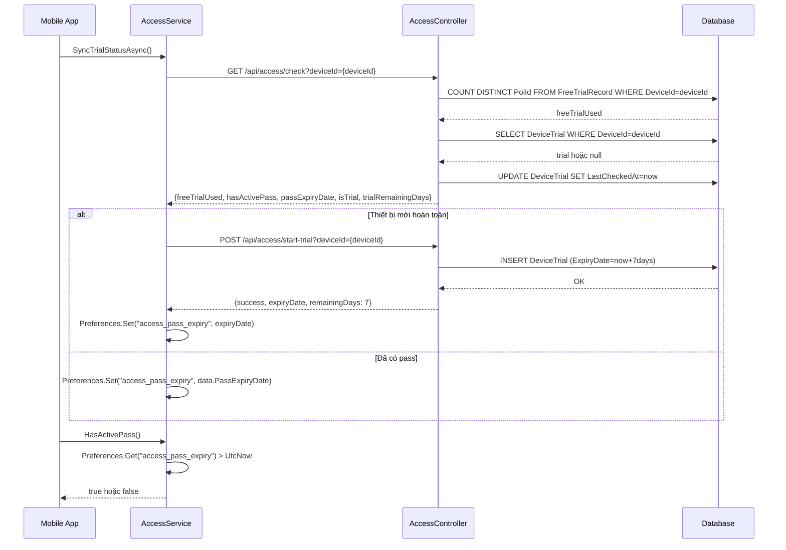
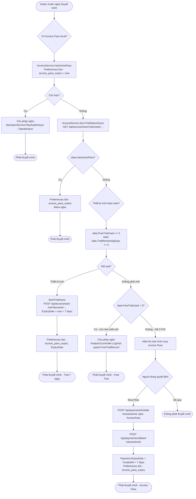

# 06 — Kiểm soát truy cập & Thanh toán

**Controllers:** `AccessController` (api/access), `PaymentController` (api/payments)  
**Mobile Service:** `AccessService`

---

## Mô hình truy cập

Hệ thống có 3 cấp độ truy cập cho Visitor:

```
Cấp 1: Free Trial (3 POI đầu tiên)
  → FreeTrialRecord: mỗi (DeviceId, PoiId) chỉ được nghe 1 lần miễn phí
  → Tổng tối đa 3 POI khác nhau

Cấp 2: Device Trial (7 ngày dùng thử)
  → DeviceTrial: gắn với DeviceId, ExpiryDate = TrialStartDate + 7 ngày
  → Nghe không giới hạn trong 7 ngày

Cấp 3: Access Pass (mua gói)
  → Payment: Type=AccessPass, Status=Completed, ExpiryDate = CreatedAt + 7 ngày
  → Nghe không giới hạn trong 7 ngày
```

---

## 1. AccessController.Check — `GET /api/access/check`

### Logic chi tiết

```
1. Lấy userId từ JWT (nếu có):
   userId = User.FindFirstValue(ClaimTypes.NameIdentifier)
   → Visitor có thể gọi không cần JWT (anonymous)

2. Đếm FreeTrialRecord:
   if userId != null:
     freeTrialUsed = COUNT(DISTINCT PoiId) WHERE UserId=userId
   else if deviceId != null:
     freeTrialUsed = COUNT(DISTINCT PoiId) WHERE DeviceId=deviceId
   else:
     freeTrialUsed = 0

3. Kiểm tra DeviceTrial:
   if deviceId != null:
     trial = DeviceTrials WHERE DeviceId=deviceId
     if trial != null:
       trialExpiryDate = trial.ExpiryDate
       isTrialActive = trial.ExpiryDate > now
       trial.LastCheckedAt = now  ← ghi nhận lần check gần nhất
       SaveChangesAsync()

4. Kiểm tra Access Pass (chỉ khi có JWT):
   if userId != null:
     activePayment = Payments
       WHERE UserId=userId
         AND Status=Completed
         AND ExpiryDate > now
       ORDER BY ExpiryDate DESC
       FIRST
     
     if activePayment != null:
       hasActivePass = true
       passExpiryDate = activePayment.ExpiryDate

5. Return:
   {
     freeTrialUsed,
     freeTrialLimit: 3,
     hasActivePass: hasActivePass || isTrialActive,  ← gộp cả 2 loại
     passExpiryDate: hasActivePass ? passExpiryDate : trialExpiryDate,
     isTrial: isTrialActive && !hasActivePass,       ← phân biệt trial vs paid
     trialRemainingDays: (trialExpiryDate - now).TotalDays
   }
```

---

## 2. AccessController.StartTrial — `POST /api/access/start-trial`

### Logic chi tiết

```
1. Validate: deviceId không được rỗng → BadRequest

2. Kiểm tra đã có trial chưa:
   existing = DeviceTrials WHERE DeviceId=deviceId
   if existing != null → BadRequest "Trial already started for this device"
   → Mỗi thiết bị chỉ được dùng thử 1 lần

3. Tạo DeviceTrial:
   {
     DeviceId = deviceId,
     TrialStartDate = now,
     ExpiryDate = now.AddDays(7),
     LastCheckedAt = now
   }

4. dbContext.DeviceTrials.Add(trial) → SaveChangesAsync()

5. Return: { success: true, expiryDate, remainingDays: 7 }
```

---

## 3. PaymentController.Initiate — `POST /api/payments/initiate`

### Logic chi tiết

```
Yêu cầu: [Authorize] — phải đăng nhập

1. Validate: TransactionId không được rỗng

2. Kiểm tra duplicate:
   exists = Payments.AnyAsync(p => p.TransactionId == request.TransactionId)
   if exists → Conflict "Giao dịch đã tồn tại."
   → TransactionId có unique index trong DB

3. Tạo Payment:
   {
     TransactionId = request.TransactionId,
     UserId = CurrentUserId,
     Amount = request.Type == PremiumUpgrade ? 10.00m : 1.00m,
     Type = request.Type,  ← AccessPass hoặc PremiumUpgrade
     PoiId = request.PoiId,  ← nullable, dùng cho PremiumUpgrade
     Status = PaymentStatus.Pending,
     CreatedAt = DateTime.UtcNow
   }

4. dbContext.Payments.Add(payment) → SaveChangesAsync()
5. Return: { success: true, paymentId }
```

---

## 4. PaymentController.Callback — `POST /api/payments/callback`

### Logic chi tiết

```
Yêu cầu: [Authorize]

1. Tìm payment:
   payment = Payments WHERE TransactionId=request.TransactionId
   → 404 nếu không tìm thấy

2. payment.Status = PaymentStatus.Completed

3. Xử lý theo Type:
   if Type == AccessPass:
     payment.ExpiryDate = payment.CreatedAt.AddDays(7)
     → Gói 7 ngày tính từ lúc tạo giao dịch (không phải lúc callback)
   
   if Type == PremiumUpgrade && payment.PoiId.HasValue:
     poi = Pois WHERE Id=payment.PoiId
     if poi != null:
       poi.IsPremium = true
       → POI được nâng cấp Premium, Priority tăng lên 100

4. SaveChangesAsync()
5. Return: { success: true, expiryDate }
```

---

## 5. AccessService (Mobile) — Quản lý truy cập local

### GetPersistentDeviceId — Lấy Device ID

```
Logic:
1. Android: Android.Provider.Settings.Secure.GetString(context.ContentResolver, AndroidId)
   → ANDROID_ID: duy nhất theo (phần cứng + tài khoản Google)
   → Thay đổi khi factory reset hoặc đổi tài khoản Google

2. Fallback (iOS, Windows, lỗi Android):
   prefId = Preferences.Get("device_id_guid", "")
   if rỗng:
     prefId = Guid.NewGuid().ToString()
     Preferences.Set("device_id_guid", prefId)
   → GUID được lưu persistent trong app storage
```

### SyncTrialStatusAsync — Đồng bộ trạng thái

```
Logic:
1. GET api/access/check?deviceId={_deviceId}

2. Nếu data.PassExpiryDate.HasValue:
   Preferences.Set("access_pass_expiry", data.PassExpiryDate.ToString("O"))
   → Cập nhật local với thông tin mới nhất từ server

3. Logic tự động bắt đầu trial cho thiết bị mới:
   if !data.HasActivePass && data.TrialRemainingDays == 0 && data.FreeTrialUsed == 0:
     StartTrialAsync()
   
   → Điều kiện: chưa có pass, chưa có trial, chưa nghe POI nào
   → Tự động kích hoạt 7 ngày dùng thử mà không cần user thao tác
```

### HasActivePass — Kiểm tra local

```
Logic:
expiryStr = Preferences.Get("access_pass_expiry", "")
if DateTime.TryParse(expiryStr, out expiryDate):
  return expiryDate > DateTime.UtcNow
return false

→ Kiểm tra local trước để tránh network request mỗi lần
→ SyncTrialStatusAsync() cập nhật local khi khởi động app
```

---

## Sequence Diagram — Kiểm soát truy cập



---

## Activity Diagram — Kiểm soát truy cập Visitor


