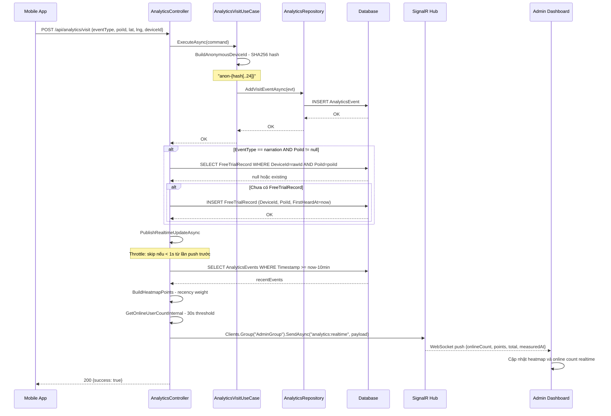
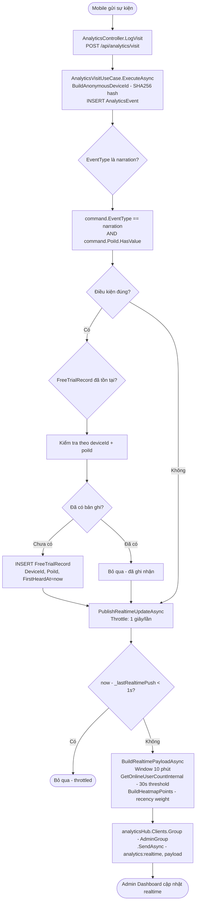

# 07 — Analytics & Realtime Dashboard

**Controller:** `AnalyticsController` — Route: `api/analytics`  
**Use Case:** `AnalyticsVisitUseCase`  
**SignalR Hub:** `AnalyticsHub`  
**Mobile Service:** `AnalyticsService`

---

## Danh sách chức năng

| # | Endpoint | Hàm | Auth | Mô tả ngắn |
|---|---|---|---|---|
| 1 | `POST /api/analytics/visit` | `LogVisit` | Public | Ghi sự kiện visit/narration |
| 2 | `GET /api/analytics/heatmap` | `GetHeatmap` | Admin | Heatmap theo khoảng ngày |
| 3 | `GET /api/analytics/heatmap/daily` | `GetHeatmapByDay` | Admin | Heatmap theo ngày cụ thể |
| 4 | `GET /api/analytics/heatmap/history` | `GetHeatmapHistory` | Admin | Heatmap nhiều ngày |
| 5 | `GET /api/analytics/content-performance` | `GetContentPerformance` | Admin | Top POI theo lượt nghe |
| 6 | `GET /api/analytics/online-count` | `GetOnlineCount` | Admin | Số thiết bị online |
| 7 | `GET /api/analytics/realtime-overview` | `GetRealtimeOverview` | Admin | Tổng quan realtime |

---

## 1. LogVisit — `POST /api/analytics/visit`

### Logic chi tiết

```
1. AnalyticsVisitUseCase.ExecuteAsync(command):

   a. BuildAnonymousDeviceId(command.DeviceId):
      if rỗng → return "anonymous"
      
      normalized = rawDeviceId.Trim().ToLowerInvariant()
      bytes = SHA256.HashData(Encoding.UTF8.GetBytes(normalized))
      hash = Convert.ToHexString(bytes).ToLowerInvariant()
      return $"anon-{hash[..24]}"
      
      → Ẩn danh hóa DeviceId: không lưu ID thực, chỉ lưu hash
      → Vẫn có thể đếm unique devices vì hash nhất quán
      → Prefix "anon-" để phân biệt với ID thực

   b. Tạo AnalyticsEvent:
      {
        Latitude = command.Latitude,
        Longitude = command.Longitude,
        DeviceId = anonymizedId,
        Timestamp = DateTime.UtcNow,
        PoiId = command.PoiId,
        EventType = command.EventType ?? "visit"
      }
   
   c. AnalyticsRepository.AddVisitEventAsync(evt):
      context.AnalyticsEvents.Add(evt)
      SaveChangesAsync()

2. Xử lý FreeTrialRecord (chỉ khi EventType=narration):
   if command.PoiId.HasValue && command.EventType == "narration":
     deviceId = command.DeviceId (raw, trước khi hash)
     
     alreadyExists = FreeTrialRecords.AnyAsync(
       f => f.DeviceId == deviceId && f.PoiId == command.PoiId.Value
     )
     
     if !alreadyExists && deviceId != null:
       FreeTrialRecords.Add({
         DeviceId = deviceId,
         PoiId = command.PoiId.Value,
         FirstHeardAt = DateTime.UtcNow
       })
       SaveChangesAsync()
   
   → Ghi nhận lần đầu nghe POI này để tính Free Trial limit

3. PublishRealtimeUpdateAsync():
   Throttle: chỉ push nếu now - _lastRealtimePush >= 1 giây
   → Tránh flood SignalR khi nhiều thiết bị gửi cùng lúc
   
   BuildRealtimePayloadAsync():
     - Window 10 phút gần nhất
     - GetOnlineUserCountInternal() (30s threshold)
     - BuildHeatmapPoints() với recency weight
   
   analyticsHub.Clients.Group(AnalyticsHub.AdminGroup)
     .SendAsync("analytics:realtime", payload)
   → Chỉ push đến Admin đang kết nối SignalR
```

---

## 2. GetHeatmap — `GET /api/analytics/heatmap`

### Logic chi tiết

```
1. ParseRange(from, to):
   - Parse ISO 8601 datetime
   - Convert to UTC
   - Nếu format sai → BadRequest

2. Query events:
   dbContext.AnalyticsEvents
     .Where(e => e.Timestamp >= fromDate && e.Timestamp <= toDate)
     .Where(e => e.PoiId == null || dbContext.Pois.Any(p => p.Id == e.PoiId))
     → Lọc bỏ events của POI đã bị xóa (tránh hiển thị dữ liệu rác)

3. BuildHeatmapPoints(events, now, useRecencyWeight=false):
   
   a. Lọc bỏ tọa độ (0,0):
      events.Where(e => Math.Abs(e.Latitude) > 0.000001 && Math.Abs(e.Longitude) > 0.000001)
   
   b. Group by tọa độ làm tròn 4 chữ số thập phân:
      (lat: Math.Round(e.Latitude, 4), lng: Math.Round(e.Longitude, 4))
      → 4 chữ số thập phân ≈ 11m x 11m = 121 m² mỗi ô
   
   c. Tính cho mỗi ô:
      uniqueDevices = g.Select(e => e.DeviceId).Distinct().Count()
      → Đếm người (unique devices), không đếm sự kiện
      
      intensity = g.Sum(e => useRecencyWeight ? weight : 1.0)
      → useRecencyWeight=true: weight = max(0.15, 1.0 - ageMinutes/10)
      → Sự kiện cũ hơn có weight thấp hơn (fade effect)
      
      density = (uniqueDevices * 100.0) / 121.0
      → Mật độ người / 100m²

   d. OrderByDescending(density).Take(500)
      → Giới hạn 500 điểm để tránh quá tải frontend

4. Return: { points: [{lat, lng, intensity, density, peopleCount}], total }
```

---

## 3. GetContentPerformance — `GET /api/analytics/content-performance`

### Logic chi tiết

```
1. limit = Math.Clamp(limit, 1, 50)  ← giới hạn 1-50

2. Query events:
   dbContext.AnalyticsEvents
     .Where(e => e.PoiId.HasValue)
     .Where(e => fromDate <= e.Timestamp <= toDate)
     .Where(e => dbContext.Pois.Any(p => p.Id == e.PoiId))  ← POI còn tồn tại

3. Group by PoiId:
   .GroupBy(e => e.PoiId.Value)
   .Select(g => new {
     poiId = g.Key,
     totalVisits = g.Count(e => e.EventType == "visit"),
     totalNarrations = g.Count(e => e.EventType == "narration")
   })
   .OrderByDescending(g => g.totalNarrations)  ← sắp xếp theo lượt nghe
   .Take(limit)

4. Lấy thông tin POI:
   pois = dbContext.Pois.Include(Localizations)
     .Where(p => poiIds.Contains(p.Id))
   
   viName = poi.Localizations.FirstOrDefault(l => l.LanguageCode == "vi")?.Name

5. Return: { items: [{poiId, poiName, totalVisits, totalNarrations, rank}], total }
```

---

## 4. GetOnlineCount — `GET /api/analytics/online-count`

### Logic chi tiết

```
GetOnlineUserCountInternal():

1. threshold = DateTime.UtcNow - 30 giây

2. recentEvents = AnalyticsEvents
   .Where(e => e.Timestamp >= threshold)
   .OrderByDescending(e => e.Timestamp)
   .ThenByDescending(e => e.Id)  ← Id lớn hơn = mới hơn nếu trùng giây
   .Select(e => new { e.DeviceId, e.EventType, e.Timestamp })

3. Đếm online:
   recentEvents
     .GroupBy(e => e.DeviceId)
     .Select(g => g.First())  ← Lấy sự kiện mới nhất của mỗi thiết bị
     .Count(e => e.EventType != "app_offline")
   
   → Thiết bị gửi "app_offline" được coi là offline
   → Thiết bị gửi bất kỳ sự kiện nào khác trong 30s = online

Return: { onlineCount, measuredAt }
```

---

## 5. AnalyticsService (Mobile)

### TrackActivityAsync

```
SendAnalyticsEventAsync(lat, lng, eventType, poiId):
  command = {
    Latitude = lat,
    Longitude = lng,
    DeviceId = _accessService.DeviceId,  ← raw DeviceId (server sẽ hash)
    PoiId = poiId,
    EventType = eventType
  }
  
  POST api/analytics/visit (command)
  → Fire-and-forget: không await kết quả để không block UI
```

### TrackAppLifecycleAsync

```
TrackAppLifecycleAsync("online"):
  → POST /api/analytics/visit {eventType: "app_online", lat: 0, lng: 0}
  → Admin biết thiết bị vừa mở app

TrackAppLifecycleAsync("offline"):
  → POST /api/analytics/visit {eventType: "app_offline", lat: 0, lng: 0}
  → Admin biết thiết bị vừa đóng app
  → GetOnlineCount sẽ loại thiết bị này khỏi danh sách online
```

---

## Sequence Diagram — Ghi sự kiện và Realtime



---

## Activity Diagram — Analytics Realtime


