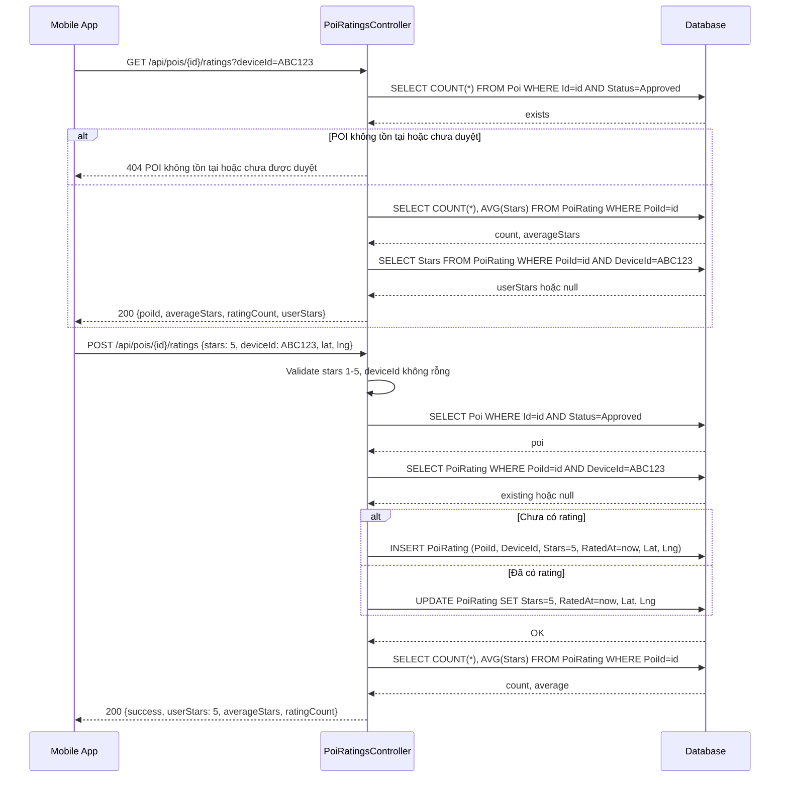
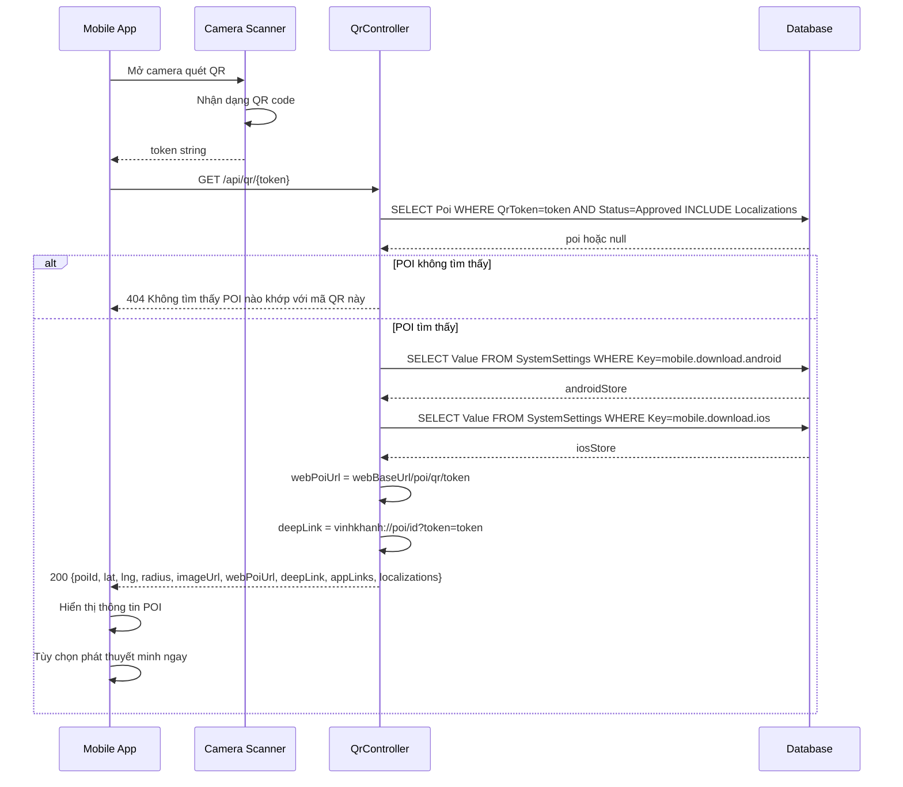

# 08 — Đánh giá POI, QR Code & Cài đặt hệ thống

---

## PHẦN A: Đánh giá POI

**Controller:** `PoiRatingsController` — Route: `api/pois/{poiId}/ratings`  
**Không yêu cầu xác thực** (public — Mobile dùng DeviceId)

---

### A1. GetSummary — `GET /api/pois/{poiId}/ratings`

#### Logic chi tiết

```
1. Kiểm tra POI tồn tại và đã duyệt:
   poiExists = Pois.AnyAsync(p => p.Id == poiId && p.Status == PoiStatus.Approved)
   → 404 nếu không tồn tại hoặc chưa duyệt
   → Không cho phép rating POI chưa được duyệt

2. Đếm và tính trung bình:
   ratings = PoiRatings.Where(r => r.PoiId == poiId)
   count = ratings.CountAsync()
   averageStars = count == 0 ? 0.0 : ratings.AverageAsync(r => (double)r.Stars)
   → Tránh chia cho 0 khi chưa có rating

3. Lấy rating của user hiện tại (nếu có deviceId):
   if deviceId != null:
     userStars = ratings
       .Where(r => r.DeviceId == deviceId)
       .Select(r => (int?)r.Stars)
       .FirstOrDefaultAsync()
   → Trả về null nếu user chưa rating

4. Return:
   {
     poiId,
     averageStars: Math.Round(averageStars, 2),
     ratingCount: count,
     userStars  ← null nếu chưa rating
   }
```

---

### A2. UpsertRating — `POST /api/pois/{poiId}/ratings`

#### Logic chi tiết

```
1. Validate:
   if request.Stars < 1 || request.Stars > 5
     → BadRequest "Số sao phải từ 1 đến 5."
   
   if string.IsNullOrWhiteSpace(request.DeviceId)
     → BadRequest "DeviceId là bắt buộc."
   
   → DB cũng có Check constraint: Stars >= 1 AND Stars <= 5

2. Kiểm tra POI:
   poi = Pois WHERE Id=poiId AND Status=Approved
   → 404 nếu không tìm thấy

3. Upsert logic:
   existing = PoiRatings WHERE PoiId=poiId AND DeviceId=request.DeviceId
   
   if existing == null:
     PoiRatings.Add({
       PoiId = poiId,
       DeviceId = request.DeviceId.Trim(),
       Stars = request.Stars,
       RatedAt = now,
       Latitude = request.Latitude,
       Longitude = request.Longitude
     })
   else:
     existing.Stars = request.Stars
     existing.RatedAt = now
     existing.Latitude = request.Latitude
     existing.Longitude = request.Longitude
   
   → Unique index (DeviceId, PoiId) đảm bảo mỗi thiết bị chỉ có 1 rating/POI
   → Upsert thay vì Insert để cho phép thay đổi rating

4. SaveChangesAsync()

5. Tính lại averageStars sau khi upsert:
   count = PoiRatings.CountAsync(r => r.PoiId == poiId)
   averageStars = PoiRatings.AverageAsync(r => r.Stars) WHERE PoiId=poiId

6. Return:
   {
     success: true,
     poiId,
     userStars: request.Stars,
     averageStars: Math.Round(averageStars, 2),
     ratingCount: count
   }
```

#### Sequence Diagram — Đánh giá POI



---

## PHẦN B: QR Code

**Controller:** `QrController` — Routes: `/qr/{token}`, `api/qr/{token}`

---

### B1. OpenPublicPoiPage — `GET /qr/{token}`

#### Logic chi tiết

```
Mục đích: Redirect QR scan từ camera đến trang web hiển thị thông tin POI

1. Lấy webBaseUrl theo thứ tự ưu tiên:
   a. SystemSettings WHERE Key="web.app.baseUrl"
   b. configuration["VITE_WEB_BASE_URL"]
   c. Environment.GetEnvironmentVariable("VITE_WEB_BASE_URL")
   d. "http://localhost:3000" (fallback)

2. Kiểm tra:
   if webBaseUrl chứa Request.Host (tức là trỏ về chính backend):
     → return Content("Mã QR không hoạt động vì Backend chưa được cấu hình...")
     → Tránh redirect loop

3. return Redirect($"{webBaseUrl}/poi/qr/{token}")
   → Ví dụ: https://vinhkhanh.com/poi/qr/poi-abc123def456
```

---

### B2. Resolve — `GET /api/qr/{token}`

#### Logic chi tiết

```
Mục đích: API cho Mobile/Web lấy thông tin POI từ QR token

1. Validate: token không được rỗng → BadRequest

2. Tìm POI:
   poi = Pois
     .Include(Localizations)
     .FirstOrDefaultAsync(p => p.QrToken == token && p.Status == PoiStatus.Approved)
   → 404 nếu không tìm thấy hoặc POI chưa duyệt/bị ẩn

3. Lấy app store links từ SystemSettings:
   androidStore = SystemSettings["mobile.download.android"] ?? "https://play.google.com/store"
   iosStore = SystemSettings["mobile.download.ios"] ?? "https://www.apple.com/app-store/"

4. Tạo links:
   webBaseUrl = SystemSettings["web.app.baseUrl"] ?? Request.Scheme://Request.Host
   webPoiUrl = $"{webBaseUrl}/poi/qr/{poi.QrToken}"
   deepLink = $"vinhkhanh://poi/{poi.Id}?token={Uri.EscapeDataString(poi.QrToken)}"
   → deepLink: nếu app đã cài → mở app trực tiếp đến POI
   → webPoiUrl: nếu chưa cài → mở web

5. Return:
   {
     poiId, basePoiId, qrToken,
     lat, lng, radius, imageUrl,
     webPoiUrl, deepLink,
     appLinks: { android, ios },
     localizations: [{ languageCode, name, description }]
   }
```

---

### B3. GetQrPng — `GET /api/qr/{token}/png`

#### Logic chi tiết

```
Mục đích: Sinh ảnh QR PNG để Admin tải về và in

1. Tìm POI theo token (không cần Status=Approved, Admin có thể xem QR của POI bất kỳ)

2. Xác định baseUrl theo thứ tự ưu tiên:
   a. Referer header (địa chỉ browser đang mở):
      uri = new Uri(referer)
      baseUrl = "{scheme}://{host}:{port}"
      → Cách chính xác nhất để lấy URL Ngrok/tunnel
   
   b. Origin header
   
   c. Request.Host (đã qua UseForwardedHeaders)
   
   d. Nếu vẫn là localhost → SystemSettings["web.app.baseUrl"]

3. qrContent = $"{baseUrl}/poi/qr/{token}"
   → URL này sẽ được encode vào QR code

4. Sinh QR PNG:
   using var generator = new QRCodeGenerator()
   using var data = generator.CreateQrCode(qrContent, ECCLevel.Q)
   → ECCLevel.Q = 25% error correction (cân bằng giữa kích thước và độ bền)
   
   var pngQrCode = new PngByteQRCode(data)
   var qrBytes = pngQrCode.GetGraphic(20)
   → pixelsPerModule=20: mỗi module QR = 20x20 pixels → ảnh rõ nét

5. return File(qrBytes, "image/png", $"poi-{poi.Id}-qr.png")
```

#### Sequence Diagram — Quét QR



---

## PHẦN C: Cài đặt hệ thống

**Controller:** `SettingsController` — Route: `api/admin/settings`  
**Yêu cầu:** `[Authorize(Roles = "Admin")]`

---

### C1. GetSettings — `GET /api/admin/settings`

```
Logic:
dbContext.SystemSettings.ToDictionaryAsync(s => s.Key, s => s.Value)
→ Return: { "web.app.baseUrl": "https://...", "mobile.download.android": "https://..." }
```

### C2. UpdateSettings — `PUT /api/admin/settings`

```
Logic:
foreach kvp in settings (Dictionary<string, string>):
  setting = SystemSettings.FirstOrDefaultAsync(s => s.Key == kvp.Key)
  
  if setting == null:
    SystemSettings.Add(new SystemSetting { Key = kvp.Key, Value = kvp.Value })
  else:
    setting.Value = kvp.Value

SaveChangesAsync()
Return: { success: true }
```

### Các key SystemSettings quan trọng

| Key | Mô tả | Ví dụ |
|---|---|---|
| `web.app.baseUrl` | URL frontend (dùng cho QR redirect) | `https://vinhkhanh.com` |
| `mobile.download.android` | Link tải app Android | `https://play.google.com/store/apps/...` |
| `mobile.download.ios` | Link tải app iOS | `https://apps.apple.com/...` |

---

## EncryptionUtility — AES-256

**File:** `VinhKhanh.Infrastructure/Security/EncryptionUtility.cs`

```
Mục đích: Mã hóa thông tin nhạy cảm (OwnerSecretInfo trong Poi)

Constructor(key):
  _key = SHA256.HashData(Encoding.UTF8.GetBytes(key))
  → Chuyển key bất kỳ thành 32 bytes (AES-256 yêu cầu 256-bit key)

Encrypt(plainText):
  1. aes.GenerateIV() → 16 bytes random IV
  2. encryptor = aes.CreateEncryptor(key, iv)
  3. cipherBytes = encryptor.TransformFinalBlock(plainBytes)
  4. result = iv + cipherBytes  ← IV được prepend vào ciphertext
  5. return Convert.ToBase64String(result)
  → IV random mỗi lần → cùng plaintext cho ciphertext khác nhau

Decrypt(cipherText):
  1. fullCipher = Convert.FromBase64String(cipherText)
  2. iv = fullCipher[0..16]
  3. cipherBytes = fullCipher[16..]
  4. decryptor = aes.CreateDecryptor(key, iv)
  5. return Encoding.UTF8.GetString(plainBytes)
```
