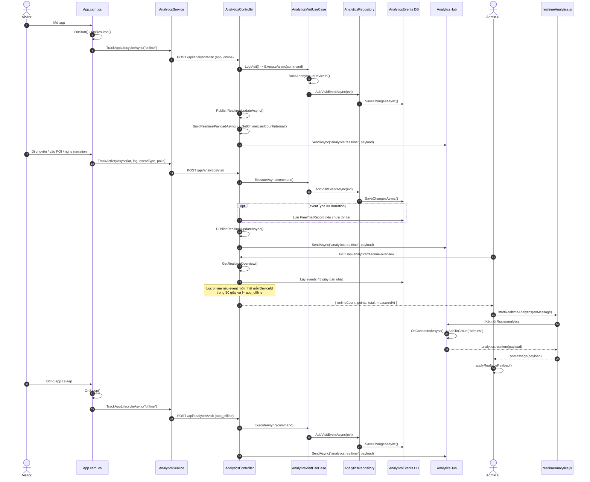

# Sơ đồ Sequence Lượt Truy Cập Online Ngắn Gọn



## Phương thức chính trong luồng

- Mobile app: `OnStart()`, `OnResume()`, `OnSleep()`, `TrackAppLifecycleAsync()`, `TrackActivityAsync()`
- Backend API: `LogVisit()`, `GetRealtimeOverview()`, `PublishRealtimeUpdateAsync()`, `BuildRealtimePayloadAsync()`, `GetOnlineUserCountInternal()`
- Application/Repository: `ExecuteAsync()`, `BuildAnonymousDeviceId()`, `AddVisitEventAsync()`
- Realtime admin: `startRealtimeAnalytics()`, `OnConnectedAsync()`, `applyRealtimePayload()`
```
