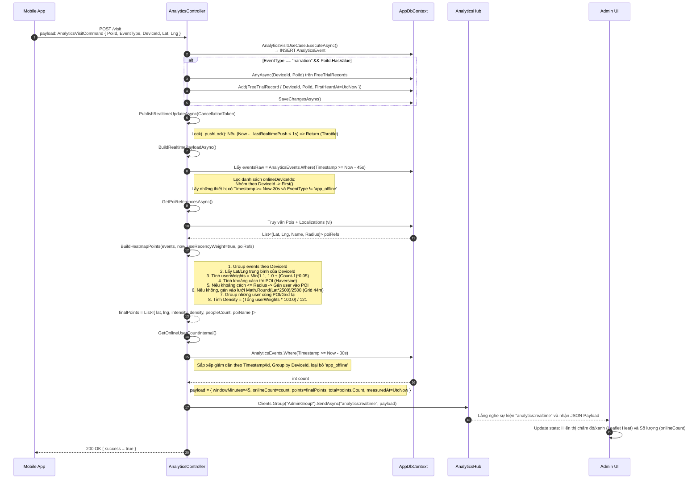

# F17 — Heatmap & Realtime Dashboard

Tài liệu này trình bày chi tiết luồng xử lý mã nguồn, các hàm được gọi, tham số và dữ liệu trả về cho luồng Ghi nhận lượt truy cập và Thể hiện lượt truy cập (F17).

## 1. Flowchart Tổng Quan: Các API và Internal Methods

Biểu đồ này chỉ rõ **các API Endpoint** nào trên `AnalyticsController` gọi các **Internal Methods** nào, và cuối cùng phục vụ cho tính năng gì trên UI.

```mermaid
flowchart TD
  %% Các thành phần gọi tới Backend
  MobileApp["📱 Mobile App"]
  AdminUI_Dashboard["💻 Admin UI: Dashboard<br/>(Lắng nghe WebSocket)"]
  AdminUI_Heatmap["💻 Admin UI: Bản đồ Nhiệt<br/>(Tra cứu lịch sử)"]
  AdminUI_Ranking["💻 Admin UI: Bảng xếp hạng<br/>(Content Performance)"]

  %% Controller & Endpoints
  subgraph AnalyticsController ["AnalyticsController.cs (Backend)"]
    API_Visit["POST /api/analytics/visit<br/>Nhận sự kiện từ Mobile"]
    API_RealtimeOverview["GET /api/analytics/realtime-overview<br/>Lấy trạng thái tức thời"]
    API_Heatmap["GET /api/analytics/heatmap<br/>(Và heatmap/daily, heatmap/history)"]
    API_ContentPerf["GET /api/analytics/content-performance<br/>Thống kê hiệu suất Content"]

    %% Các hàm xử lý nội bộ
    UseCase_Visit["AnalyticsVisitUseCase.ExecuteAsync()"]
    Method_Publish["PublishRealtimeUpdateAsync()"]
    Method_BuildPayload["BuildRealtimePayloadAsync()"]
    Method_GetOnlineCount["GetOnlineUserCountInternal()"]
    Method_BuildHeatmap["BuildHeatmapPoints()"]
    Method_GetPoiRefs["GetPoiReferencesAsync()"]
  end

  %% Các bảng trong DB
  subgraph DB ["AppDbContext (SQL Server)"]
    Tbl_AnalyticsEvent[("Table: AnalyticsEvents")]
    Tbl_FreeTrial[("Table: FreeTrialRecords")]
    Tbl_Poi[("Table: Pois & Localizations")]
  end

  %% SignalR
  Hub["📡 AnalyticsHub (SignalR)"]

  %% Luồng 1: Ghi nhận sự kiện (Visit)
  MobileApp -- "1. Gửi lệnh (AnalyticsVisitCommand)" --> API_Visit
  API_Visit -- "2. Lưu sự kiện thô" --> UseCase_Visit
  UseCase_Visit -- "INSERT (Tọa độ, EventType, DeviceId)" --> Tbl_AnalyticsEvent
  API_Visit -- "3. Upsert FreeTrial nếu là narration" --> Tbl_FreeTrial
  API_Visit -- "4. Kích hoạt Push (Throttle 1s)" --> Method_Publish
  
  %% Luồng 2: Xử lý Realtime & Heatmap
  Method_Publish -- "5. Xây dựng gói dữ liệu" --> Method_BuildPayload
  API_RealtimeOverview --> Method_BuildPayload
  Method_BuildPayload -- "Truy vấn 45s qua" --> Tbl_AnalyticsEvent
  Method_BuildPayload -- "Tính onlineCount" --> Method_GetOnlineCount
  Method_BuildPayload -- "Lấy danh sách POI" --> Method_GetPoiRefs
  Method_BuildPayload -- "Tính Mật độ (Density)" --> Method_BuildHeatmap
  Method_BuildHeatmap -- "Tạo mảng điểm {lat, lng, intensity, density}" --> Method_BuildPayload
  Method_Publish -- "6. SendAsync('analytics:realtime', payload)" --> Hub
  Hub -- "7. Broadcast (JSON Payload)" --> AdminUI_Dashboard

  %% Luồng 3: Heatmap Lịch sử
  AdminUI_Heatmap -- "Tra cứu" --> API_Heatmap
  API_Heatmap -- "SELECT from, to" --> Tbl_AnalyticsEvent
  API_Heatmap --> Method_GetPoiRefs
  API_Heatmap --> Method_BuildHeatmap

  %% Luồng 4: Bảng xếp hạng
  AdminUI_Ranking -- "Lọc ngày, số lượng (limit)" --> API_ContentPerf
  API_ContentPerf -- "GroupBy(PoiId) SUM(visit/narration)" --> Tbl_AnalyticsEvent
  API_ContentPerf -- "Lấy tên quán" --> Tbl_Poi
```



---

## 2.Heatmap & Realtime Dashboard(Sequence Diagram)

Phân tích sâu vào chi tiết các biến, kiểu dữ liệu, các bước lọc (filter) tại Backend trong quá trình ghi nhận và xử lý realtime.



---

## 3. Cấu trúc cấu thành dữ liệu chi tiết

### 3.1 Gói dữ liệu `payload` được trả về AdminUI qua Realtime
Khi frontend (`Dashboard.jsx`) nhận được sự kiện qua WebSocket, cấu trúc JSON chính xác như sau:
```json
{
  "windowMinutes": 0, // Dựa trên RealtimeWindow.TotalMinutes (vd: 0 phút 45 giây -> 0)
  "onlineCount": 12, // Kết quả từ GetOnlineUserCountInternal
  "measuredAt": "2026-04-24T12:00:00Z",
  "total": 5, // Tổng số các cụm (clusters) heatmap
  "points": [
    {
      "lat": 10.7626,
      "lng": 106.6601,
      "intensity": 1.25,      // Tổng userWeights
      "density": 1.03,        // Tính bằng: (intensity * 100.0) / 121
      "peopleCount": 2,       // Số lượng thiết bị thật nằm trong cụm này
      "weightedPeople": 1.3,
      "poiName": "Quán Ốc Vũ" // Tên POI nếu người dùng đứng trong Radius (nếu đứng ngoài lưới thì trả null)
    }
  ]
}
```

### 3.2 Endpoint Content Performance (`GET /api/analytics/content-performance`)
Đây là nơi AdminUI (`Analytics.jsx`) gọi để lấy Bảng Xếp Hạng số lượt truy cập. Code bên trong sẽ thực thi:

- Bước 1: Query `AnalyticsEvents` có `PoiId.HasValue`. Áp dụng bộ lọc `from` và `to`.
- Bước 2: Dùng cú pháp EF Core LINQ `GroupBy(e => e.PoiId!.Value)` để tạo truy vấn SUM phía SQL Server:
  - `totalVisits = g.Count(e => e.EventType == "visit")`
  - `totalNarrations = g.Count(e => e.EventType == "narration")`
- Bước 3: `OrderByDescending(g => g.totalNarrations).Take(limit)`.
- Bước 4: Truy vấn sang bảng `Pois` để lấy tên `viName` tương ứng.
- Bước 5: Trả về Frontend mảng `items`:
```json
{
  "total": 100,
  "items": [
    {
      "poiId": 4,
      "poiName": "Hải sản Vân",
      "totalVisits": 150,
      "totalNarrations": 45,
      "rank": 1
    }
  ]
}
```
Thông qua 3 luồng dữ liệu (Visit -> Realtime -> Content Performance), toàn bộ quy trình người dùng đi dạo, nghe app được bóc tách và phản chiếu tức thời trên hệ thống Web của nhà quản trị.
