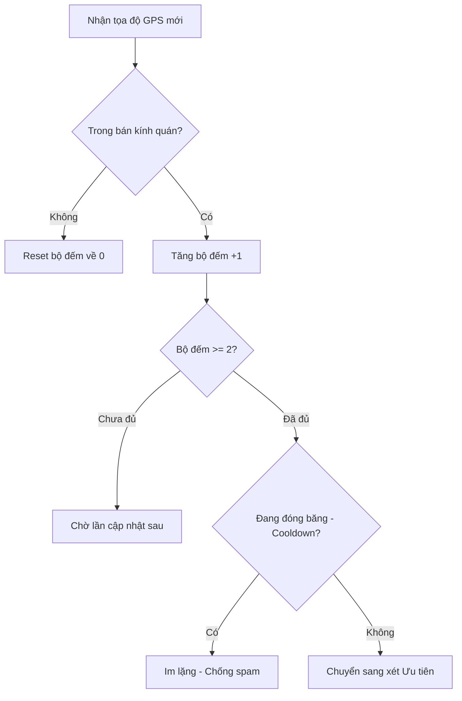
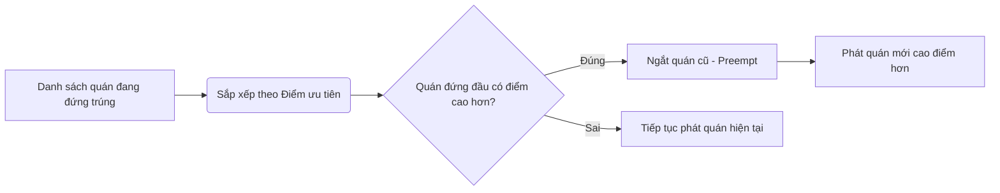
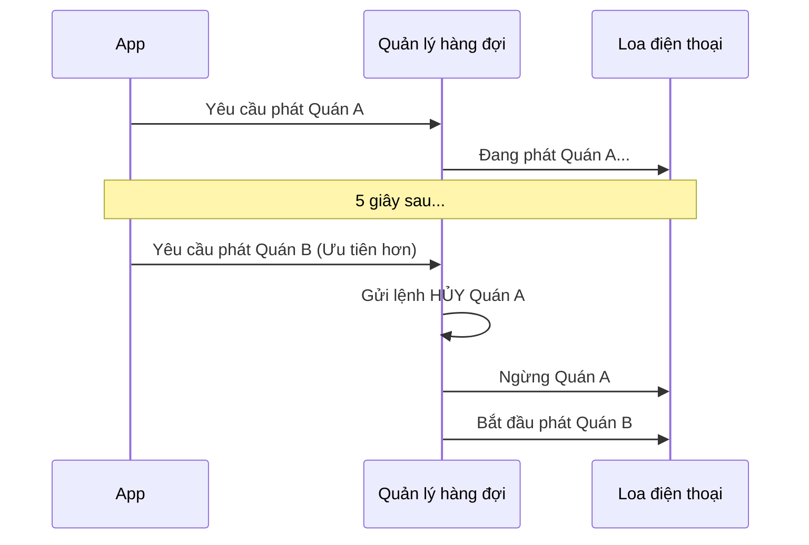

# Tài liệu Chứng minh Cơ chế Hoạt động Hệ thống Vĩnh Khánh

> **Dành cho**: Ban quản lý và Đội ngũ kiểm định.
> **Mục tiêu**: Giải thích các thuật toán xử lý thực tế trong mã nguồn bằng ngôn ngữ đời thường, giúp người không biết lập trình cũng có thể hiểu được cách hệ thống vận hành.

---

## 1. Cơ chế Chống Nhiễu & Trùng lặp (Duplicate Prevention)



### 1a. Chống "Spam" thông báo do nhiễu GPS
*   **Vấn đề thực tế**: Sóng GPS trên điện thoại luôn bị sai số (nhảy lung tung). Nếu bạn đứng ở cửa quán, GPS có thể nhảy vào trong rồi lại nhảy ra ngoài liên tục. Nếu không xử lý, điện thoại sẽ phát tiếng "Chào mừng" rồi lại "Tạm biệt" hàng chục lần, gây khó chịu cực độ.
*   **Giải pháp "Xác nhận 2 lần"**: App sẽ không phát tiếng ngay khi thấy bạn vào quán. Nó bắt buộc bạn phải ở trong vùng đó **ít nhất 2 lần cập nhật liên tiếp** (khoảng 20 giây). Nếu bạn chỉ lướt ngang qua hoặc GPS nhảy nhầm, hệ thống sẽ bỏ qua.
*   **Bằng chứng kỹ thuật (`GeofenceEngine.cs`):**
```csharp
// Phải đứng trong vùng >= 2 lần mới tính là "Đã vào"
private const int EnterDebounceThreshold = 2; 

// Mỗi lần quét thấy, tăng bộ đếm lên 1
_insideStableCounters[poi.Id] = _insideStableCounters.GetValueOrDefault(poi.Id) + 1;

// Chỉ khi bộ đếm đạt ngưỡng 2 thì mới cho phép phát âm thanh
var readyToEnter = insideCandidates.Where(p => _insideStableCounters[p.Id] >= EnterDebounceThreshold);
```

### 1c. Chống "Spam" cho cùng một quán (Thời gian đóng băng)
*   **Vấn đề thực tế**: Bạn vừa nghe xong bài giới thiệu của quán A, nhưng vì đứng lại chụp ảnh nên GPS nhảy ra nhảy vào. Bạn không muốn cứ mỗi 1 phút app lại chào mừng bạn vào quán A một lần nữa.
*   **Giải pháp "Đóng băng 10 phút"**: Sau khi một quán đã phát xong âm thanh, quán đó sẽ bị đưa vào danh sách "Chờ" (Cooldown) trong 10 phút. Trong suốt 10 phút này, dù bạn có ra vào quán đó bao nhiêu lần, hệ thống cũng sẽ không phát lại âm thanh để đảm bảo sự tinh tế.
*   **Bằng chứng kỹ thuật (`GeofenceEngine.cs`):**
```csharp
// Mặc định mỗi quán phát xong sẽ nghỉ 10 phút mới được phát lại
private static readonly TimeSpan DefaultCooldown = TimeSpan.FromMinutes(10);

// Khi phát xong, ghi nhận thời điểm "Đóng băng"
_cooldownUntilUtc[poiId] = DateTimeOffset.UtcNow.Add(DefaultCooldown);

// Khi kiểm tra để phát tiếng, phải đảm bảo đã hết thời gian đóng băng
var readyToEnter = insideCandidates
    .Where(p => !_cooldownUntilUtc.TryGetValue(p.Id, out var untill) || untill <= now);
```

### 1b. Xử lý vùng chồng lấn (Nhiều quán sát nhau)
*   **Vấn đề thực tế**: Ở phố ẩm thực, các quán nằm sát vách nhau. Khi bạn đứng một chỗ, có thể bạn đang nằm trong bán kính của 3 quán cùng lúc.
*   **Giải pháp "Duyệt toàn bộ"**: Hệ thống không bao giờ lấy quán đầu tiên nó thấy. Nó sẽ quét toàn bộ danh sách, gom tất cả các quán bạn đang đứng trúng vào một "rổ" chung, sau đó mới dùng quy tắc Ưu tiên để chọn quán đúng nhất.
*   **Bằng chứng kỹ thuật (`GeofenceEngine.cs`):**
```csharp
foreach (var poi in _cachedPois) // Duyệt TOÀN BỘ danh sách, không dừng sớm
{
    if (dist <= poi.Radius)
        insideCandidates.Add(poi); // Gom tất cả các quán đang đứng trúng vào rổ
}
```

---

## 2. Cơ chế Độ ưu tiên & Quyền ưu tiên (Priority & Preemption)



### 2a. Quy tắc VIP (Premium luôn thắng)
*   **Vấn đề thực tế**: Bạn đang đứng ở vùng giao thoa giữa một quán thường và một quán Premium (trả phí). Bạn nên nghe giới thiệu của quán nào?
*   **Giải pháp**: Hệ thống luôn ưu tiên quán có điểm `Priority` cao nhất. Quán Premium được Admin gán 100 điểm, quán thường 0 điểm.
*   **Bằng chứng kỹ thuật (`GeofenceEngine.cs`):**
```csharp
var selectedPoi = readyToEnter
    .OrderByDescending(p => p.Priority) // Sắp xếp ai điểm cao nhất đứng đầu
    .First();                           // Chọn người đứng đầu
```

### 2b. Cơ chế Cắt ngang (Preemption)
*   **Vấn đề thực tế**: Bạn đang nghe giới thiệu quán thường, nhưng vừa bước chân vào vùng của một quán Premium.
*   **Giải pháp "Mời khách thường nhường chỗ cho khách VIP"**: Hệ thống sẽ lập tức **ngắt** bài giới thiệu của quán thường đang phát và **thay thế bằng** bài giới thiệu của quán Premium ngay lập tức, không bắt khách VIP phải chờ.
*   **Bằng chứng kỹ thuật (`GeofenceEngine.cs`):**
```csharp
// Tìm xem có quán nào điểm thấp hơn đang phát không?
var lowerPriorityActives = _activePoiIds.Where(p => p.Priority < selectedPoi.Priority);

foreach (var lowerPoi in lowerPriorityActives)
{
    _activePoiIds.Remove(lowerPoi.Id); // Đuổi quán thấp điểm ra
    OnPoiExited?.Invoke(lowerPoi);    // Lệnh ngừng phát âm thanh quán đó
}
```

---

## 3. Cơ chế Hàng đợi âm thanh Độc quyền (Exclusive Audio)



### 3a. Nguyên tắc "Chỉ một tiếng nói"
*   **Vấn đề thực tế**: Nếu 2 quán cùng phát giới thiệu một lúc, điện thoại sẽ thành một mớ hỗn độn. Hoặc nếu bạn đang nghe AI đọc mà có file âm thanh MP3 kích hoạt, chúng sẽ đè lên nhau.
*   **Giải pháp "Người mới đến, người cũ nghỉ"**: Hệ thống có một quản lý hàng đợi. Khi có yêu cầu phát âm thanh mới, nó sẽ gửi tín hiệu "Hủy" đến yêu cầu cũ đang chạy, chờ yêu cầu cũ dừng hẳn rồi mới bắt đầu phát tiếng mới. Đảm bảo tại mọi thời điểm chỉ có **duy nhất 1 giọng nói**.
*   **Bằng chứng kỹ thuật (`AudioQueueManager.cs`):**
```csharp
public async Task RunExclusiveAsync(Func<CancellationToken, Task> work)
{
    _currentCts?.Cancel(); // Hủy ngay lập tức yêu cầu đang phát hiện tại
    
    await _queueLock.WaitAsync(); // Chờ slot trống (đảm bảo chỉ có 1 slot)
    try {
        await work(localCts.Token); // Bắt đầu phát tiếng mới
    }
    finally {
        _queueLock.Release(); // Phát xong mới nhường chỗ cho người tiếp theo
    }
}
```

---

## 4. Cơ chế Tối ưu Hiệu suất (Performance)

### 4a. Gom nhóm Heatmap (Nhìn từ trên cao)
*   **Vấn đề thực tế**: Nếu có 1000 người đứng trong một quán, thay vì vẽ 1000 điểm đỏ lòe loẹt trên bản đồ, Admin sẽ thấy rất rối.
*   **Giải pháp "Nam châm POI"**: Hệ thống coi mỗi quán như một thỏi nam châm. Tất cả những người đứng trong bán kính quán sẽ bị "hút" về tâm của quán đó. Thay vì gửi 1000 tọa độ, Server chỉ gửi 1 tọa độ quán kèm theo con số "1000 người".
*   **Bằng chứng kỹ thuật (`AnalyticsController.cs`):**
```csharp
// Nếu nằm trong bán kính quán -> hút về tâm quán
var nearestPoi = poiRefs.Where(p => p.Dist <= p.Radius).OrderBy(p => p.Dist).FirstOrDefault();

// Nhóm lại theo tên quán để gửi về bản đồ
.GroupBy(x => x.Poi != null ? x.Poi.Name : "Đường phố")
```

### 4b. Chống dội bom dữ liệu (Throttling)
*   **Vấn đề thực tế**: Khi phố ẩm thực cực đông (ví dụ 5000 người), mỗi giây có hàng nghìn cập nhật vị trí gửi về. Nếu Web Admin cập nhật liên tục 1000 lần/giây, trình duyệt sẽ bị treo (đơ).
*   **Giải pháp "Đếm nhịp 1 giây"**: Server được gắn một bộ lọc. Dù dữ liệu đổ về nhiều thế nào, nó cũng chỉ "nhả" kết quả cập nhật lên bản đồ đúng **1 lần mỗi giây**.
*   **Bằng chứng kỹ thuật (`AnalyticsController.cs`):**
```csharp
// Nếu chưa đủ 1 giây kể từ lần cập nhật trước -> bỏ qua
if (DateTime.UtcNow - _lastRealtimePush < TimeSpan.FromSeconds(1)) 
    return; 
```

### 4c. Đồng bộ thông minh (Chỉ lấy cái mới)
*   **Vấn đề thực tế**: Phố có 500 quán. Mỗi lần mở app mà phải tải lại cả 500 quán thì rất tốn 4G và chậm.
*   **Giải pháp "Mua bù"**: App sẽ hỏi Server: "Tôi đã có dữ liệu lúc 8h sáng, từ 8h đến giờ có gì mới không?". Server chỉ gửi về 1-2 quán mới thay đổi.
*   **Bằng chứng kỹ thuật (`DatabaseService.cs`):**
```csharp
// Chỉ lấy những quán có ngày cập nhật (UpdatedAt) lớn hơn lần đồng bộ cuối
var url = $"api/pois/updates?lastSync={thời_điểm_trước_đó}";
```

---

## Tóm tắt cho người quản lý

| Tính năng | Lợi ích cho người dùng | Tại sao nó đặc biệt? |
| :--- | :--- | :--- |
| **Chống Spam GPS** | Không bị "tra tấn" bởi âm thanh khi GPS nhảy. | Thông minh hơn các app bản đồ thông thường. |
| **Chống Spam 1 Quán** | Không nghe đi nghe lại 1 nội dung trong thời gian ngắn. | Cơ chế đóng băng (Cooldown) 10 phút tinh tế. |
| **Ưu tiên VIP** | Quán Premium luôn được giới thiệu trước. | Đảm bảo quyền lợi cho chủ quán trả phí. |
| **Độc quyền âm thanh**| Nghe rõ ràng, không bị chồng chéo tiếng. | Xử lý mượt mà giữa giọng đọc AI và nhạc MP3. |
| **Siêu mượt** | Bản đồ Admin không bị giật lag khi đông người. | Nén dữ liệu thông minh ngay tại Server. |
| **Tiết kiệm 4G** | Mở App cực nhanh, tốn ít dung lượng. | Chỉ tải những gì thực sự thay đổi. |
